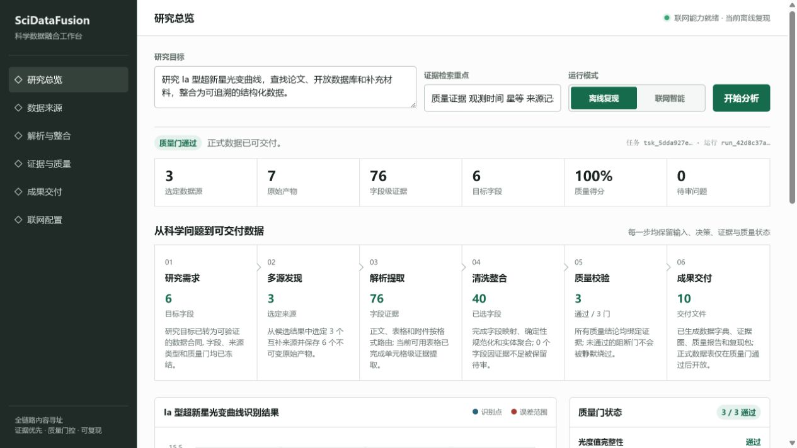
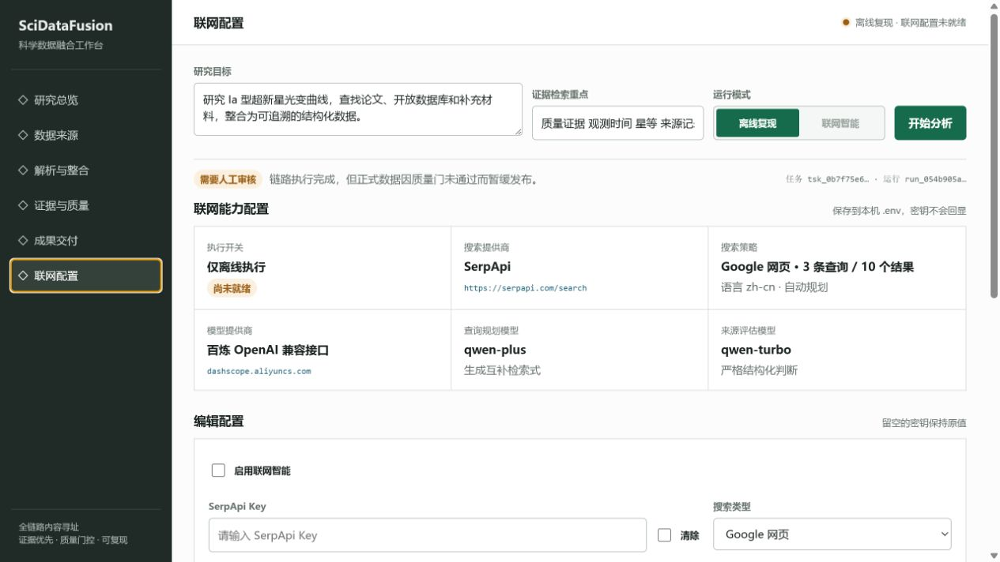

# SciDataFusion

面向科学研究的数据发现与整合工作台。输入一个研究目标，系统可以从论文、开放数据库、表格、附件和图表中整理候选数据，保留来源与证据，完成解析、字段对齐、质量检查，并输出可复现的交付包。

它适合需要把“研究问题”快速变成“可检查数据”的研究人员、数据工程师和科研团队。默认离线运行，配置密钥后可切换到联网搜索与百炼 Qwen 智能规划。



## 能做什么

- 根据自然语言研究目标，规划论文、数据库、补充材料和图表的检索方向。
- 展示每个来源、原始产物、解析路线、表格单元格和字段证据。
- 并列查看原始值、规范化值、融合结果和待审核冲突。
- 由 Qwen 自动分析质量问题、规划补充检索和重新解析；缺少证据时不会编造数值。
- 提供 light-curve 图表、证据关系图、数据字典、质量报告和复现包。

## 工作方式

`研究目标 → 多源发现 → 解析提取 → 清洗整合 → 证据与质量 → 成果交付`

页面中的六个视图对应这条主线：

| 页面 | 你可以看到 |
| --- | --- |
| 研究总览 | 研究目标、运行模式、流程状态和结果预览 |
| 数据来源 | 来源类型、覆盖字段、许可、评分和检索结果 |
| 解析与整合 | 文档/表格/图像路线、字段值和融合决策 |
| 证据与质量 | 字段证据、质量门、问题和审核动作 |
| 成果交付 | 数据字典、证据图、质量报告和可复现文件 |
| 联网配置 | SerpApi、百炼、搜索策略和模型设置 |

## 快速开始

需要 Python 3.11+、[uv](https://docs.astral.sh/uv/) 和 PowerShell：

```powershell
uv sync --python 3.11 --group dev --extra scientific
Copy-Item .env.example .env
uv run uvicorn scidatafusion.api:app --host 127.0.0.1 --port 8000
```

打开 [http://127.0.0.1:8000](http://127.0.0.1:8000)。首次启动会进入离线复现模式，不需要任何密钥。

也可以运行一个离线命令行演示：

```powershell
uv run scidatafusion phase8-delivery-demo `
  --goal "研究 Ia 型超新星光变曲线并整合为可追溯数据" `
  --query "质量证据 观测时间 星等 来源记录" `
  --confirmed-by "demo-reviewer"
```

## 开启联网智能



1. 打开左侧“联网配置”。
2. 勾选“启用联网智能”，填写 SerpApi Key 和百炼 API Key。
3. 保持默认百炼 Base URL，点击“保存并应用”。配置会写入本机项目目录的 `.env`，立即对后续任务生效。

密钥输入框留空会保留原值。接口只返回“已配置/未配置”，不会回显密钥。配置写入接口仅允许本机回环地址访问，且不会把 `.env` 提交到 GitHub。

默认使用百炼北京兼容接口和 `qwen-plus`/`qwen-turbo`。联网搜索仅负责发现和评估来源，模型不能直接修改科学数值；解析、证据、质量门和交付仍由本地确定性流程控制。

官方配置参考：[阿里云百炼 Base URL](https://help.aliyun.com/zh/model-studio/base-url)、[SerpApi Search API](https://serpapi.com/search-api)。

## 交付内容

每次任务都会形成可追溯的工作台结果。质量门未通过时，联网模式会让 Qwen 自动生成补证、重新解析或保持阻断的结构化决策；只有真实证据被解析并重新通过质量门后才会开放正式 CSV/Parquet。真正无法依据证据消解的科学语义冲突才提交人工确认。

交付包通常包括：

- 数据字典与字段来源说明
- 原始产物清单和内容哈希
- 字段级证据与证据关系图
- 质量报告、审核问题和运行指标
- 可复现的验证笔记本与元数据

## 安全与边界

- 默认离线，测试和演示不调用外部服务。
- 外部页面和模型输出都按不可信输入处理，并经过严格结构校验。
- 原始产物不可变、按内容寻址；冲突值不会被静默覆盖。
- API Key 只保存在本机 `.env`，请勿写入代码、截图或提交记录。

## 开发检查

提交前运行完整门禁：

```powershell
powershell -ExecutionPolicy Bypass -File scripts/check.ps1
```

该命令会执行 Ruff、mypy、pytest、Bandit、秘密扫描和依赖检查。

## 项目结构

```text
src/scidatafusion/       FastAPI、工作流、在线服务和中文工作台
tests/                    单元、契约、API 和离线演示测试
docs/                     验收记录、架构决策和页面截图
prompts/                  版本化的模型提示词
scripts/                  本地检查与演示脚本
```

更多边界说明见 [联网配置验收](docs/phase-9-m22-acceptance.md) 和 [工作台验收](docs/product-workbench-acceptance.md)。
