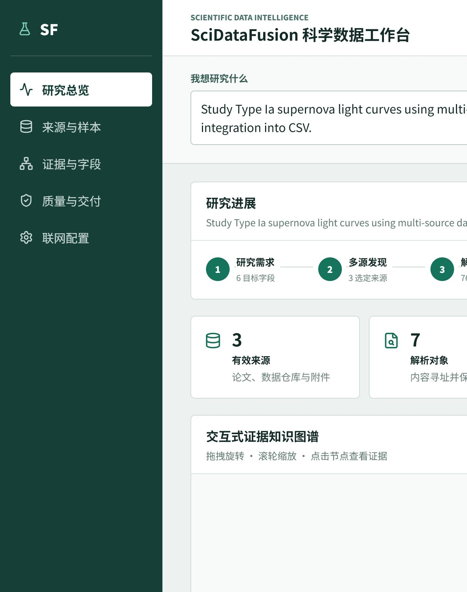

# SciDataFusion 科学数据智能工作台

SciDataFusion 是一个面向科研数据获取、解析、整合和审计的中文 AI 工作台。用户输入研究方向后，系统可以规划检索任务、发现多源资料、受控下载原始文件、解析表格与科学文档、对齐字段、绑定证据并生成可复现的结构化交付物。

项目坚持“证据优先”：没有经过来源和质量检查的内容不会被包装成科学结论，模型只能提出检索、映射或修复建议，不能直接发明或覆盖科学数值。



## 核心能力

- **主题驱动探索**：根据研究问题生成检索重点、候选数据源、目标字段和质量检查项。
- **多源数据发现**：支持网页、论文、预印本、开放数据库、CSV、TSV、JSON、附件、图表和科学文件。
- **受控下载与本地存储**：原始文件按内容哈希归档，下载过程具备超时、重试、缓存和完整性校验。
- **结构化解析**：使用 Python、Polars、DuckDB 处理表格、PDF、HTML、JSON 和科学数据格式。
- **字段映射与证据绑定**：保留原始字段名、来源位置、转换过程和 `EvidenceAtom`，冲突值不会被静默覆盖。
- **质量门禁**：在输出 Gold CSV/Parquet 前检查语义、单位、冲突、完整性和证据覆盖率。
- **中文工作台**：展示任务状态、来源覆盖、质量问题、证据链和可下载的交付文件。
- **可追溯 3D 图谱**：同时提供科研证据关系图和中文医学知识图谱，支持拖拽、缩放、搜索、点击节点和查看一跳关系。

## 中文医学知识图谱

左侧导航中的“医学图谱”是一个独立的本地浏览页面，使用参考项目的知识图谱关系数据并提供中文展示映射：

| 类型 | 数量 |
| --- | ---: |
| 疾病 | 41 |
| 症状或病史 | 131 |
| 防护建议 | 96 |
| 节点总数 | 268 |
| 有向关系 | 483 |

图谱支持：

- 按中文或原始英文名称搜索；
- 搜索后只展开匹配节点及其一跳邻域；
- 疾病、症状/病史、防护建议使用稳定颜色区分；
- 选中节点后高亮直接关系，并在右侧显示关系方向和数据来源；
- 3D 节点标签使用中文显示，关系使用方向箭头和粒子提示；
- 页面明确标注“仅用于数据关系浏览，不构成诊断或治疗建议”。

医学图谱是关系数据的可视化浏览工具，不是临床决策系统，也不会根据图谱自动生成诊断或治疗方案。

## 工作流

```text
研究问题
   ↓
检索规划 → 多源发现 → 受控下载 → 文档/表格解析
   ↓                                      ↓
质量规则 ← 字段映射 ← 证据绑定 ← 内容寻址原始产物
   ↓
可审核交付：证据 CSV / Gold CSV / Parquet / 复现元数据
```

每个研究任务都会记录来源清单、原始产物哈希、字段映射、逐单元格证据长表、质量问题、证据关系图和复现元数据。证据 CSV 可直接用于筛选、透视和后续分析。

## 快速开始

### Docker Compose

需要 Docker Desktop。首次启动：

```powershell
Copy-Item compose.env.example .env
docker compose --env-file .env up --build -d
```

打开 [http://127.0.0.1:8080](http://127.0.0.1:8080)。默认可以离线体验；联网研究可以在页面的“联网配置”中填写阿里云百炼和 SerpApi 配置。页面不会回显密钥，配置接口只绑定本机回环地址。

停止服务：

```powershell
docker compose down
```

### Windows 便携版

从 [GitHub Releases](https://github.com/xsc2466729313-cyber/SciDataFusion/releases/latest) 下载对应版本的 `SciDataFusion-*-windows-x64.zip`，完整解压后运行 `SciDataFusion.exe`。便携版包含 Python 运行环境和中文 React 页面，无需单独安装 Python、Node.js 或 Git。

### 源码开发

环境要求：

- Python 3.11 或更高版本；
- [uv](https://docs.astral.sh/uv/)；
- Node.js 24 或更高版本；
- Windows 下建议使用 `npm.cmd`，避免 PowerShell 执行策略拦截 `npm.ps1`。

安装依赖：

```powershell
uv sync --python 3.11 --group dev --extra scientific --extra platform
npm.cmd --prefix frontend ci
```

启动后端（终端一）：

```powershell
uv run uvicorn scidatafusion.api:app --host 127.0.0.1 --port 8000
```

启动前端（终端二）：

```powershell
npm.cmd --prefix frontend run dev
```

访问：

- 工作台：[http://127.0.0.1:5173](http://127.0.0.1:5173)
- API 文档：[http://127.0.0.1:8000/api/docs](http://127.0.0.1:8000/api/docs)

## 配置与运行模式

项目提供两种运行模式：

| 模式 | 用途 | 依赖 |
| --- | --- | --- |
| 单机模式 | 本地离线复现和开发 | FastAPI、DuckDB、Polars |
| 平台模式 | 持久化任务、异步队列和向量索引 | PostgreSQL、Redis、Celery、Chroma |

联网能力默认关闭。需要联网时，将 API Key 写入本机配置或 `.env`，不要把真实密钥提交到 Git。需要 PyTorch 时，在 `.env` 设置 `SCIDATA_INSTALL_TORCH=true` 后重新构建镜像。

## 技术结构

| 层 | 主要技术 |
| --- | --- |
| 前端 | React、TypeScript、Vite、Three.js、`react-force-graph-3d` |
| 后端 | FastAPI、Pydantic v2、Uvicorn |
| 数据处理 | Polars、DuckDB、pypdf、Astropy（可选） |
| AI/工作流 | LangGraph、LangChain Core、LlamaIndex Core（可选） |
| 平台服务 | PostgreSQL、Celery、Redis、Chroma（可选） |
| 交付与部署 | Docker Compose、Nginx、PyInstaller |

## 目录结构

```text
frontend/                 React 中文工作台和 3D 图谱
src/scidatafusion/        FastAPI 服务、领域模块和工作流
domain_packs/             领域规则与数据包
prompts/                  版本化提示词
schema_packs/             数据模式定义
docs/adr/                 架构决策记录
tests/                    后端单元测试和集成测试
scripts/                  检查、构建和 Windows 发布脚本
var/                      本地运行数据（不提交）
```

## 质量检查

提交前运行：

```powershell
uv run ruff check .
uv run mypy src
uv run pytest -q
uv run bandit -q -r src
npm.cmd --prefix frontend run check
npm.cmd --prefix frontend run build
```

也可以运行统一检查脚本：

```powershell
powershell -ExecutionPolicy Bypass -File scripts/check.ps1
```

## 安全与科学边界

- 外部文档、网络响应和模型输出一律按不可信输入处理；
- LLM 输出使用严格的 Pydantic 模型校验，未知字段不得静默进入核心数据；
- 模型可以提出映射或修复建议，但不能直接改写科学值；
- 原始产物不可变并按内容寻址，冲突数据必须显式保留；
- 外部 API 使用白名单、超时、重试、速率限制和缓存；
- 医学知识图谱只展示已有关系，不构成诊断、治疗或公共卫生建议。

相关设计见：

- [部署平台 ADR](docs/adr/0033-deployable-ai-service-platform.md)
- [当前主题结构化预览 ADR](docs/adr/0034-current-topic-structured-preview.md)
- [字段映射与证据导出 ADR](docs/adr/0035-reviewable-field-mapping-and-evidence-export.md)
- [本机配置与中文证据图谱 ADR](docs/adr/0036-local-configuration-and-chinese-evidence-graph.md)
- [中文工作台验收清单](docs/chinese-workbench-reliability-acceptance.md)

## 许可证

仓库当前未声明开源许可证。二次分发或商业使用前，请先确认项目维护者的授权范围。
