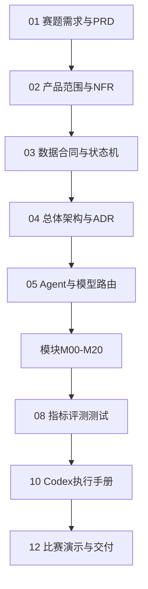

# 00 项目文档导航与执行顺序

## 1. 核心目标

将用户的自然语言科研需求转化为一份**可分析、可追溯、可复现、可修正**的数据产品。赛题明确关注多源异构数据处理、来源与处理过程保留、可靠清洗整合、便于后续分析的结构化输出，以及对缺失、重复、单位不一致、坐标轴或图例错误的发现和修正。

## 2. 文档依赖图

## 3. 模块索引

| 模块 | 文档 | 上游 | 下游 |
|---|---|---|---|
| M00 | [任务接入、安全检查与预算](modules/M00_任务接入、安全检查与预算.md) | 用户或API客户端 | M01 科研问题编译器 |
| M01 | [科研问题编译器](modules/M01_科研问题编译器.md) | M00 TaskEnvelope | M02 领域与任务原型路由 |
| M02 | [领域与任务原型路由](modules/M02_领域与任务原型路由.md) | M01 ScientificProblemSpec | M03 动态数据合同编译 |
| M03 | [动态数据合同编译](modules/M03_动态数据合同编译.md) | M02 RoutingDecision | M04 检索策略与覆盖规划 |
| M04 | [检索策略与覆盖规划](modules/M04_检索策略与覆盖规划.md) | M03 ScientificDataContract | M05 联邦Connector与来源评估 |
| M05 | [联邦Connector与来源评估](modules/M05_联邦Connector与来源评估.md) | M04 SearchPlan | M06 覆盖度评估与来源选择 |
| M06 | [覆盖度评估与来源选择](modules/M06_覆盖度评估与来源选择.md) | M05 SourceCandidateSet | M07 下载、固化与数据湖 |
| M07 | [下载、固化与数据湖](modules/M07_下载、固化与数据湖.md) | M06 SelectedSourceSet | M08 文件分类与解析路由 |
| M08 | [文件分类与解析路由](modules/M08_文件分类与解析路由.md) | M07 BronzeArtifacts | M09/M10/M11/M12解析模块 |
| M09 | [PDF与通用文档解析集成](modules/M09_PDF与通用文档解析集成.md) | M08 ParsePlan | M10表格/M11图表/M13抽取 |
| M10 | [表格结构恢复](modules/M10_表格结构恢复.md) | M08/M09 | M13字段抽取 |
| M11 | [图表数字化](modules/M11_图表数字化.md) | M08/M09 | M13字段抽取/M18质量审计 |
| M12 | [科学文件格式解析](modules/M12_科学文件格式解析.md) | M08 ParsePlan | M13/M15 |
| M13 | [证据优先字段抽取](modules/M13_证据优先字段抽取.md) | M09-M12 | M14 字段映射与语义对齐 |
| M14 | [字段映射与语义对齐](modules/M14_字段映射与语义对齐.md) | M13 ExtractedFieldCandidateSet | M15 规范化 |
| M15 | [单位、时间、坐标与值规范化](modules/M15_单位、时间、坐标与值规范化.md) | M14 FieldMappingSet | M16 实体消歧与重复检测 |
| M16 | [实体消歧与重复检测](modules/M16_实体消歧与重复检测.md) | M15 NormalizedRecordSet | M17 冲突保留式融合 |
| M17 | [冲突保留式融合](modules/M17_冲突保留式融合.md) | M16 EntityClusterSet | M18 质量审计与自动修复 |
| M18 | [质量审计与自动修复](modules/M18_质量审计与自动修复.md) | M17 GoldCandidateDataset | M19知识与记忆/M20交付 |
| M19 | [RAG、知识图谱与任务记忆](modules/M19_RAG、知识图谱与任务记忆.md) | 全流程写入证据和经验 | M01-M18按需读取，M20展示 |
| M20 | [交付、报告与复现包](modules/M20_交付、报告与复现包.md) | M18质量通过结果与M19知识资产 | 最终用户、科研分析工具和比赛展示 |

## 4. Codex每次任务的上下文最小集合

- 本导航；
- `03_核心数据契约_事件模型与状态机.md`；
- 当前模块文档；
- `10_Codex执行手册与AGENTS规则.md`；
- 当前仓库中的`AGENTS.md`和相关代码。

## 5. 禁止一次性大爆炸开发

一次性实现全项目会造成：合同漂移、空壳模块、无法测试、模型与数据耦合、错误难定位。必须按模块DoD逐步推进，阶段结束后打Tag或提交Checkpoint。
