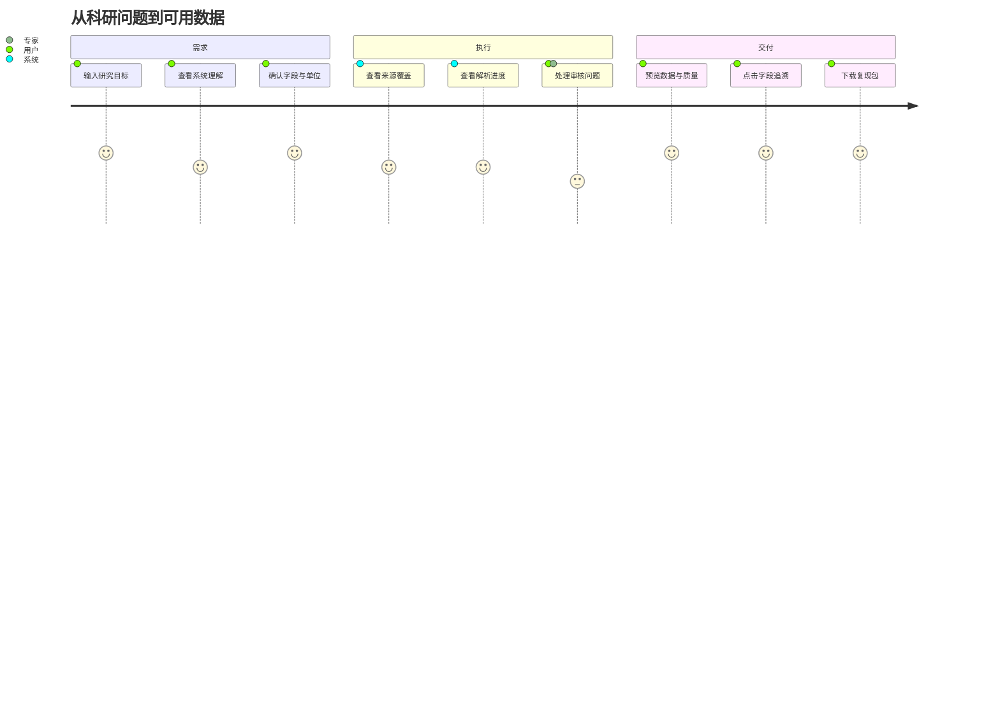

# 02 产品范围、用户体验与非功能需求

## 1. 用户角色

| 角色 | 核心目标 | 权限 | 主要风险 |
|---|---|---|---|
| 科研用户 | 快速获得可用数据 | 创建任务、确认合同、下载 | 误信低质量数据 |
| 领域专家 | 审核术语、映射、冲突 | 审核和发布领域规则 | 人工规则污染 |
| 数据工程师 | 扩展Connector/Parser | 代码和注册表 | 接口漂移 |
| 项目管理员 | 配置预算和凭证 | 系统配置 | 密钥与成本风险 |
| 评委/审计者 | 验证过程和指标 | 只读演示 | 演示不可复现 |

## 2. 端到端用户旅程

## 3. 关键页面

1. 任务创建：自然语言、目标字段、预算、上传文件；
2. 数据合同确认：领域、任务原型、字段、单位、来源和质量门；
3. 执行工作台：DAG、覆盖矩阵、来源、下载、解析和成本；
4. 数据预览：Gold视图、原始值、标准值、冲突；
5. 质量审核：Issue、证据、建议动作、前后差异；
6. 溯源图：论文/文件/表/图/字段/转换关系；
7. 交付：数据包、报告、Notebook和已知限制。

## 4. 非功能需求

### 可靠性
- 每个节点幂等和可检查点恢复；
- 单Connector或解析器失败不导致全任务失败；
- 原始Artifact不可变；
- 任务取消和超时可控。

### 性能
- UI状态更新延迟≤2秒；
- 网络和模型任务异步并发但受限流；
- 大数组懒加载；
- 支持按页面、文件和实体分区重跑。

### 可解释性
- 任何重要决策有规则/模型/证据/置信度；
- 不确定性和不支持范围前置展示；
- 质量分必须能展开到子指标。

### 可维护性
- Connector、Parser、Domain Pack和Validator插件化；
- Schema、Prompt、规则和模型版本化；
- ADR记录架构变化；
- 公共契约有向后兼容策略。

### 安全与许可
- 密钥环境变量或Secret Manager；
- SSRF、防压缩炸弹、下载白名单；
- 许可证决定可否再分发；
- 文档内容不能注入系统指令。
