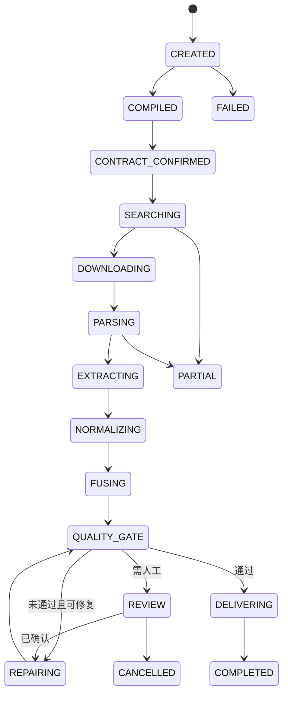

# 03 核心数据契约、事件模型与状态机

## 1. 为什么数据合同是主轴

没有统一合同，检索会追求“相关论文”，解析会输出各自格式，清洗会随意猜列，最终无法判断任务是否完成。所有模块必须围绕同一`ScientificDataContract`工作。

## 2. 核心对象

### ScientificProblemSpec
```yaml
problem_id: string
research_goal: string
research_questions: [string]
target_entities: [EntityIntent]
target_variables: [VariableIntent]
conditions: [ConditionIntent]
temporal_scope: object|null
spatial_scope: object|null
assumptions: [Assumption]
source_spans: [SourceSpan]
```

### ScientificDataContract
```yaml
contract_id: string
version: semver
domain_profile: object
task_archetypes: [string]
fields: [FieldContract]
entity_keys: [string]
acceptable_source_types: [string]
quality_gates: [QualityGate]
provenance_level: field
output_formats: [csv, parquet, json, notebook]
license_policy: object
```

### FieldContract
```yaml
name: string
description: string
requirement: required|optional|derived
data_type: string
semantic_type: string
allowed_units: [string]
target_unit: string|null
nullable: bool
valid_range: object|null
source_preference: [string]
derivation: object|null
quality_threshold: float
```

### EvidenceAtom
```yaml
evidence_id: string
artifact_id: string
document_id: string|null
page: integer|null
section: string|null
table_id: string|null
figure_id: string|null
cell_range: string|null
bounding_box: [float,float,float,float]|null
raw_text: string|null
raw_value: any
extraction_method: string
confidence: float
artifact_hash: sha256
producer_version: string
```

### TransformationRecord
```yaml
transformation_id: string
input_evidence_ids: [string]
field_name: string
raw_value: any
raw_unit: string|null
normalized_value: any
normalized_unit: string|null
method: string
parameters: object
library_version: string|null
confidence: float
reviewed_by: string|null
```

## 3. ResearchTaskState

状态只保存结构化数据和引用，不存大文件字节或整篇文档文本。大产物存对象存储，状态保存URI、哈希和摘要。

```python
class ResearchTaskState(BaseModel):
    task_id: str
    run_id: str
    status: str
    problem_spec_ref: str | None
    contract_ref: str | None
    routing_ref: str | None
    search_plan_ref: str | None
    selected_sources_ref: str | None
    artifacts_ref: str | None
    parse_outputs_ref: str | None
    evidence_ref: str | None
    gold_dataset_ref: str | None
    quality_report_ref: str | None
    budget: dict
    current_module: str | None
    attempts: dict[str, int]
    pending_reviews: list[str]
```

## 4. 状态机



## 5. 事件溯源

每个节点发出不可变事件。状态可由事件重建；大数据结果不进入事件正文，只保存引用和哈希。

关键事件：`task.created`、`problem.compiled`、`contract.confirmed`、`search.completed`、`artifact.stored`、`document.parsed`、`field.extracted`、`record.normalized`、`fusion.completed`、`quality.issue.created`、`review.resolved`、`delivery.completed`。

## 6. 版本兼容

- 合同、Domain Pack、Prompt、Parser、模型和规则均有版本；
- 只允许显式Schema迁移；
- 旧运行保持原版本可重放；
- 模型Alias和真实快照同时记录；
- 任一规则升级先跑回归与消融。
