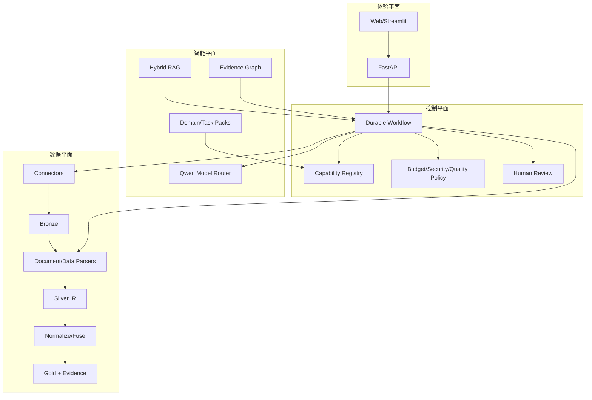

# 04 总体架构、技术选型与ADR

## 1. 四平面架构



## 2. 核心技术选择

| 领域 | 比赛版 | 生产增强 | 选择理由 |
|---|---|---|---|
| 工作流 | LangGraph或自研typed state machine | Temporal/Celery+工作流 | durable、HITL、检查点 |
| API | FastAPI | FastAPI | 类型与异步友好 |
| 数据框 | Polars + DuckDB | 同左 | 高效、可复现SQL |
| 元数据 | SQLite/PostgreSQL | PostgreSQL | 事务和JSONB |
| 对象存储 | 本地hash目录 | OSS/S3 | 原始文件不可变 |
| 向量 | FAISS | Qdrant/pgvector | 比赛轻量、后续扩展 |
| 图 | NetworkX | Neo4j | 先验证价值再生产化 |
| 文档 | Docling+MinerU+GROBID+PyMuPDF | 同左服务化 | 多解析器互补 |
| 模型 | 百炼Qwen模型路由 | 同左 | 符合赛题和多模态能力 |
| 追踪 | OpenTelemetry+JSONL | OTel+Langfuse/平台 | 框架无关 |

## 3. 关键ADR

### ADR-001 受约束Agent Harness
不使用自由群聊式多Agent。每个节点有Typed I/O、工具白名单、预算、质量门和重试策略。

### ADR-002 字段级Evidence强制
最终Required字段没有EvidenceAtom则不能进入Gold。

### ADR-003 Parser Ensemble
文档解析不存在全局最佳单工具，采用页面/元素级路由和质量门。

### ADR-004 GraphRAG选择性使用
实体/证据关联和跨文档推理使用图；简单字段检索不强制走昂贵社区构建。

### ADR-005 冲突保留
不静默覆盖，Gold是带决策记录的视图。

### ADR-006 三个深度领域优先
比赛版重点做天文、材料/化学、环境/生命中的3个深度案例，其他领域证明插件架构和留出适配。

## 4. 仓库目标结构

```text
src/
  contracts/ workflow/ intake/ problem/ routing/ search/ connectors/
  artifacts/ parsing/ extraction/ normalization/ entity/ fusion/
  quality/ review/ knowledge/ provenance/ export/ observability/
domain_packs/
task_packs/
schemas/ prompts/ tests/ fixtures/ docs/ scripts/ apps/
```

## 5. 技术债务控制

- 不允许跨层直接访问数据库表；
- 不把prompt字符串散落在代码；
- 不用单一`confidence`掩盖多种证据；
- 不在通用核心硬编码领域分支；
- 不让前端直接驱动数据处理函数；
- 不把外部API返回对象直接作为内部合同。
