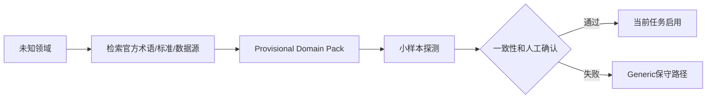

# 07 Domain Pack、任务原型与跨领域泛化

## 1. 泛化不是所有领域走同一条流水线

系统先识别领域、任务原型、数据模态和风险，再动态组合通用能力与专用插件。

## 2. Task Archetype

- observation_time_series
- property_aggregation
- experiment_condition_extraction
- spatiotemporal_alignment
- matrix_dataset_integration
- sequence_dataset_integration
- figure_digitization
- benchmark_synthesis
- spectral_processing

## 3. Domain Pack结构

```text
domain_packs/materials_core/
  manifest.yaml
  ontology.yaml
  schema_fragments/
  source_connectors.yaml
  field_aliases.yaml
  unit_rules.yaml
  entity_rules.yaml
  validators/
  parsers/
  prompts/
  fixtures/
  benchmarks/
```

## 4. Manifest示例

```yaml
name: materials_core
version: 1.0.0
compatible_core: ">=0.4,<0.5"
domains: [materials_science]
archetypes: [property_aggregation, experiment_condition_extraction]
capabilities:
  parsers: [cif]
  normalizers: [chemical_formula, temperature, pressure]
  validators: [composition_balance, condition_binding]
optional_dependencies: [pymatgen]
```

## 5. 独特化处理示例

| 领域 | 专用对象 | 专用处理 | 专用质量门 |
|---|---|---|---|
| 天文 | 天体/观测 | MJD、坐标、星等、波段 | 轴倒置、坐标近邻 |
| 材料 | 化学式/样品 | 化学式归一、制备条件 | 实验/计算值区分 |
| 化学 | 反应 | 反应物-催化剂-条件绑定 | 质量守恒、产率范围 |
| 生命 | 基因/样本 | ID映射、表达矩阵 | 物种/组织/批次一致 |
| 环境 | 栅格/站点 | CRS、时间尺度、重采样 | 空间覆盖和nodata |
| 计算机 | 模型/数据集 | 版本、指标方向、设置 | 同基准同协议比较 |

## 6. 未知领域适配



临时包只在当前任务使用；发布为正式包必须经过黄金集、领域专家和负迁移测试。

## 7. 泛化评测

- 已知领域宏平均；
- 最差领域性能；
- 留出领域保留率；
- Few-shot适配增益；
- 专用化增益；
- 错误领域包负迁移率；
- Unsupported Detection Recall。
