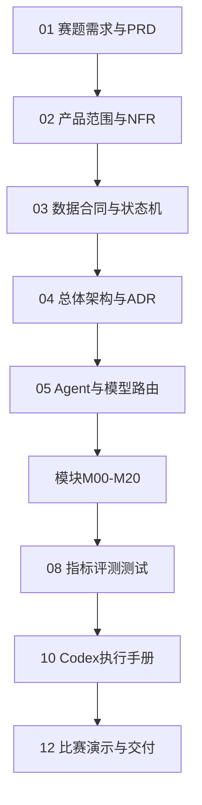
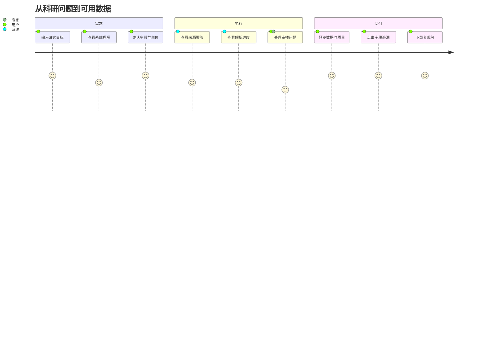
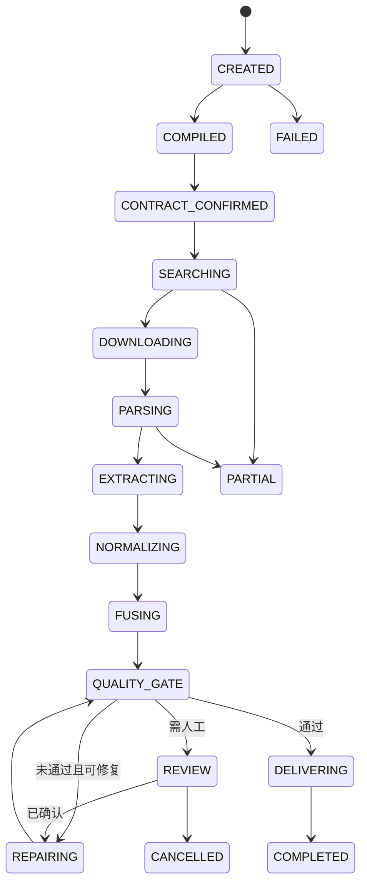
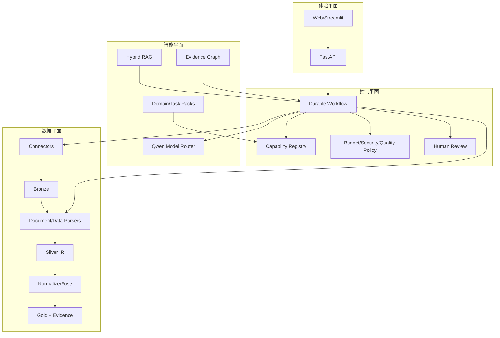
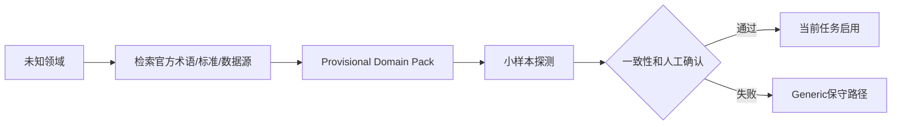
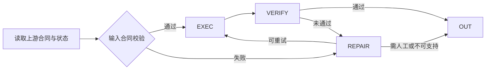

# AI Data Scientist / SciDataFusion V4 全量合并文档

> 推荐实际开发使用分文件版本；本文件仅用于全文搜索和归档。


---

<!-- FILE: README.md -->

# AI Data Scientist / SciDataFusion V4 文档包

本目录是一套可直接交给 Codex 逐步实施的项目经理级需求与技术文档，目标对应 2026 挑战杯阿里云榜题 **赛道二—方向一—A：科学数据查找、解析与整合**。

## 文档结构

- `00_项目文档导航与执行顺序.md`：唯一入口；
- `01`–`12`：跨模块PRD、架构、数据合同、评测和项目执行方案；
- `modules/M00`–`M20`：每个模块的独立施工说明；
- `prompts/`：Codex总体、阶段与模块提示词；
- `references/`：前沿项目与采用决策；
- `templates/`：ADR、模块验收和Codex工作报告模板。

## 使用规则

1. 不要把全部文档一次性丢给Codex要求“一次完成”；
2. 先执行Phase 0，建立仓库与合同，再按依赖顺序实施模块；
3. 每次只给Codex一份阶段提示词和对应模块文档；
4. 每阶段必须运行测试并输出指标；
5. 所有LLM输出均不可信，必须结构校验；
6. 原始数据不可变，科学数值不得由LLM凭空补齐；
7. 正式参赛核心模型切换到阿里云百炼Qwen；
8. 现有本地`.env`中的真实凭证必须轮换，仓库只提交`.env.example`。

## 推荐施工顺序

```text
工程基线 → M00 → M01 → M02 → M03 → M04-M06 → M07-M12
→ M13-M17 → M18 → M19 → M20 → 全链评测与比赛演示
```

## 版本

- 文档版本：V4.0
- 生成日期：2026-07-11
- 母文档：V3项目经理级完整PRD


---

<!-- FILE: 00_项目文档导航与执行顺序.md -->

# 00 项目文档导航与执行顺序

## 1. 核心目标

将用户的自然语言科研需求转化为一份**可分析、可追溯、可复现、可修正**的数据产品。赛题明确关注多源异构数据处理、来源与处理过程保留、可靠清洗整合、便于后续分析的结构化输出，以及对缺失、重复、单位不一致、坐标轴或图例错误的发现和修正。

## 2. 文档依赖图



## 3. 模块索引

| 模块 | 文档 | 上游 | 下游 |
|---|---|---|---|
| M00 | [任务接入、安全检查与预算](modules/M00_任务接入、安全检查与预算.md) | 用户或API客户端 | M01 科研问题编译器 |
| M01 | [科研问题编译器](modules/M01_科研问题编译器.md) | M00 TaskEnvelope | M02 领域与任务原型路由 |
| M02 | [领域与任务原型路由](modules/M02_领域与任务原型路由.md) | M01 ScientificProblemSpec | M03 动态数据合同编译 |
| M03 | [动态数据合同编译](modules/M03_动态数据合同编译.md) | M02 RoutingDecision | M04 检索策略与覆盖规划 |
| M04 | [检索策略与覆盖规划](modules/M04_检索策略与覆盖规划.md) | M03 ScientificDataContract | M05 联邦Connector与来源评估 |
| M05 | [联邦Connector与来源评估](modules/M05_联邦Connector与来源评估.md) | M04 SearchPlan | M06 覆盖度评估与来源选择 |
| M06 | [覆盖度评估与来源选择](modules/M06_覆盖度评估与来源选择.md) | M05 SourceCandidateSet | M07 下载、固化与数据湖 |
| M07 | [下载、固化与数据湖](modules/M07_下载、固化与数据湖.md) | M06 SelectedSourceSet | M08 文件分类与解析路由 |
| M08 | [文件分类与解析路由](modules/M08_文件分类与解析路由.md) | M07 BronzeArtifacts | M09/M10/M11/M12解析模块 |
| M09 | [PDF与通用文档解析集成](modules/M09_PDF与通用文档解析集成.md) | M08 ParsePlan | M10表格/M11图表/M13抽取 |
| M10 | [表格结构恢复](modules/M10_表格结构恢复.md) | M08/M09 | M13字段抽取 |
| M11 | [图表数字化](modules/M11_图表数字化.md) | M08/M09 | M13字段抽取/M18质量审计 |
| M12 | [科学文件格式解析](modules/M12_科学文件格式解析.md) | M08 ParsePlan | M13/M15 |
| M13 | [证据优先字段抽取](modules/M13_证据优先字段抽取.md) | M09-M12 | M14 字段映射与语义对齐 |
| M14 | [字段映射与语义对齐](modules/M14_字段映射与语义对齐.md) | M13 ExtractedFieldCandidateSet | M15 规范化 |
| M15 | [单位、时间、坐标与值规范化](modules/M15_单位、时间、坐标与值规范化.md) | M14 FieldMappingSet | M16 实体消歧与重复检测 |
| M16 | [实体消歧与重复检测](modules/M16_实体消歧与重复检测.md) | M15 NormalizedRecordSet | M17 冲突保留式融合 |
| M17 | [冲突保留式融合](modules/M17_冲突保留式融合.md) | M16 EntityClusterSet | M18 质量审计与自动修复 |
| M18 | [质量审计与自动修复](modules/M18_质量审计与自动修复.md) | M17 GoldCandidateDataset | M19知识与记忆/M20交付 |
| M19 | [RAG、知识图谱与任务记忆](modules/M19_RAG、知识图谱与任务记忆.md) | 全流程写入证据和经验 | M01-M18按需读取，M20展示 |
| M20 | [交付、报告与复现包](modules/M20_交付、报告与复现包.md) | M18质量通过结果与M19知识资产 | 最终用户、科研分析工具和比赛展示 |


## 4. Codex每次任务的上下文最小集合

- 本导航；
- `03_核心数据契约_事件模型与状态机.md`；
- 当前模块文档；
- `10_Codex执行手册与AGENTS规则.md`；
- 当前仓库中的`AGENTS.md`和相关代码。

## 5. 禁止一次性大爆炸开发

一次性实现全项目会造成：合同漂移、空壳模块、无法测试、模型与数据耦合、错误难定位。必须按模块DoD逐步推进，阶段结束后打Tag或提交Checkpoint。


---

<!-- FILE: 01_赛题需求_PRD与验收追踪矩阵.md -->

# 01 赛题需求、PRD与验收追踪矩阵

## 1. 官方需求基线

官方赛道二强调：系统需要围绕真实科研数据获取、整理与应用，处理多源异构数据，保留来源和处理过程，形成可分析、可追溯、可复用结果，并能在发现错误或收到反馈后修正。方向一A要求从科研问题出发，自动查找论文、开放数据库、表格、补充材料和图像数据，从正文、表格、附件或图表提取信息，完成数据清洗、字段对齐、来源标注和结构化输出。

官方页面：[https://university.aliyun.com/action/tzbjbgs2026](https://university.aliyun.com/action/tzbjbgs2026)

## 2. 产品北极星

> 用户提交一个科研目标后，在可接受的时间和预算内得到一份Required字段齐全、字段级可溯源、质量门通过、可直接用Python/R/MATLAB分析的数据包。

## 3. 核心用户故事

1. 研究生希望把一个科研问题自动编译成明确的数据需求；
2. 科研人员希望系统覆盖论文、数据库、补充材料和图表，而不是只返回文献列表；
3. 数据分析人员希望拿到类型稳定的CSV/Parquet和数据字典；
4. 审核者希望点击任一单元格查看来源页、表格/图像区域和变换链；
5. 领域专家希望系统发现错误后只重跑相关节点并允许人工修正；
6. 项目评委希望看到多领域泛化、专用化增益和可复现实验。

## 4. 官方关注点到系统证据

| 官方关注点 | 模块 | 量化证据 | 演示证据 |
|---|---|---|---|
| 查找是否完备 | M04-M06 | Source Recall@K、字段覆盖矩阵、缺口补搜日志 | 搜索结果与黄金来源对照 |
| 多源异构处理 | M05、M07-M12 | 来源类型数、支持格式、解析成功率 | 论文+附件+数据库+图表同任务 |
| 来源可追溯 | M07、M13、M20 | 字段级Provenance 100% | 单元格回跳原页/表/图 |
| 清洗整合可靠 | M14-M17 | 映射、单位、实体、冲突指标 | 错误注入前后对比 |
| 输出便于分析 | M20 | Schema合格率、Notebook执行率 | CSV/Parquet/字典/Notebook |
| 错误发现与修正 | M18 | Issue Recall、修复准确率、质量提升 | 单位/图例/重复错误闭环 |
| 泛化与独特化 | M02/M03/M19 | 跨领域宏平均、专用化增益 | 至少3个深度领域+留出领域 |


## 5. P0/P1/P2范围

### P0（比赛核心）

- 科研问题编译和数据合同；
- 至少4类来源Connector；
- PDF正文、原生表格、PDF表格和基础图表解析；
- 字段级Evidence；
- 字段映射、单位转换、实体去重、冲突保留；
- 质量审计、一次自动修复与人工审核；
- CSV/Parquet/字典/溯源/报告；
- 3个深度领域案例。

### P1（增强）

- GraphRAG、科学格式插件、更多图表类型；
- RO-Crate、OpenLineage、MCP工具服务；
- PostgreSQL/Qdrant/Neo4j生产化；
- 更大规模并行和缓存。

### P2（长期）

- 自动生成完整科研结论；
- 全领域零配置；
- 任意3D/复合图表无人工数字化；
- 无许可限制的数据自动再分发。

## 6. 关键非目标

- 不是文献聊天机器人；
- 不是让LLM生成一份看似合理的CSV；
- 不是把“有知识图谱”当作结果；
- 不是一次性脚本；
- 不保证覆盖所有科研领域和私有数据库；
- 不替代领域专家对高风险结果的最终判断。

## 7. 项目级验收

- 至少3个领域端到端任务成功；
- Required字段级溯源覆盖率100%；
- 冲突静默覆盖率0%；
- 错误注入集问题检测Recall≥0.95；
- 留出领域保留率达到项目基线；
- 复现包在干净环境运行成功率≥95%；
- 正式演示调用记录能证明核心基座为百炼Qwen。


---

<!-- FILE: 02_产品范围_用户体验与非功能需求.md -->

# 02 产品范围、用户体验与非功能需求

## 1. 用户角色

| 角色 | 核心目标 | 权限 | 主要风险 |
|---|---|---|---|
| 科研用户 | 快速获得可用数据 | 创建任务、确认合同、下载 | 误信低质量数据 |
| 领域专家 | 审核术语、映射、冲突 | 审核和发布领域规则 | 人工规则污染 |
| 数据工程师 | 扩展Connector/Parser | 代码和注册表 | 接口漂移 |
| 项目管理员 | 配置预算和凭证 | 系统配置 | 密钥与成本风险 |
| 评委/审计者 | 验证过程和指标 | 只读演示 | 演示不可复现 |

## 2. 端到端用户旅程



## 3. 关键页面

1. 任务创建：自然语言、目标字段、预算、上传文件；
2. 数据合同确认：领域、任务原型、字段、单位、来源和质量门；
3. 执行工作台：DAG、覆盖矩阵、来源、下载、解析和成本；
4. 数据预览：Gold视图、原始值、标准值、冲突；
5. 质量审核：Issue、证据、建议动作、前后差异；
6. 溯源图：论文/文件/表/图/字段/转换关系；
7. 交付：数据包、报告、Notebook和已知限制。

## 4. 非功能需求

### 可靠性
- 每个节点幂等和可检查点恢复；
- 单Connector或解析器失败不导致全任务失败；
- 原始Artifact不可变；
- 任务取消和超时可控。

### 性能
- UI状态更新延迟≤2秒；
- 网络和模型任务异步并发但受限流；
- 大数组懒加载；
- 支持按页面、文件和实体分区重跑。

### 可解释性
- 任何重要决策有规则/模型/证据/置信度；
- 不确定性和不支持范围前置展示；
- 质量分必须能展开到子指标。

### 可维护性
- Connector、Parser、Domain Pack和Validator插件化；
- Schema、Prompt、规则和模型版本化；
- ADR记录架构变化；
- 公共契约有向后兼容策略。

### 安全与许可
- 密钥环境变量或Secret Manager；
- SSRF、防压缩炸弹、下载白名单；
- 许可证决定可否再分发；
- 文档内容不能注入系统指令。


---

<!-- FILE: 03_核心数据契约_事件模型与状态机.md -->

# 03 核心数据契约、事件模型与状态机

## 1. 为什么数据合同是主轴

没有统一合同，检索会追求“相关论文”，解析会输出各自格式，清洗会随意猜列，最终无法判断任务是否完成。所有模块必须围绕同一`ScientificDataContract`工作。

## 2. 核心对象

### ScientificProblemSpec
```yaml
problem_id: string
research_goal: string
research_questions: [string]
target_entities: [EntityIntent]
target_variables: [VariableIntent]
conditions: [ConditionIntent]
temporal_scope: object|null
spatial_scope: object|null
assumptions: [Assumption]
source_spans: [SourceSpan]
```

### ScientificDataContract
```yaml
contract_id: string
version: semver
domain_profile: object
task_archetypes: [string]
fields: [FieldContract]
entity_keys: [string]
acceptable_source_types: [string]
quality_gates: [QualityGate]
provenance_level: field
output_formats: [csv, parquet, json, notebook]
license_policy: object
```

### FieldContract
```yaml
name: string
description: string
requirement: required|optional|derived
data_type: string
semantic_type: string
allowed_units: [string]
target_unit: string|null
nullable: bool
valid_range: object|null
source_preference: [string]
derivation: object|null
quality_threshold: float
```

### EvidenceAtom
```yaml
evidence_id: string
artifact_id: string
document_id: string|null
page: integer|null
section: string|null
table_id: string|null
figure_id: string|null
cell_range: string|null
bounding_box: [float,float,float,float]|null
raw_text: string|null
raw_value: any
extraction_method: string
confidence: float
artifact_hash: sha256
producer_version: string
```

### TransformationRecord
```yaml
transformation_id: string
input_evidence_ids: [string]
field_name: string
raw_value: any
raw_unit: string|null
normalized_value: any
normalized_unit: string|null
method: string
parameters: object
library_version: string|null
confidence: float
reviewed_by: string|null
```

## 3. ResearchTaskState

状态只保存结构化数据和引用，不存大文件字节或整篇文档文本。大产物存对象存储，状态保存URI、哈希和摘要。

```python
class ResearchTaskState(BaseModel):
    task_id: str
    run_id: str
    status: str
    problem_spec_ref: str | None
    contract_ref: str | None
    routing_ref: str | None
    search_plan_ref: str | None
    selected_sources_ref: str | None
    artifacts_ref: str | None
    parse_outputs_ref: str | None
    evidence_ref: str | None
    gold_dataset_ref: str | None
    quality_report_ref: str | None
    budget: dict
    current_module: str | None
    attempts: dict[str, int]
    pending_reviews: list[str]
```

## 4. 状态机



## 5. 事件溯源

每个节点发出不可变事件。状态可由事件重建；大数据结果不进入事件正文，只保存引用和哈希。

关键事件：`task.created`、`problem.compiled`、`contract.confirmed`、`search.completed`、`artifact.stored`、`document.parsed`、`field.extracted`、`record.normalized`、`fusion.completed`、`quality.issue.created`、`review.resolved`、`delivery.completed`。

## 6. 版本兼容

- 合同、Domain Pack、Prompt、Parser、模型和规则均有版本；
- 只允许显式Schema迁移；
- 旧运行保持原版本可重放；
- 模型Alias和真实快照同时记录；
- 任一规则升级先跑回归与消融。


---

<!-- FILE: 04_总体架构_技术选型与ADR.md -->

# 04 总体架构、技术选型与ADR

## 1. 四平面架构



## 2. 核心技术选择

| 领域 | 比赛版 | 生产增强 | 选择理由 |
|---|---|---|---|
| 工作流 | LangGraph或自研typed state machine | Temporal/Celery+工作流 | durable、HITL、检查点 |
| API | FastAPI | FastAPI | 类型与异步友好 |
| 数据框 | Polars + DuckDB | 同左 | 高效、可复现SQL |
| 元数据 | SQLite/PostgreSQL | PostgreSQL | 事务和JSONB |
| 对象存储 | 本地hash目录 | OSS/S3 | 原始文件不可变 |
| 向量 | FAISS | Qdrant/pgvector | 比赛轻量、后续扩展 |
| 图 | NetworkX | Neo4j | 先验证价值再生产化 |
| 文档 | Docling+MinerU+GROBID+PyMuPDF | 同左服务化 | 多解析器互补 |
| 模型 | 百炼Qwen模型路由 | 同左 | 符合赛题和多模态能力 |
| 追踪 | OpenTelemetry+JSONL | OTel+Langfuse/平台 | 框架无关 |

## 3. 关键ADR

### ADR-001 受约束Agent Harness
不使用自由群聊式多Agent。每个节点有Typed I/O、工具白名单、预算、质量门和重试策略。

### ADR-002 字段级Evidence强制
最终Required字段没有EvidenceAtom则不能进入Gold。

### ADR-003 Parser Ensemble
文档解析不存在全局最佳单工具，采用页面/元素级路由和质量门。

### ADR-004 GraphRAG选择性使用
实体/证据关联和跨文档推理使用图；简单字段检索不强制走昂贵社区构建。

### ADR-005 冲突保留
不静默覆盖，Gold是带决策记录的视图。

### ADR-006 三个深度领域优先
比赛版重点做天文、材料/化学、环境/生命中的3个深度案例，其他领域证明插件架构和留出适配。

## 4. 仓库目标结构

```text
src/
  contracts/ workflow/ intake/ problem/ routing/ search/ connectors/
  artifacts/ parsing/ extraction/ normalization/ entity/ fusion/
  quality/ review/ knowledge/ provenance/ export/ observability/
domain_packs/
task_packs/
schemas/ prompts/ tests/ fixtures/ docs/ scripts/ apps/
```

## 5. 技术债务控制

- 不允许跨层直接访问数据库表；
- 不把prompt字符串散落在代码；
- 不用单一`confidence`掩盖多种证据；
- 不在通用核心硬编码领域分支；
- 不让前端直接驱动数据处理函数；
- 不把外部API返回对象直接作为内部合同。


---

<!-- FILE: 05_Agent编排_模型路由与MCP工具协议.md -->

# 05 Agent编排、模型路由与MCP工具协议

## 1. Agent角色

| 角色 | 输出 | 不允许做的事 |
|---|---|---|
| Specifier | ProblemSpec/DataContract候选 | 猜科学数值 |
| Planner | Search/Parse/Repair计划 | 调用未注册工具 |
| Executor | 执行确定性工具 | 自行改合同 |
| Verifier | 质量门和证据校验 | 只用自评置信度放行 |
| Repairer | 白名单修复动作 | 直接编造替代值 |

## 2. Durable DAG

工作流节点要“小而清晰”：每个节点一件事，状态存原始结构而不是格式化文本。支持暂停、恢复、时间旅行、局部重跑和人工中断。

## 3. 模型路由

禁止在源代码硬编码具体模型快照；通过逻辑角色配置：

```yaml
models:
  planner: ${PLANNER_MODEL_ID}
  fast_classifier: ${FAST_MODEL_ID}
  critic: ${CRITIC_MODEL_ID}
  vision: ${VISION_MODEL_ID}
  ocr: ${OCR_MODEL_ID}
  embedding: text-embedding-v4
  rerank: qwen3-rerank
  multimodal_embedding: ${MULTIMODAL_EMBEDDING_MODEL_ID}
  multimodal_rerank: ${MULTIMODAL_RERANK_MODEL_ID}
```

正式调用前从百炼模型列表校验可用性；演示固定模型快照，开发可使用Alias。

## 4. 置信度融合

模型自评只是一项特征。最终置信度建议综合：规则一致、Schema验证、来源可信、跨源一致、解析质量、模型一致、人工状态。

```text
C = w_rule*C_rule + w_schema*C_schema + w_source*C_source
  + w_cross*C_cross + w_parse*C_parse + w_model*C_model
```

权重必须在验证集上校准，不能拍脑袋后当成概率。

## 5. MCP/Capability Registry

工具统一声明：名称、版本、输入Schema、输出Schema、权限、成本、速率、适用领域、幂等性和副作用。MCP可作为外部工具互联协议，但内部仍需要Capability Registry控制。

```yaml
name: search.openalex
version: 1.0.0
input_schema: SearchQuery
output_schema: SourceCandidateList
permissions: [network:openalex.org]
cost_model: request
idempotent: true
timeout_seconds: 20
domains: [generic]
```

## 6. Context Engineering

- System：不可变安全和科学规则；
- Task：当前合同和节点目标；
- Retrieved Evidence：可追溯、限长、分隔；
- Tool results：结构化，不拼接成自然语言大段；
- Memory：只有通过准入的规则/经验；
- Output schema：严格JSON。

## 7. 模型失败策略

非法JSON→本地解析/一次结构修复→低级模型/模板回退→人工；限流→队列和指数退避；大上下文→证据压缩和分层检索；视觉失败→OCR/解析器或人工。


---

<!-- FILE: 06_检索_RAG_GraphRAG与知识管理.md -->

# 06 检索、Hybrid RAG、GraphRAG与知识管理

## 1. 三种检索目标必须分开

1. **发现检索**：找论文、数据集、仓库和附件；
2. **证据检索**：在已下载资料中找字段和关系证据；
3. **经验检索**：复用领域规则、数据源说明和历史成功策略。

## 2. Hybrid RAG

```text
候选 = BM25 ∪ DenseEmbedding ∪ MetadataFilter ∪ GraphNeighborhood
最终 = Rerank(query, 候选Top20~100) → Top5~10
```

官方百炼文档也建议在初始检索返回20–100+混合相关候选时使用rerank，再选Top结果进入模型。

## 3. 结构化Chunk

- 正文按章节、段落和引用关系；
- 表格按caption+header+行组，不破坏表头；
- 图表按caption+OCR+视觉描述+系列；
- 数据库文档按endpoint/字段/示例；
- chunk保留文档、页码、bbox和层级路径。

## 4. Evidence Graph

节点：ResearchQuestion、Entity、Paper、Dataset、Artifact、Table、Figure、Field、Unit、Observation、Transformation、QualityIssue、Run。

关系：MENTIONS、PROVIDES、EXTRACTED_FROM、DERIVED_FROM、HAS_UNIT、SAME_AS、CONFLICTS_WITH、VALIDATED_BY、GENERATED_IN。

## 5. GraphRAG使用边界

适合：跨文档实体关系、来源链、冲突定位、全局主题和证据推理。
不适合：简单精确字段查找、单文档小规模任务、预算极小任务。

## 6. 知识准入

- official：官方数据库文档/标准；
- verified：人工确认且评测通过；
- provisional：当前任务临时推断；
- quarantined：冲突或低质量，不参与自动决策。

任何从任务自动提炼的规则默认provisional，不能直接污染所有后续任务。


---

<!-- FILE: 07_DomainPack_任务原型与跨领域泛化.md -->

# 07 Domain Pack、任务原型与跨领域泛化

## 1. 泛化不是所有领域走同一条流水线

系统先识别领域、任务原型、数据模态和风险，再动态组合通用能力与专用插件。

## 2. Task Archetype

- observation_time_series
- property_aggregation
- experiment_condition_extraction
- spatiotemporal_alignment
- matrix_dataset_integration
- sequence_dataset_integration
- figure_digitization
- benchmark_synthesis
- spectral_processing

## 3. Domain Pack结构

```text
domain_packs/materials_core/
  manifest.yaml
  ontology.yaml
  schema_fragments/
  source_connectors.yaml
  field_aliases.yaml
  unit_rules.yaml
  entity_rules.yaml
  validators/
  parsers/
  prompts/
  fixtures/
  benchmarks/
```

## 4. Manifest示例

```yaml
name: materials_core
version: 1.0.0
compatible_core: ">=0.4,<0.5"
domains: [materials_science]
archetypes: [property_aggregation, experiment_condition_extraction]
capabilities:
  parsers: [cif]
  normalizers: [chemical_formula, temperature, pressure]
  validators: [composition_balance, condition_binding]
optional_dependencies: [pymatgen]
```

## 5. 独特化处理示例

| 领域 | 专用对象 | 专用处理 | 专用质量门 |
|---|---|---|---|
| 天文 | 天体/观测 | MJD、坐标、星等、波段 | 轴倒置、坐标近邻 |
| 材料 | 化学式/样品 | 化学式归一、制备条件 | 实验/计算值区分 |
| 化学 | 反应 | 反应物-催化剂-条件绑定 | 质量守恒、产率范围 |
| 生命 | 基因/样本 | ID映射、表达矩阵 | 物种/组织/批次一致 |
| 环境 | 栅格/站点 | CRS、时间尺度、重采样 | 空间覆盖和nodata |
| 计算机 | 模型/数据集 | 版本、指标方向、设置 | 同基准同协议比较 |

## 6. 未知领域适配



临时包只在当前任务使用；发布为正式包必须经过黄金集、领域专家和负迁移测试。

## 7. 泛化评测

- 已知领域宏平均；
- 最差领域性能；
- 留出领域保留率；
- Few-shot适配增益；
- 专用化增益；
- 错误领域包负迁移率；
- Unsupported Detection Recall。


---

<!-- FILE: 08_数据平台_API_安全与可观测性.md -->

# 08 数据平台、API、安全与可观测性

## 1. Bronze/Silver/Gold

- Bronze：原始不可变字节、HTTP元数据、哈希；
- Silver：DocumentIR/TableIR/FigureIR/DatasetIR、Evidence候选；
- Gold：合同对齐、规范化、实体融合、质量通过的视图。

## 2. 存储

| 数据 | 比赛版 | 生产版 |
|---|---|---|
| 任务元数据 | SQLite/PostgreSQL | PostgreSQL |
| 原始文件 | 本地hash目录 | OSS/S3 |
| 分析数据 | Parquet+DuckDB | Lakehouse/对象存储 |
| 向量 | FAISS | Qdrant/pgvector |
| 图 | NetworkX+JSON | Neo4j |
| Trace | JSONL+OTel | OTel后端 |

## 3. API

- `POST /v1/tasks`
- `GET /v1/tasks/{id}`
- `POST /v1/tasks/{id}/confirm-contract`
- `GET /v1/tasks/{id}/sources`
- `GET /v1/tasks/{id}/artifacts`
- `GET /v1/tasks/{id}/data`
- `GET /v1/tasks/{id}/evidence/{evidence_id}`
- `GET /v1/tasks/{id}/quality-issues`
- `POST /v1/tasks/{id}/reviews/{issue_id}`
- `POST /v1/tasks/{id}/cancel`
- `GET /v1/tasks/{id}/exports`

所有写操作支持幂等键；长任务返回202与状态URL。

## 4. 安全

- 密钥通过环境变量/Secret Manager；
- URL下载阻断localhost、RFC1918、link-local和云元数据地址；
- 网络域名按Connector白名单；
- 压缩包防路径穿越和压缩炸弹；
- 文档文本作为不可信输入，防Prompt Injection；
- 不执行论文附件代码；
- 用户数据和日志按隐私等级脱敏。

## 5. 可观测性

Trace层级：Task→Module→Tool/Model/Parser→Record/Issue。Span记录版本、输入输出计数、延迟、费用、缓存、错误码和质量分。

## 6. 费用与限流

百炼模型按模型独立限流，账号下多个Key/空间可能合并计算。实现Token Bucket、平滑并发、Retry-After、预算预估和实际费用归集。


---

<!-- FILE: 09_量化指标_基准测试与故障注入.md -->

# 09 量化指标、基准、测试与故障注入

## 1. 评测分层

1. 单函数/算法；
2. 模块黄金集；
3. 跨模块合同测试；
4. 端到端科研任务；
5. 跨领域和留出领域；
6. 安全与故障注入；
7. 消融和成本性能。

## 2. 建议黄金集规模

| 类别 | 最小规模 |
|---|---:|
| 科研需求 | 150条，至少6领域 |
| 检索任务 | 40个 |
| PDF页面 | 200页 |
| 表格 | 100张 |
| 图表 | 60张 |
| 字段映射 | 1000对 |
| 实体对 | 800对 |
| 质量问题 | 400个 |
| 端到端任务 | 24个 |

## 3. 核心指标

### 检索
Recall@K、Precision@K、nDCG、字段覆盖、来源类型覆盖、有效下载率。

### 解析
内容忠实度、阅读顺序、Table Structure F1、Cell Accuracy、Axis/Legend Accuracy、图表NMAE。

### 整合
字段映射F1、单位转换准确率、实体/去重F1、冲突Recall、静默覆盖率。

### 可信
Evidence定位准确率、字段级溯源覆盖、Transformation覆盖、问题检测Recall、修复准确率、复现成功率。

### 泛化
Domain/Archetype/Tool Routing、Cross-domain Macro、Worst-domain、Held-out Retention、Specialization Gain、Negative Transfer。

## 4. 指标报告规则

- 报告样本数、均值、分领域结果和95%置信区间；
- 不只报宏平均，必须报最差领域；
- 和简单基线比较：关键词检索、单解析器、无Rerank、无Domain Pack；
- 指标由代码自动生成`run_metrics.json`；
- 演示案例不能替代测试集。

## 5. 故障注入

PDF损坏、OCR错位、跨页表、合并单元格、单位遗漏、字段歧义、429/超时、Schema漂移、DOI重复、图例近色、对数/倒置轴、实体别名、值冲突、非法JSON、存储半失败、预算耗尽、恶意Prompt Injection。

## 6. 消融实验

关闭Rerank、Domain Pack、Graph、Parser Ensemble、Figure Validator、Repair Agent、HITL、Evidence强制，分别衡量质量、费用和人工率变化。

## 7. 回归门

- 核心准确率下降>2个百分点阻断；
- 静默覆盖或无证据Gold>0立即阻断；
- P95延迟或成本上升>20%需说明；
- 最差领域显著退化阻断；
- 安全测试失败阻断发布。


---

<!-- FILE: 10_项目实施路线_DoD与风险管理.md -->

# 10 项目实施路线、Definition of Done与风险管理

## 1. 阶段路线

| Phase | 范围 | 可演示出口 |
|---|---|---|
| 0 | 仓库、配置、合同、CI | 健康检查与测试 |
| 1 | M00-M03 | 输入→数据合同 |
| 2 | M04-M06 | 多源检索与覆盖矩阵 |
| 3 | M07-M10 | 下载、PDF与表格解析 |
| 4 | M13-M15 | Evidence、映射和单位 |
| 5 | M16-M18 | 去重、融合、质量修复 |
| 6 | M19 | Hybrid RAG与证据图 |
| 7 | Domain Packs | 三领域专用化 |
| 8 | M11/M12 | 图表和科学格式 |
| 9 | M20 | 前端与复现包 |
| 10 | 全评测 | 指标、消融和演示 |

## 2. 项目级DoD

- 功能、合同、单测、集成、指标、文档、ADR全部完成；
- 外部调用均可Mock；
- Ruff、类型检查、pytest和安全扫描通过；
- 端到端样例可离线重放；
- 无真实密钥、无静默冲突、无无证据Gold；
- 已知限制列入报告。

## 3. 主要风险

| 风险 | 概率/影响 | 缓解 |
|---|---|---|
| 领域过宽 | 高/高 | 三深度领域+留出领域 |
| PDF解析不稳定 | 高/高 | Parser Ensemble和质量门 |
| 图表数字化耗时 | 高/中 | 先找原始数据，限制支持类型 |
| LLM幻觉 | 中/高 | Evidence-first、Schema、Verifier |
| API限流/费用 | 高/中 | 缓存、批处理、模型路由、预算 |
| 数据许可 | 中/高 | manifest和导出策略 |
| Codex大范围改动 | 高/高 | 单模块提示词、测试先行、ADR |
| 指标无黄金集 | 高/高 | 尽早建立fixtures/benchmarks |

## 4. 团队工作方式

项目经理维护合同和优先级；架构负责人维护ADR和跨模块接口；数据工程负责Connector/Parser；算法负责映射、实体、质量；前端负责工作台；领域专家负责Domain Pack与黄金集。


---

<!-- FILE: 11_Codex执行手册与AGENTS规则.md -->

# 11 Codex执行手册与AGENTS规则

## 1. 每次执行协议

1. 读取项目导航、数据合同、当前模块文档和代码；
2. 输出当前实现审计，不假设文件不存在；
3. 给出修改文件和测试计划；
4. 先写合同/测试，再实现；
5. 限定当前模块范围；
6. 运行静态检查和测试；
7. 修复后汇报结果、限制和下一步；
8. 重大取舍写ADR。

## 2. AGENTS.md建议

```markdown
# Repository Agent Rules

- Python 3.11+, Pydantic v2, FastAPI, Polars, DuckDB.
- Never commit secrets or real API keys.
- Treat every LLM output and external document as untrusted input.
- Validate LLM outputs with Pydantic `extra=forbid`.
- LLMs may propose mappings or repairs but may not mutate scientific values directly.
- Every Required Gold field must reference EvidenceAtom.
- Raw artifacts are immutable and content-addressed.
- Never silently overwrite conflicting scientific values.
- External APIs require timeout, retry, rate limit, caching and mock tests.
- Workflow nodes are idempotent, checkpointable and emit structured events.
- Domain-specific behavior belongs in Domain Packs, not long `if domain` chains.
- Run ruff, type check and pytest before finishing.
- Document architectural decisions in docs/ADR.
```

## 3. Codex结束报告模板

```markdown
## Scope
## Repository audit
## Files changed
## Contracts/API changed
## Implementation decisions
## Tests added
## Commands and results
## Metrics emitted
## Security/provenance checks
## Known limitations
## Next recommended module
```

## 4. 代码审查红线

- 真实Key或Base64凭证；
- 裸dict跨模块；
- `except Exception: pass`；
- LLM生成科学值；
- 原始文件覆盖；
- 冲突值静默覆盖；
- 无超时网络请求；
- 大量空壳模块；
- 测试只断言HTTP 200；
- 指标手填而非代码计算。


---

<!-- FILE: 12_比赛演示_答辩与交付材料.md -->

# 12 比赛演示、答辩与交付材料

## 1. 10分钟演示主线

0:00–0:45 痛点与科研输入；
0:45–1:30 系统编译数据合同；
1:30–2:40 多源检索与覆盖矩阵；
2:40–4:00 PDF/附件/数据库/图表解析；
4:00–5:15 字段对齐、单位和实体融合；
5:15–6:40 注入错误并展示修复/HITL；
6:40–7:50 点击CSV单元格追溯；
7:50–8:40 下载数据与复现包；
8:40–9:35 三领域、留出领域和消融；
9:35–10:00 局限与总结。

## 2. 代表性案例

- 天文：Ia型超新星或其他时域光变曲线；
- 材料/化学：材料性质与制备/反应条件；
- 环境/生命：时空数据对齐或表达矩阵；
- 留出领域：不预置正式包，展示Provisional适配。

## 3. 必须现场展示的可信证据

- 来源覆盖矩阵和补搜；
- 表格单元格/图表点的bbox；
- 原值→标准值Transformation；
- 同一实体不同别名的匹配依据；
- 来源冲突不被覆盖；
- 图表倒置轴或图例错误的修复；
- Qwen调用和版本记录；
- 指标样本数、基线和消融。

## 4. 技术方案20页建议

封面、需求、痛点、产品、架构、合同、Agent、检索、解析、Evidence、清洗融合、质量修复、RAG图谱、Domain Pack、前端、3案例、指标、消融、风险、总结。

## 5. 答辩高频问题

- 为什么不是普通RAG？——输出是数据产品，字段级证据和确定性变换是核心。
- 为什么需要知识图谱？——用于实体/来源/冲突和证据关系，且通过消融证明价值。
- 如何保证不幻觉？——Evidence-first、Schema、质量门、低置信审核。
- 如何泛化？——任务原型+Domain Pack+临时适配+留出领域评测。
- 图表是否可靠？——先找原始表，数字化保存校准和误差，低可信不放行。
- 数据是否可复现？——源文件哈希、合同、代码/模型/解析器版本、Notebook和RO-Crate。


---

<!-- FILE: references/前沿技术参考与采用决策.md -->

# 前沿技术参考与采用决策（截至2026-07-11）

> 只列与本项目架构决策直接相关的官方文档、官方仓库或论文。具体模型可用性和价格以实施当天百炼控制台为准。

## 1. 赛题与阿里云模型

- [2026挑战杯阿里云榜题](https://university.aliyun.com/action/tzbjbgs2026)：赛道二方向一A官方需求。
- [百炼OpenAI兼容接口](https://help.aliyun.com/en/model-studio/compatibility-of-openai-with-dashscope)：保留通用OpenAI客户端抽象，只切Key、Base URL和模型。
- [百炼模型选择](https://help.aliyun.com/zh/model-studio/models)：实施时校验最新Qwen、Embedding和Rerank。
- [Qwen OCR](https://help.aliyun.com/en/model-studio/qwen-vl-ocr)：扫描页和视觉文字识别。
- [Rerank API](https://help.aliyun.com/en/model-studio/rerank)：宽召回后使用qwen3-rerank选择Top证据。
- [多模态Embedding](https://help.aliyun.com/zh/model-studio/multimodal-embedding-api-reference)：图文跨模态检索。

## 2. Agent与工具协议

- [LangGraph Overview](https://docs.langchain.com/oss/python/langgraph/overview)：durable execution、persistence和HITL。
- [LangGraph Persistence](https://docs.langchain.com/oss/python/langgraph/persistence)：检查点、故障恢复和跨线程存储。
- [MCP Specification 2025-11-25](https://modelcontextprotocol.io/specification/2025-11-25)：Resources、Prompts、Tools的互联标准。

**采用决策**：内部核心仍使用Typed Capability Registry；MCP用于对外暴露和接入工具，避免协议替代权限、预算和质量治理。

## 3. 文档解析

- [Docling](https://www.docling.ai/)：统一结构、表格、公式、阅读顺序、bbox和OCR。
- [MinerU](https://github.com/opendatalab/mineru)：复杂PDF/Office/图像解析，支持跨页表等能力。
- [GROBID](https://github.com/kermitt2/grobid)：科学论文元数据、结构和引用解析。
- [MinerU2.5论文](https://arxiv.org/abs/2509.22186)：coarse-to-fine高分辨率文档解析。
- [ParseBench](https://arxiv.org/abs/2604.08538)：强调表格、图表、语义格式和视觉grounding，无单一方法全维度最佳。

**采用决策**：Parser Ensemble和页面级质量路由，不绑定单工具。

## 4. 科学RAG和GraphRAG

- [PaperQA2](https://github.com/future-house/paper-qa)：科学文献高准确RAG、引用和矛盾检测思路。
- [Microsoft GraphRAG](https://microsoft.github.io/graphrag/)：实体图、社区层次、Local/Global/DRIFT搜索。

**采用决策**：Hybrid RAG为默认；GraphRAG只在关系、全局和跨文档证据任务启用。

## 5. 采用原则

- 前沿项目提供机制参考，不直接照搬全部框架；
- 所有外部组件置于Adapter后，内部IR和合同保持稳定；
- 任何新模型/解析器先跑黄金集和成本评测，再加入Capability Registry；
- 比赛展示固定版本，避免Alias更新造成不可复现。


---

<!-- FILE: modules/M00_任务接入、安全检查与预算.md -->

# M00：任务接入、安全检查与预算——详细需求与 Codex 实施说明

> 文档版本：V4.0  
> 状态：Implementation Ready  
> 上游：用户或API客户端  
> 下游：M01 科研问题编译器

## 1. 模块使命

建立每个科研数据任务的可信入口，在任何搜索、下载或模型调用发生前完成输入规范化、风险识别、资源预算、许可策略和运行隔离。

本模块必须同时满足三类要求：

1. **业务正确性**：输出能够直接推动“从科学问题到可用数据”的下游流程；
2. **科学可信性**：不隐藏不确定性，不让LLM替代确定性数据处理；
3. **工程可运行性**：可测试、可观测、可恢复、可扩展且成本受控。

## 2. 范围与非范围

### 2.1 本模块负责

- 输入长度与文件类型校验
- SSRF/URL白名单与私网地址阻断
- 压缩炸弹、恶意文件和大小预算检查
- 任务成本、时长、搜索轮次和下载量硬限制
- 生成不可变task_id与配置快照
- 对模糊请求做低成本分类，不读取或输出密钥
- 判断研究意图是否属于支持范围并给出理由候选

### 2.2 本模块不负责

- 不替代上游数据合同定义；
- 不静默修改其他模块持有的状态；
- 不绕过质量门直接输出最终Gold数据；
- 不将未注册工具、临时脚本或真实密钥写入运行逻辑；
- 不在无法证明正确时假装完成。

## 3. 输入与输出合同

### 3.1 输入

- 用户自然语言研究目标
- 可选目标字段/单位/范围
- 用户上传文件引用
- 预算和时间限制
- 数据许可与隐私偏好

### 3.2 输出

- TaskEnvelope
- SecurityDecision
- BudgetPolicy
- InputArtifactManifest
- task.accepted/task.rejected事件

### 3.3 合同不变量

- 输入和输出都使用Pydantic v2模型，禁止裸`dict`跨模块传递核心状态；
- 每个产物包含`task_id`、`run_id`、`contract_version`、`created_at`和`producer_version`；
- 失败使用结构化错误码，不使用只有字符串的异常作为业务结果；
- 重试不得产生重复副作用，事件使用`event_id`和幂等键；
- 任何科学数值变换均保留原值与变换记录。

### 3.4 推荐模型骨架

```python
from datetime import datetime
from typing import Literal
from pydantic import BaseModel, ConfigDict, Field

class ModuleResult(BaseModel):
    model_config = ConfigDict(extra="forbid")
    task_id: str
    run_id: str
    module_id: Literal["M00"] = "M00"
    contract_version: str
    status: Literal["succeeded", "partial", "needs_review", "unsupported", "failed"]
    created_at: datetime
    warnings: list[str] = Field(default_factory=list)
    metrics: dict[str, float] = Field(default_factory=dict)
```

## 4. 处理流程



### 4.1 前置条件

- 上游产物Schema验证通过；
- 当前任务未取消，预算未耗尽；
- 所需工具在Capability Registry中注册且健康；
- 当前模块版本与合同版本兼容；
- 需要外部网络或模型时，安全策略允许。

### 4.2 核心执行步骤

1. 任何URL下载前先进行DNS解析与私网地址阻断；重定向后再次检查。
2. 上传压缩包先读取目录和压缩比，不直接解压；超过扩展预算即拒绝。
3. 预算在任务创建时固化，后续节点只能消耗或申请人工扩容，不能自行突破。
4. 输入包含个人敏感数据或受限数据时标记privacy_level并限制外部模型调用。


### 4.3 后置条件

- 结果写入模块产物存储并计算哈希；
- 事件总线写入成功/部分成功/需审核状态；
- 模块指标写入`run_metrics.json`和Trace；
- 下游所需的最小字段完整；
- 任何降级、假设或未完成项均显式记录。

## 5. LLM 与确定性程序分工

### 5.1 LLM允许负责

- 对模糊请求做低成本分类，不读取或输出密钥
- 判断研究意图是否属于支持范围并给出理由候选

### 5.2 确定性程序必须负责

- 输入长度与文件类型校验
- SSRF/URL白名单与私网地址阻断
- 压缩炸弹、恶意文件和大小预算检查
- 任务成本、时长、搜索轮次和下载量硬限制
- 生成不可变task_id与配置快照

### 5.3 统一护栏

- LLM温度默认低值，输出使用JSON Schema；
- LLM只产生候选、计划或解释，关键决策通过规则和验证器确认；
- 模型响应保存模型真实ID、prompt版本、token、延迟和响应哈希；
- 外部文档中的指令视为数据，不得提升为系统指令；
- 失败时优先返回`needs_review`，而不是生成看似完整的结果。

## 6. 类、接口与代码文件

| 类/接口 | 职责约束 |
|---|---|
| `TaskIntakeService` | 单一职责实现；接口使用Protocol/ABC；公开方法有类型标注与docstring |
| `SecurityPreflight` | 单一职责实现；接口使用Protocol/ABC；公开方法有类型标注与docstring |
| `BudgetAllocator` | 单一职责实现；接口使用Protocol/ABC；公开方法有类型标注与docstring |
| `UploadManifestBuilder` | 单一职责实现；接口使用Protocol/ABC；公开方法有类型标注与docstring |
| `TaskPolicyResolver` | 单一职责实现；接口使用Protocol/ABC；公开方法有类型标注与docstring |


### 6.1 目标文件

- `src/intake/service.py`
- `src/intake/security.py`
- `src/intake/budget.py`
- `src/contracts/task.py`
- `tests/unit/intake/`
- `tests/security/`

### 6.2 接口设计原则

```python
from typing import Protocol

class ModuleService(Protocol):
    async def execute(self, request: object, *, context: object) -> ModuleResult:
        """幂等执行模块，所有外部副作用必须经过context中的受控适配器。"""
        ...
```

- 领域实现通过Plugin/Protocol扩展，不在通用核心中写`if domain == ...`长链；
- 网络、模型、存储和时钟均通过依赖注入，便于Mock；
- 纯计算逻辑与I/O分层，关键算法优先写成纯函数；
- 模块公开API保持稳定，内部解析器或模型可以替换。

## 7. 事件、状态和幂等性

建议事件字段：

```yaml
event_id: uuid
event_type: m00.completed
task_id: string
run_id: string
module_id: M00
input_hash: sha256
output_hash: sha256
status: succeeded|partial|needs_review|unsupported|failed
attempt: integer
producer_version: semver
timestamp: RFC3339
```

幂等键建议为：`task_id + module_id + contract_version + input_hash + producer_version`。同一幂等键重复执行应返回已存在结果，除非显式设置`force_recompute=true`。

## 8. 失败模式与恢复策略

- 用户目标为空或过于宽泛→返回needs_clarification并给出结构化缺口
- URL指向私网/本地地址→阻断并记录SEC_SSRF_BLOCKED
- 文件超限或压缩比异常→隔离，不进入解析链
- 预算不足→返回可解释的降级方案而不是偷偷缩减质量

统一恢复顺序：

1. 本地确定性重试；
2. 切换同能力低风险Fallback；
3. 局部重新执行受影响数据；
4. 进入人工审核；
5. 明确标记unsupported/partial并继续交付可用部分。

## 9. 可观测性

每次执行至少记录：

- 输入/输出数量、字节数和哈希；
- 处理成功、部分成功、失败和审核数量；
- 模型/工具/解析器真实版本；
- 每一步延迟、重试、缓存命中、token与费用；
- 质量门得分和被阻断原因；
- 关联EvidenceAtom、TransformationRecord或QualityIssue数量。

禁止记录：真实密钥、完整个人敏感数据、未经脱敏的授权头。

## 10. 量化目标

| 指标 | 目标值 | 验收方式 |
|---|---|---|
| 合法任务接纳准确率 | ≥98% | 自动化测试或基准集 |
| 高风险输入拦截召回率 | ≥99% | 自动化测试或基准集 |
| 预算越界率 | 0% | 自动化测试或基准集 |
| 任务创建P95 | ≤1.5s，不含大文件上传 | 自动化测试或基准集 |
| 密钥泄露事件 | 0 | 自动化测试或基准集 |


目标值是项目工程验收建议，不代表赛事官方权重；比赛展示应同时提供基线、样本量和置信区间。

## 11. 测试规格

### 11.1 单元测试

- 合法/非法URL矩阵
- 压缩炸弹与伪扩展名
- 预算边界和并发任务
- 敏感字段日志脱敏
- LLM非法JSON回退

### 11.2 合同测试

- Pydantic `extra="forbid"`；
- 旧版本输入兼容或明确迁移失败；
- 非法枚举、缺字段、NaN/Inf和超长字符串；
- 事件字段和幂等键稳定；
- 错误码与HTTP状态映射。

### 11.3 集成测试

- 使用Fake LLM、Fake Connector、临时对象存储；
- 验证上游→本模块→下游最小闭环；
- 验证重试不会重复写数据；
- 验证断点恢复与取消；
- 验证Metrics和Trace完整。

### 11.4 故障注入

- 外部服务超时、429、500与非法响应；
- 模型返回非法JSON或不存在的证据；
- 存储写入一半失败；
- 预算在执行中耗尽；
- 规则版本或领域包不兼容。

## 12. Definition of Done

- [ ] 所有后续节点只能接收通过预检的TaskEnvelope
- [ ] 任务配置、预算和安全决策可审计
- [ ] 仓库与日志不出现真实API Key
- [ ] 公共API有类型、docstring和结构化错误；
- [ ] 外部服务均可Mock；
- [ ] Ruff、类型检查和pytest通过；
- [ ] 指标能从代码自动计算，不靠手填；
- [ ] 新增架构取舍写入ADR；
- [ ] 无真实密钥、无空壳`pass`、无静默科学值覆盖。

## 13. Codex 分步施工顺序

1. 阅读合同和上游/下游接口，输出差距分析；
2. 新增或修订Pydantic模型、错误码和事件；
3. 先写黄金路径、边界和故障测试；
4. 实现纯函数核心逻辑；
5. 接入模型/网络/存储适配器；
6. 接入工作流节点、检查点与指标；
7. 运行静态检查和测试；
8. 写模块README/ADR并汇报限制。

## 14. 可直接复制给 Codex 的提示词

```text
你是本项目负责 **M00：任务接入、安全检查与预算** 的资深 Python/LLM/科学数据工程师。

只实现本模块及其必要的最小依赖，不擅自扩展到后续模块。开始前必须读取：
- `docs/00_项目文档导航与执行顺序.md`
- `docs/03_核心数据契约_事件模型与状态机.md`
- `docs/modules/M00_任务接入、安全检查与预算.md`
- `AGENTS.md`
- 当前仓库代码与测试。

执行要求：
1. 先输出仓库现状、缺口、拟修改文件和分步计划；
2. 优先定义/更新数据合同与失败类型，再实现逻辑；
3. 所有LLM输出视为不可信，必须通过Pydantic v2验证；
4. 外部调用必须具备超时、重试、限流、缓存和Mock测试；
5. 原始Artifact不可变，科学数值不得由LLM编造或直接修改；
6. 工作流节点必须幂等、可检查点恢复，并产出结构化事件；
7. 实现本文档列出的正常路径、边界路径和失败路径测试；
8. 运行ruff、类型检查和pytest，修复全部由本次修改导致的错误；
9. 完成后汇报：修改文件、设计取舍、测试命令与结果、指标采集方式、已知限制；
10. 不提交真实密钥，不创建只有`pass`的空壳。

本模块精确目标：建立每个科研数据任务的可信入口，在任何搜索、下载或模型调用发生前完成输入规范化、风险识别、资源预算、许可策略和运行隔离。

最低验收：
- 所有后续节点只能接收通过预检的TaskEnvelope
- 任务配置、预算和安全决策可审计
- 仓库与日志不出现真实API Key

```


---

<!-- FILE: modules/M01_科研问题编译器.md -->

# M01：科研问题编译器——详细需求与 Codex 实施说明

> 文档版本：V4.0  
> 状态：Implementation Ready  
> 上游：M00 TaskEnvelope  
> 下游：M02 领域与任务原型路由

## 1. 模块使命

把自然语言科研目标编译为可验证、可执行、可版本化的ScientificProblemSpec，明确研究对象、变量、条件、范围和期望数据产品。

本模块必须同时满足三类要求：

1. **业务正确性**：输出能够直接推动“从科学问题到可用数据”的下游流程；
2. **科学可信性**：不隐藏不确定性，不让LLM替代确定性数据处理；
3. **工程可运行性**：可测试、可观测、可恢复、可扩展且成本受控。

## 2. 范围与非范围

### 2.1 本模块负责

- Pydantic严格校验
- 字段必填关系与枚举检查
- 范围逻辑校验
- 假设登记和版本号生成
- 实体、变量、条件和约束候选抽取
- 研究目标分解与歧义说明
- 生成可供用户确认的最小问题列表

### 2.2 本模块不负责

- 不替代上游数据合同定义；
- 不静默修改其他模块持有的状态；
- 不绕过质量门直接输出最终Gold数据；
- 不将未注册工具、临时脚本或真实密钥写入运行逻辑；
- 不在无法证明正确时假装完成。

## 3. 输入与输出合同

### 3.1 输入

- TaskEnvelope
- 用户文本
- 可选用户确认信息
- 领域术语RAG候选

### 3.2 输出

- ScientificProblemSpec
- AmbiguityReport
- AssumptionRegister
- problem.compiled事件

### 3.3 合同不变量

- 输入和输出都使用Pydantic v2模型，禁止裸`dict`跨模块传递核心状态；
- 每个产物包含`task_id`、`run_id`、`contract_version`、`created_at`和`producer_version`；
- 失败使用结构化错误码，不使用只有字符串的异常作为业务结果；
- 重试不得产生重复副作用，事件使用`event_id`和幂等键；
- 任何科学数值变换均保留原值与变换记录。

### 3.4 推荐模型骨架

```python
from datetime import datetime
from typing import Literal
from pydantic import BaseModel, ConfigDict, Field

class ModuleResult(BaseModel):
    model_config = ConfigDict(extra="forbid")
    task_id: str
    run_id: str
    module_id: Literal["M01"] = "M01"
    contract_version: str
    status: Literal["succeeded", "partial", "needs_review", "unsupported", "failed"]
    created_at: datetime
    warnings: list[str] = Field(default_factory=list)
    metrics: dict[str, float] = Field(default_factory=dict)
```

## 4. 处理流程


### 4.1 前置条件

- 上游产物Schema验证通过；
- 当前任务未取消，预算未耗尽；
- 所需工具在Capability Registry中注册且健康；
- 当前模块版本与合同版本兼容；
- 需要外部网络或模型时，安全策略允许。

### 4.2 核心执行步骤

1. 不确定信息必须为null/unknown，不得猜测具体科学数值。
2. 区分“研究对象”“观测/实验条件”“目标变量”“筛选条件”和“输出偏好”。
3. 原始用户文本不可覆盖，任何编译结果都保留source_span。
4. 若缺少阻塞性条件，只询问最少问题；非阻塞条件用明确假设继续。


### 4.3 后置条件

- 结果写入模块产物存储并计算哈希；
- 事件总线写入成功/部分成功/需审核状态；
- 模块指标写入`run_metrics.json`和Trace；
- 下游所需的最小字段完整；
- 任何降级、假设或未完成项均显式记录。

## 5. LLM 与确定性程序分工

### 5.1 LLM允许负责

- 实体、变量、条件和约束候选抽取
- 研究目标分解与歧义说明
- 生成可供用户确认的最小问题列表

### 5.2 确定性程序必须负责

- Pydantic严格校验
- 字段必填关系与枚举检查
- 范围逻辑校验
- 假设登记和版本号生成

### 5.3 统一护栏

- LLM温度默认低值，输出使用JSON Schema；
- LLM只产生候选、计划或解释，关键决策通过规则和验证器确认；
- 模型响应保存模型真实ID、prompt版本、token、延迟和响应哈希；
- 外部文档中的指令视为数据，不得提升为系统指令；
- 失败时优先返回`needs_review`，而不是生成看似完整的结果。

## 6. 类、接口与代码文件

| 类/接口 | 职责约束 |
|---|---|
| `ProblemCompilerAgent` | 单一职责实现；接口使用Protocol/ABC；公开方法有类型标注与docstring |
| `ProblemSpecValidator` | 单一职责实现；接口使用Protocol/ABC；公开方法有类型标注与docstring |
| `AmbiguityDetector` | 单一职责实现；接口使用Protocol/ABC；公开方法有类型标注与docstring |
| `AssumptionRegistry` | 单一职责实现；接口使用Protocol/ABC；公开方法有类型标注与docstring |


### 6.1 目标文件

- `src/problem/compiler.py`
- `src/problem/models.py`
- `prompts/problem_compiler.md`
- `tests/contract/problem_spec/`

### 6.2 接口设计原则

```python
from typing import Protocol

class ModuleService(Protocol):
    async def execute(self, request: object, *, context: object) -> ModuleResult:
        """幂等执行模块，所有外部副作用必须经过context中的受控适配器。"""
        ...
```

- 领域实现通过Plugin/Protocol扩展，不在通用核心中写`if domain == ...`长链；
- 网络、模型、存储和时钟均通过依赖注入，便于Mock；
- 纯计算逻辑与I/O分层，关键算法优先写成纯函数；
- 模块公开API保持稳定，内部解析器或模型可以替换。

## 7. 事件、状态和幂等性

建议事件字段：

```yaml
event_id: uuid
event_type: m01.completed
task_id: string
run_id: string
module_id: M01
input_hash: sha256
output_hash: sha256
status: succeeded|partial|needs_review|unsupported|failed
attempt: integer
producer_version: semver
timestamp: RFC3339
```

幂等键建议为：`task_id + module_id + contract_version + input_hash + producer_version`。同一幂等键重复执行应返回已存在结果，除非显式设置`force_recompute=true`。

## 8. 失败模式与恢复策略

- 模型返回非法JSON→结构修复一次，仍失败则模板化回退
- 目标包含多个独立问题→拆成ProblemUnit列表
- 范围冲突→标记blocking_conflict并等待确认
- 不支持的目标→输出unsupported_reason和可支持的邻近能力

统一恢复顺序：

1. 本地确定性重试；
2. 切换同能力低风险Fallback；
3. 局部重新执行受影响数据；
4. 进入人工审核；
5. 明确标记unsupported/partial并继续交付可用部分。

## 9. 可观测性

每次执行至少记录：

- 输入/输出数量、字节数和哈希；
- 处理成功、部分成功、失败和审核数量；
- 模型/工具/解析器真实版本；
- 每一步延迟、重试、缓存命中、token与费用；
- 质量门得分和被阻断原因；
- 关联EvidenceAtom、TransformationRecord或QualityIssue数量。

禁止记录：真实密钥、完整个人敏感数据、未经脱敏的授权头。

## 10. 量化目标

| 指标 | 目标值 | 验收方式 |
|---|---|---|
| 核心字段抽取F1 | ≥0.92 | 自动化测试或基准集 |
| 阻塞歧义召回率 | ≥0.95 | 自动化测试或基准集 |
| 非法结构输出率 | ≤1% | 自动化测试或基准集 |
| 不当补全率 | ≤1% | 自动化测试或基准集 |
| 用户一次确认通过率 | ≥80% | 自动化测试或基准集 |


目标值是项目工程验收建议，不代表赛事官方权重；比赛展示应同时提供基线、样本量和置信区间。

## 11. 测试规格

### 11.1 单元测试

- 跨领域100条需求黄金集
- 中文/英文/中英混合输入
- 多问题和否定约束
- 模糊单位与时间范围
- Prompt injection文本作为普通数据处理

### 11.2 合同测试

- Pydantic `extra="forbid"`；
- 旧版本输入兼容或明确迁移失败；
- 非法枚举、缺字段、NaN/Inf和超长字符串；
- 事件字段和幂等键稳定；
- 错误码与HTTP状态映射。

### 11.3 集成测试

- 使用Fake LLM、Fake Connector、临时对象存储；
- 验证上游→本模块→下游最小闭环；
- 验证重试不会重复写数据；
- 验证断点恢复与取消；
- 验证Metrics和Trace完整。

### 11.4 故障注入

- 外部服务超时、429、500与非法响应；
- 模型返回非法JSON或不存在的证据；
- 存储写入一半失败；
- 预算在执行中耗尽；
- 规则版本或领域包不兼容。

## 12. Definition of Done

- [ ] ScientificProblemSpec可被下游机器消费
- [ ] 每个推断字段有confidence和依据
- [ ] 所有假设显式可见且可修改
- [ ] 公共API有类型、docstring和结构化错误；
- [ ] 外部服务均可Mock；
- [ ] Ruff、类型检查和pytest通过；
- [ ] 指标能从代码自动计算，不靠手填；
- [ ] 新增架构取舍写入ADR；
- [ ] 无真实密钥、无空壳`pass`、无静默科学值覆盖。

## 13. Codex 分步施工顺序

1. 阅读合同和上游/下游接口，输出差距分析；
2. 新增或修订Pydantic模型、错误码和事件；
3. 先写黄金路径、边界和故障测试；
4. 实现纯函数核心逻辑；
5. 接入模型/网络/存储适配器；
6. 接入工作流节点、检查点与指标；
7. 运行静态检查和测试；
8. 写模块README/ADR并汇报限制。

## 14. 可直接复制给 Codex 的提示词

```text
你是本项目负责 **M01：科研问题编译器** 的资深 Python/LLM/科学数据工程师。

只实现本模块及其必要的最小依赖，不擅自扩展到后续模块。开始前必须读取：
- `docs/00_项目文档导航与执行顺序.md`
- `docs/03_核心数据契约_事件模型与状态机.md`
- `docs/modules/M01_科研问题编译器.md`
- `AGENTS.md`
- 当前仓库代码与测试。

执行要求：
1. 先输出仓库现状、缺口、拟修改文件和分步计划；
2. 优先定义/更新数据合同与失败类型，再实现逻辑；
3. 所有LLM输出视为不可信，必须通过Pydantic v2验证；
4. 外部调用必须具备超时、重试、限流、缓存和Mock测试；
5. 原始Artifact不可变，科学数值不得由LLM编造或直接修改；
6. 工作流节点必须幂等、可检查点恢复，并产出结构化事件；
7. 实现本文档列出的正常路径、边界路径和失败路径测试；
8. 运行ruff、类型检查和pytest，修复全部由本次修改导致的错误；
9. 完成后汇报：修改文件、设计取舍、测试命令与结果、指标采集方式、已知限制；
10. 不提交真实密钥，不创建只有`pass`的空壳。

本模块精确目标：把自然语言科研目标编译为可验证、可执行、可版本化的ScientificProblemSpec，明确研究对象、变量、条件、范围和期望数据产品。

最低验收：
- ScientificProblemSpec可被下游机器消费
- 每个推断字段有confidence和依据
- 所有假设显式可见且可修改

```


---

<!-- FILE: modules/M02_领域与任务原型路由.md -->

# M02：领域与任务原型路由——详细需求与 Codex 实施说明

> 文档版本：V4.0  
> 状态：Implementation Ready  
> 上游：M01 ScientificProblemSpec  
> 下游：M03 动态数据合同编译

## 1. 模块使命

识别主领域、次领域、任务原型、数据模态和风险类型，并选择正式Domain Pack、Task Pack或临时适配路径。

本模块必须同时满足三类要求：

1. **业务正确性**：输出能够直接推动“从科学问题到可用数据”的下游流程；
2. **科学可信性**：不隐藏不确定性，不让LLM替代确定性数据处理；
3. **工程可运行性**：可测试、可观测、可恢复、可扩展且成本受控。

## 2. 范围与非范围

### 2.1 本模块负责

- 候选包兼容性检查
- 模型置信度校准
- 规则投票与阈值决策
- 版本和依赖解析
- 层级领域分类候选
- 多标签任务原型判断
- 跨领域任务的依赖说明

### 2.2 本模块不负责

- 不替代上游数据合同定义；
- 不静默修改其他模块持有的状态；
- 不绕过质量门直接输出最终Gold数据；
- 不将未注册工具、临时脚本或真实密钥写入运行逻辑；
- 不在无法证明正确时假装完成。

## 3. 输入与输出合同

### 3.1 输入

- ScientificProblemSpec
- DomainPackRegistry
- TaskArchetypeRegistry
- 领域分类RAG证据

### 3.2 输出

- RoutingDecision
- DomainProfile
- TaskArchetypeSet
- PackSelection
- routing.completed事件

### 3.3 合同不变量

- 输入和输出都使用Pydantic v2模型，禁止裸`dict`跨模块传递核心状态；
- 每个产物包含`task_id`、`run_id`、`contract_version`、`created_at`和`producer_version`；
- 失败使用结构化错误码，不使用只有字符串的异常作为业务结果；
- 重试不得产生重复副作用，事件使用`event_id`和幂等键；
- 任何科学数值变换均保留原值与变换记录。

### 3.4 推荐模型骨架

```python
from datetime import datetime
from typing import Literal
from pydantic import BaseModel, ConfigDict, Field

class ModuleResult(BaseModel):
    model_config = ConfigDict(extra="forbid")
    task_id: str
    run_id: str
    module_id: Literal["M02"] = "M02"
    contract_version: str
    status: Literal["succeeded", "partial", "needs_review", "unsupported", "failed"]
    created_at: datetime
    warnings: list[str] = Field(default_factory=list)
    metrics: dict[str, float] = Field(default_factory=dict)
```

## 4. 处理流程


### 4.1 前置条件

- 上游产物Schema验证通过；
- 当前任务未取消，预算未耗尽；
- 所需工具在Capability Registry中注册且健康；
- 当前模块版本与合同版本兼容；
- 需要外部网络或模型时，安全策略允许。

### 4.2 核心执行步骤

1. 路由采用规则+检索+模型的集成，不以单次LLM自评分为唯一依据。
2. 允许multi-domain与multi-archetype，但必须给出主次顺序。
3. 低置信度时进入provisional模式，不强行套用错误领域包。
4. 领域包选择后仍需通过能力注册表确认真实工具可用。


### 4.3 后置条件

- 结果写入模块产物存储并计算哈希；
- 事件总线写入成功/部分成功/需审核状态；
- 模块指标写入`run_metrics.json`和Trace；
- 下游所需的最小字段完整；
- 任何降级、假设或未完成项均显式记录。

## 5. LLM 与确定性程序分工

### 5.1 LLM允许负责

- 层级领域分类候选
- 多标签任务原型判断
- 跨领域任务的依赖说明

### 5.2 确定性程序必须负责

- 候选包兼容性检查
- 模型置信度校准
- 规则投票与阈值决策
- 版本和依赖解析

### 5.3 统一护栏

- LLM温度默认低值，输出使用JSON Schema；
- LLM只产生候选、计划或解释，关键决策通过规则和验证器确认；
- 模型响应保存模型真实ID、prompt版本、token、延迟和响应哈希；
- 外部文档中的指令视为数据，不得提升为系统指令；
- 失败时优先返回`needs_review`，而不是生成看似完整的结果。

## 6. 类、接口与代码文件

| 类/接口 | 职责约束 |
|---|---|
| `DomainRouter` | 单一职责实现；接口使用Protocol/ABC；公开方法有类型标注与docstring |
| `ArchetypeRouter` | 单一职责实现；接口使用Protocol/ABC；公开方法有类型标注与docstring |
| `PackResolver` | 单一职责实现；接口使用Protocol/ABC；公开方法有类型标注与docstring |
| `UnsupportedTaskDetector` | 单一职责实现；接口使用Protocol/ABC；公开方法有类型标注与docstring |
| `RoutingCalibrator` | 单一职责实现；接口使用Protocol/ABC；公开方法有类型标注与docstring |


### 6.1 目标文件

- `src/routing/domain.py`
- `src/routing/archetype.py`
- `src/domain/registry.py`
- `config/task_archetypes.yaml`
- `tests/benchmarks/routing/`

### 6.2 接口设计原则

```python
from typing import Protocol

class ModuleService(Protocol):
    async def execute(self, request: object, *, context: object) -> ModuleResult:
        """幂等执行模块，所有外部副作用必须经过context中的受控适配器。"""
        ...
```

- 领域实现通过Plugin/Protocol扩展，不在通用核心中写`if domain == ...`长链；
- 网络、模型、存储和时钟均通过依赖注入，便于Mock；
- 纯计算逻辑与I/O分层，关键算法优先写成纯函数；
- 模块公开API保持稳定，内部解析器或模型可以替换。

## 7. 事件、状态和幂等性

建议事件字段：

```yaml
event_id: uuid
event_type: m02.completed
task_id: string
run_id: string
module_id: M02
input_hash: sha256
output_hash: sha256
status: succeeded|partial|needs_review|unsupported|failed
attempt: integer
producer_version: semver
timestamp: RFC3339
```

幂等键建议为：`task_id + module_id + contract_version + input_hash + producer_version`。同一幂等键重复执行应返回已存在结果，除非显式设置`force_recompute=true`。

## 8. 失败模式与恢复策略

- 正式包不存在→创建ProvisionalPackPlan
- 多个包冲突→按字段/工具粒度组合而非全包覆盖
- 模型高置信但规则冲突→降级为人工确认
- 领域已知但任务原型未知→使用generic_data_integration并限制自动修复

统一恢复顺序：

1. 本地确定性重试；
2. 切换同能力低风险Fallback；
3. 局部重新执行受影响数据；
4. 进入人工审核；
5. 明确标记unsupported/partial并继续交付可用部分。

## 9. 可观测性

每次执行至少记录：

- 输入/输出数量、字节数和哈希；
- 处理成功、部分成功、失败和审核数量；
- 模型/工具/解析器真实版本；
- 每一步延迟、重试、缓存命中、token与费用；
- 质量门得分和被阻断原因；
- 关联EvidenceAtom、TransformationRecord或QualityIssue数量。

禁止记录：真实密钥、完整个人敏感数据、未经脱敏的授权头。

## 10. 量化目标

| 指标 | 目标值 | 验收方式 |
|---|---|---|
| Domain Routing Accuracy | ≥0.93 | 自动化测试或基准集 |
| Archetype Macro-F1 | ≥0.90 | 自动化测试或基准集 |
| Unsupported Detection Recall | ≥0.95 | 自动化测试或基准集 |
| 错误领域包负迁移率 | ≤3% | 自动化测试或基准集 |
| 路由P95 | ≤3s | 自动化测试或基准集 |


目标值是项目工程验收建议，不代表赛事官方权重；比赛展示应同时提供基线、样本量和置信区间。

## 11. 测试规格

### 11.1 单元测试

- 已知领域/留出领域
- 多领域交叉问题
- 错误领域诱导
- 无支持工具的领域
- 包版本冲突

### 11.2 合同测试

- Pydantic `extra="forbid"`；
- 旧版本输入兼容或明确迁移失败；
- 非法枚举、缺字段、NaN/Inf和超长字符串；
- 事件字段和幂等键稳定；
- 错误码与HTTP状态映射。

### 11.3 集成测试

- 使用Fake LLM、Fake Connector、临时对象存储；
- 验证上游→本模块→下游最小闭环；
- 验证重试不会重复写数据；
- 验证断点恢复与取消；
- 验证Metrics和Trace完整。

### 11.4 故障注入

- 外部服务超时、429、500与非法响应；
- 模型返回非法JSON或不存在的证据；
- 存储写入一半失败；
- 预算在执行中耗尽；
- 规则版本或领域包不兼容。

## 12. Definition of Done

- [ ] RoutingDecision包含证据、置信度和回退路线
- [ ] 错误包不得静默启用
- [ ] 相同输入和注册表版本路由可重放
- [ ] 公共API有类型、docstring和结构化错误；
- [ ] 外部服务均可Mock；
- [ ] Ruff、类型检查和pytest通过；
- [ ] 指标能从代码自动计算，不靠手填；
- [ ] 新增架构取舍写入ADR；
- [ ] 无真实密钥、无空壳`pass`、无静默科学值覆盖。

## 13. Codex 分步施工顺序

1. 阅读合同和上游/下游接口，输出差距分析；
2. 新增或修订Pydantic模型、错误码和事件；
3. 先写黄金路径、边界和故障测试；
4. 实现纯函数核心逻辑；
5. 接入模型/网络/存储适配器；
6. 接入工作流节点、检查点与指标；
7. 运行静态检查和测试；
8. 写模块README/ADR并汇报限制。

## 14. 可直接复制给 Codex 的提示词

```text
你是本项目负责 **M02：领域与任务原型路由** 的资深 Python/LLM/科学数据工程师。

只实现本模块及其必要的最小依赖，不擅自扩展到后续模块。开始前必须读取：
- `docs/00_项目文档导航与执行顺序.md`
- `docs/03_核心数据契约_事件模型与状态机.md`
- `docs/modules/M02_领域与任务原型路由.md`
- `AGENTS.md`
- 当前仓库代码与测试。

执行要求：
1. 先输出仓库现状、缺口、拟修改文件和分步计划；
2. 优先定义/更新数据合同与失败类型，再实现逻辑；
3. 所有LLM输出视为不可信，必须通过Pydantic v2验证；
4. 外部调用必须具备超时、重试、限流、缓存和Mock测试；
5. 原始Artifact不可变，科学数值不得由LLM编造或直接修改；
6. 工作流节点必须幂等、可检查点恢复，并产出结构化事件；
7. 实现本文档列出的正常路径、边界路径和失败路径测试；
8. 运行ruff、类型检查和pytest，修复全部由本次修改导致的错误；
9. 完成后汇报：修改文件、设计取舍、测试命令与结果、指标采集方式、已知限制；
10. 不提交真实密钥，不创建只有`pass`的空壳。

本模块精确目标：识别主领域、次领域、任务原型、数据模态和风险类型，并选择正式Domain Pack、Task Pack或临时适配路径。

最低验收：
- RoutingDecision包含证据、置信度和回退路线
- 错误包不得静默启用
- 相同输入和注册表版本路由可重放

```


---

<!-- FILE: modules/M03_动态数据合同编译.md -->

# M03：动态数据合同编译——详细需求与 Codex 实施说明

> 文档版本：V4.0  
> 状态：Implementation Ready  
> 上游：M02 RoutingDecision  
> 下游：M04 检索策略与覆盖规划

## 1. 模块使命

将科研问题、领域规则和任务原型编译为ScientificDataContract与CanonicalSchema，作为检索、抽取、清洗和验收的统一合同。

本模块必须同时满足三类要求：

1. **业务正确性**：输出能够直接推动“从科学问题到可用数据”的下游流程；
2. **科学可信性**：不隐藏不确定性，不让LLM替代确定性数据处理；
3. **工程可运行性**：可测试、可观测、可恢复、可扩展且成本受控。

## 2. 范围与非范围

### 2.1 本模块负责

- JSON Schema/Pydantic生成
- 字段类型、单位维度、主键、可空性和约束合并
- 冲突Schema检测
- 版本diff和迁移策略
- 候选字段、语义定义、别名和条件关系生成
- 用户目标到可观测字段的解释映射

### 2.2 本模块不负责

- 不替代上游数据合同定义；
- 不静默修改其他模块持有的状态；
- 不绕过质量门直接输出最终Gold数据；
- 不将未注册工具、临时脚本或真实密钥写入运行逻辑；
- 不在无法证明正确时假装完成。

## 3. 输入与输出合同

### 3.1 输入

- ScientificProblemSpec
- RoutingDecision
- DomainPack schema fragments
- TaskPack requirements

### 3.2 输出

- ScientificDataContract
- CanonicalSchema
- FieldRequirementSet
- QualityGateSet
- contract.compiled事件

### 3.3 合同不变量

- 输入和输出都使用Pydantic v2模型，禁止裸`dict`跨模块传递核心状态；
- 每个产物包含`task_id`、`run_id`、`contract_version`、`created_at`和`producer_version`；
- 失败使用结构化错误码，不使用只有字符串的异常作为业务结果；
- 重试不得产生重复副作用，事件使用`event_id`和幂等键；
- 任何科学数值变换均保留原值与变换记录。

### 3.4 推荐模型骨架

```python
from datetime import datetime
from typing import Literal
from pydantic import BaseModel, ConfigDict, Field

class ModuleResult(BaseModel):
    model_config = ConfigDict(extra="forbid")
    task_id: str
    run_id: str
    module_id: Literal["M03"] = "M03"
    contract_version: str
    status: Literal["succeeded", "partial", "needs_review", "unsupported", "failed"]
    created_at: datetime
    warnings: list[str] = Field(default_factory=list)
    metrics: dict[str, float] = Field(default_factory=dict)
```

## 4. 处理流程


### 4.1 前置条件

- 上游产物Schema验证通过；
- 当前任务未取消，预算未耗尽；
- 所需工具在Capability Registry中注册且健康；
- 当前模块版本与合同版本兼容；
- 需要外部网络或模型时，安全策略允许。

### 4.2 核心执行步骤

1. Required字段必须有定义、类型、允许单位、来源级别和质量阈值。
2. 字段可分为raw/normalized/derived；derived必须声明公式或算法。
3. 领域包只能扩展或收紧合同，不得悄悄删除用户Required字段。
4. 合同确认后冻结版本；变更产生新版本与ContractDiff。


### 4.3 后置条件

- 结果写入模块产物存储并计算哈希；
- 事件总线写入成功/部分成功/需审核状态；
- 模块指标写入`run_metrics.json`和Trace；
- 下游所需的最小字段完整；
- 任何降级、假设或未完成项均显式记录。

## 5. LLM 与确定性程序分工

### 5.1 LLM允许负责

- 候选字段、语义定义、别名和条件关系生成
- 用户目标到可观测字段的解释映射

### 5.2 确定性程序必须负责

- JSON Schema/Pydantic生成
- 字段类型、单位维度、主键、可空性和约束合并
- 冲突Schema检测
- 版本diff和迁移策略

### 5.3 统一护栏

- LLM温度默认低值，输出使用JSON Schema；
- LLM只产生候选、计划或解释，关键决策通过规则和验证器确认；
- 模型响应保存模型真实ID、prompt版本、token、延迟和响应哈希；
- 外部文档中的指令视为数据，不得提升为系统指令；
- 失败时优先返回`needs_review`，而不是生成看似完整的结果。

## 6. 类、接口与代码文件

| 类/接口 | 职责约束 |
|---|---|
| `DataContractCompiler` | 单一职责实现；接口使用Protocol/ABC；公开方法有类型标注与docstring |
| `SchemaComposer` | 单一职责实现；接口使用Protocol/ABC；公开方法有类型标注与docstring |
| `FieldRequirementResolver` | 单一职责实现；接口使用Protocol/ABC；公开方法有类型标注与docstring |
| `ContractValidator` | 单一职责实现；接口使用Protocol/ABC；公开方法有类型标注与docstring |
| `ContractDiffService` | 单一职责实现；接口使用Protocol/ABC；公开方法有类型标注与docstring |


### 6.1 目标文件

- `src/contracts/scientific.py`
- `src/schema/composer.py`
- `src/schema/registry.py`
- `schemas/meta/`
- `tests/contract/data_contract/`

### 6.2 接口设计原则

```python
from typing import Protocol

class ModuleService(Protocol):
    async def execute(self, request: object, *, context: object) -> ModuleResult:
        """幂等执行模块，所有外部副作用必须经过context中的受控适配器。"""
        ...
```

- 领域实现通过Plugin/Protocol扩展，不在通用核心中写`if domain == ...`长链；
- 网络、模型、存储和时钟均通过依赖注入，便于Mock；
- 纯计算逻辑与I/O分层，关键算法优先写成纯函数；
- 模块公开API保持稳定，内部解析器或模型可以替换。

## 7. 事件、状态和幂等性

建议事件字段：

```yaml
event_id: uuid
event_type: m03.completed
task_id: string
run_id: string
module_id: M03
input_hash: sha256
output_hash: sha256
status: succeeded|partial|needs_review|unsupported|failed
attempt: integer
producer_version: semver
timestamp: RFC3339
```

幂等键建议为：`task_id + module_id + contract_version + input_hash + producer_version`。同一幂等键重复执行应返回已存在结果，除非显式设置`force_recompute=true`。

## 8. 失败模式与恢复策略

- 字段定义冲突→保留两种定义并生成blocking issue
- 单位维度未知→标记unresolved_dimension禁止自动转换
- 合同过大超预算→建议分批任务并保持同一父任务
- 用户变更需求→新合同版本，不覆写旧版本

统一恢复顺序：

1. 本地确定性重试；
2. 切换同能力低风险Fallback；
3. 局部重新执行受影响数据；
4. 进入人工审核；
5. 明确标记unsupported/partial并继续交付可用部分。

## 9. 可观测性

每次执行至少记录：

- 输入/输出数量、字节数和哈希；
- 处理成功、部分成功、失败和审核数量；
- 模型/工具/解析器真实版本；
- 每一步延迟、重试、缓存命中、token与费用；
- 质量门得分和被阻断原因；
- 关联EvidenceAtom、TransformationRecord或QualityIssue数量。

禁止记录：真实密钥、完整个人敏感数据、未经脱敏的授权头。

## 10. 量化目标

| 指标 | 目标值 | 验收方式 |
|---|---|---|
| Schema Induction F1 | ≥0.90 | 自动化测试或基准集 |
| Required字段遗漏率 | ≤2% | 自动化测试或基准集 |
| Schema冲突检测召回率 | ≥0.98 | 自动化测试或基准集 |
| 合同验证通过率 | 100% | 自动化测试或基准集 |
| 合同编译P95 | ≤5s | 自动化测试或基准集 |


目标值是项目工程验收建议，不代表赛事官方权重；比赛展示应同时提供基线、样本量和置信区间。

## 11. 测试规格

### 11.1 单元测试

- 多包Schema组合
- required/optional/derived字段
- 单位维度冲突
- 版本diff
- 循环依赖的派生字段

### 11.2 合同测试

- Pydantic `extra="forbid"`；
- 旧版本输入兼容或明确迁移失败；
- 非法枚举、缺字段、NaN/Inf和超长字符串；
- 事件字段和幂等键稳定；
- 错误码与HTTP状态映射。

### 11.3 集成测试

- 使用Fake LLM、Fake Connector、临时对象存储；
- 验证上游→本模块→下游最小闭环；
- 验证重试不会重复写数据；
- 验证断点恢复与取消；
- 验证Metrics和Trace完整。

### 11.4 故障注入

- 外部服务超时、429、500与非法响应；
- 模型返回非法JSON或不存在的证据；
- 存储写入一半失败；
- 预算在执行中耗尽；
- 规则版本或领域包不兼容。

## 12. Definition of Done

- [ ] 每个下游模块读取同一合同版本
- [ ] 所有Required字段可追踪到用户目标或领域规则
- [ ] 合同具备机器校验与人类可读视图
- [ ] 公共API有类型、docstring和结构化错误；
- [ ] 外部服务均可Mock；
- [ ] Ruff、类型检查和pytest通过；
- [ ] 指标能从代码自动计算，不靠手填；
- [ ] 新增架构取舍写入ADR；
- [ ] 无真实密钥、无空壳`pass`、无静默科学值覆盖。

## 13. Codex 分步施工顺序

1. 阅读合同和上游/下游接口，输出差距分析；
2. 新增或修订Pydantic模型、错误码和事件；
3. 先写黄金路径、边界和故障测试；
4. 实现纯函数核心逻辑；
5. 接入模型/网络/存储适配器；
6. 接入工作流节点、检查点与指标；
7. 运行静态检查和测试；
8. 写模块README/ADR并汇报限制。

## 14. 可直接复制给 Codex 的提示词

```text
你是本项目负责 **M03：动态数据合同编译** 的资深 Python/LLM/科学数据工程师。

只实现本模块及其必要的最小依赖，不擅自扩展到后续模块。开始前必须读取：
- `docs/00_项目文档导航与执行顺序.md`
- `docs/03_核心数据契约_事件模型与状态机.md`
- `docs/modules/M03_动态数据合同编译.md`
- `AGENTS.md`
- 当前仓库代码与测试。

执行要求：
1. 先输出仓库现状、缺口、拟修改文件和分步计划；
2. 优先定义/更新数据合同与失败类型，再实现逻辑；
3. 所有LLM输出视为不可信，必须通过Pydantic v2验证；
4. 外部调用必须具备超时、重试、限流、缓存和Mock测试；
5. 原始Artifact不可变，科学数值不得由LLM编造或直接修改；
6. 工作流节点必须幂等、可检查点恢复，并产出结构化事件；
7. 实现本文档列出的正常路径、边界路径和失败路径测试；
8. 运行ruff、类型检查和pytest，修复全部由本次修改导致的错误；
9. 完成后汇报：修改文件、设计取舍、测试命令与结果、指标采集方式、已知限制；
10. 不提交真实密钥，不创建只有`pass`的空壳。

本模块精确目标：将科研问题、领域规则和任务原型编译为ScientificDataContract与CanonicalSchema，作为检索、抽取、清洗和验收的统一合同。

最低验收：
- 每个下游模块读取同一合同版本
- 所有Required字段可追踪到用户目标或领域规则
- 合同具备机器校验与人类可读视图

```


---

<!-- FILE: modules/M04_检索策略与覆盖规划.md -->

# M04：检索策略与覆盖规划——详细需求与 Codex 实施说明

> 文档版本：V4.0  
> 状态：Implementation Ready  
> 上游：M03 ScientificDataContract  
> 下游：M05 联邦Connector与来源评估

## 1. 模块使命

根据数据合同生成多源、多轮、可停止的检索计划，明确查询族、目标来源类型、覆盖缺口和预算分配。

本模块必须同时满足三类要求：

1. **业务正确性**：输出能够直接推动“从科学问题到可用数据”的下游流程；
2. **科学可信性**：不隐藏不确定性，不让LLM替代确定性数据处理；
3. **工程可运行性**：可测试、可观测、可恢复、可扩展且成本受控。

## 2. 范围与非范围

### 2.1 本模块负责

- 查询去重和规范化
- 预算分配
- 来源能力匹配
- 覆盖矩阵初始化
- 停止条件计算
- 将目标拆为对象、变量、数据类型、文件格式、数据库和补充材料查询族
- 生成术语、缩写、别名和多语言查询候选

### 2.2 本模块不负责

- 不替代上游数据合同定义；
- 不静默修改其他模块持有的状态；
- 不绕过质量门直接输出最终Gold数据；
- 不将未注册工具、临时脚本或真实密钥写入运行逻辑；
- 不在无法证明正确时假装完成。

## 3. 输入与输出合同

### 3.1 输入

- ScientificDataContract
- RoutingDecision
- SourceCapabilityRegistry
- 历史任务经验

### 3.2 输出

- SearchPlan
- QueryFamilySet
- CoverageMatrixTemplate
- SearchBudgetAllocation
- search.plan.created事件

### 3.3 合同不变量

- 输入和输出都使用Pydantic v2模型，禁止裸`dict`跨模块传递核心状态；
- 每个产物包含`task_id`、`run_id`、`contract_version`、`created_at`和`producer_version`；
- 失败使用结构化错误码，不使用只有字符串的异常作为业务结果；
- 重试不得产生重复副作用，事件使用`event_id`和幂等键；
- 任何科学数值变换均保留原值与变换记录。

### 3.4 推荐模型骨架

```python
from datetime import datetime
from typing import Literal
from pydantic import BaseModel, ConfigDict, Field

class ModuleResult(BaseModel):
    model_config = ConfigDict(extra="forbid")
    task_id: str
    run_id: str
    module_id: Literal["M04"] = "M04"
    contract_version: str
    status: Literal["succeeded", "partial", "needs_review", "unsupported", "failed"]
    created_at: datetime
    warnings: list[str] = Field(default_factory=list)
    metrics: dict[str, float] = Field(default_factory=dict)
```

## 4. 处理流程


### 4.1 前置条件

- 上游产物Schema验证通过；
- 当前任务未取消，预算未耗尽；
- 所需工具在Capability Registry中注册且健康；
- 当前模块版本与合同版本兼容；
- 需要外部网络或模型时，安全策略允许。

### 4.2 核心执行步骤

1. 至少覆盖论文元数据、数据仓库、专业数据库、补充材料/网页四类中的适用类别。
2. 查询族必须对应数据合同字段或来源缺口，禁止无目的泛搜。
3. 第一轮偏召回，后续轮次由覆盖缺口驱动。
4. 停止条件综合边际新增来源、字段覆盖、预算和时间，不只看结果数。


### 4.3 后置条件

- 结果写入模块产物存储并计算哈希；
- 事件总线写入成功/部分成功/需审核状态；
- 模块指标写入`run_metrics.json`和Trace；
- 下游所需的最小字段完整；
- 任何降级、假设或未完成项均显式记录。

## 5. LLM 与确定性程序分工

### 5.1 LLM允许负责

- 将目标拆为对象、变量、数据类型、文件格式、数据库和补充材料查询族
- 生成术语、缩写、别名和多语言查询候选

### 5.2 确定性程序必须负责

- 查询去重和规范化
- 预算分配
- 来源能力匹配
- 覆盖矩阵初始化
- 停止条件计算

### 5.3 统一护栏

- LLM温度默认低值，输出使用JSON Schema；
- LLM只产生候选、计划或解释，关键决策通过规则和验证器确认；
- 模型响应保存模型真实ID、prompt版本、token、延迟和响应哈希；
- 外部文档中的指令视为数据，不得提升为系统指令；
- 失败时优先返回`needs_review`，而不是生成看似完整的结果。

## 6. 类、接口与代码文件

| 类/接口 | 职责约束 |
|---|---|
| `SearchPlannerAgent` | 单一职责实现；接口使用Protocol/ABC；公开方法有类型标注与docstring |
| `QueryDecomposer` | 单一职责实现；接口使用Protocol/ABC；公开方法有类型标注与docstring |
| `QueryExpander` | 单一职责实现；接口使用Protocol/ABC；公开方法有类型标注与docstring |
| `CoveragePlanner` | 单一职责实现；接口使用Protocol/ABC；公开方法有类型标注与docstring |
| `SearchStopPolicy` | 单一职责实现；接口使用Protocol/ABC；公开方法有类型标注与docstring |


### 6.1 目标文件

- `src/search/planner.py`
- `src/search/query_expansion.py`
- `src/search/coverage.py`
- `prompts/search_planner.md`
- `tests/unit/search/`

### 6.2 接口设计原则

```python
from typing import Protocol

class ModuleService(Protocol):
    async def execute(self, request: object, *, context: object) -> ModuleResult:
        """幂等执行模块，所有外部副作用必须经过context中的受控适配器。"""
        ...
```

- 领域实现通过Plugin/Protocol扩展，不在通用核心中写`if domain == ...`长链；
- 网络、模型、存储和时钟均通过依赖注入，便于Mock；
- 纯计算逻辑与I/O分层，关键算法优先写成纯函数；
- 模块公开API保持稳定，内部解析器或模型可以替换。

## 7. 事件、状态和幂等性

建议事件字段：

```yaml
event_id: uuid
event_type: m04.completed
task_id: string
run_id: string
module_id: M04
input_hash: sha256
output_hash: sha256
status: succeeded|partial|needs_review|unsupported|failed
attempt: integer
producer_version: semver
timestamp: RFC3339
```

幂等键建议为：`task_id + module_id + contract_version + input_hash + producer_version`。同一幂等键重复执行应返回已存在结果，除非显式设置`force_recompute=true`。

## 8. 失败模式与恢复策略

- 领域术语不足→调用领域RAG补充
- 来源能力注册缺失→生成能力缺口而非虚构Connector
- 预算过小→优先Required字段与一手来源
- 查询爆炸→按价值/成本排序截断并记录未执行项

统一恢复顺序：

1. 本地确定性重试；
2. 切换同能力低风险Fallback；
3. 局部重新执行受影响数据；
4. 进入人工审核；
5. 明确标记unsupported/partial并继续交付可用部分。

## 9. 可观测性

每次执行至少记录：

- 输入/输出数量、字节数和哈希；
- 处理成功、部分成功、失败和审核数量；
- 模型/工具/解析器真实版本；
- 每一步延迟、重试、缓存命中、token与费用；
- 质量门得分和被阻断原因；
- 关联EvidenceAtom、TransformationRecord或QualityIssue数量。

禁止记录：真实密钥、完整个人敏感数据、未经脱敏的授权头。

## 10. 量化目标

| 指标 | 目标值 | 验收方式 |
|---|---|---|
| 查询意图覆盖率 | ≥95% | 自动化测试或基准集 |
| 无效查询率 | ≤10% | 自动化测试或基准集 |
| 计划来源类型覆盖率 | 适用类型100% | 自动化测试或基准集 |
| SearchPlan可执行率 | ≥98% | 自动化测试或基准集 |
| 规划P95 | ≤8s | 自动化测试或基准集 |


目标值是项目工程验收建议，不代表赛事官方权重；比赛展示应同时提供基线、样本量和置信区间。

## 11. 测试规格

### 11.1 单元测试

- 同义词和缩写扩展
- 多语言检索
- 字段覆盖驱动补搜
- 预算限制
- 停止条件边界

### 11.2 合同测试

- Pydantic `extra="forbid"`；
- 旧版本输入兼容或明确迁移失败；
- 非法枚举、缺字段、NaN/Inf和超长字符串；
- 事件字段和幂等键稳定；
- 错误码与HTTP状态映射。

### 11.3 集成测试

- 使用Fake LLM、Fake Connector、临时对象存储；
- 验证上游→本模块→下游最小闭环；
- 验证重试不会重复写数据；
- 验证断点恢复与取消；
- 验证Metrics和Trace完整。

### 11.4 故障注入

- 外部服务超时、429、500与非法响应；
- 模型返回非法JSON或不存在的证据；
- 存储写入一半失败；
- 预算在执行中耗尽；
- 规则版本或领域包不兼容。

## 12. Definition of Done

- [ ] 每条查询可解释其目标字段和来源类型
- [ ] 计划可直接被Executor执行
- [ ] 搜索停止策略可单测
- [ ] 公共API有类型、docstring和结构化错误；
- [ ] 外部服务均可Mock；
- [ ] Ruff、类型检查和pytest通过；
- [ ] 指标能从代码自动计算，不靠手填；
- [ ] 新增架构取舍写入ADR；
- [ ] 无真实密钥、无空壳`pass`、无静默科学值覆盖。

## 13. Codex 分步施工顺序

1. 阅读合同和上游/下游接口，输出差距分析；
2. 新增或修订Pydantic模型、错误码和事件；
3. 先写黄金路径、边界和故障测试；
4. 实现纯函数核心逻辑；
5. 接入模型/网络/存储适配器；
6. 接入工作流节点、检查点与指标；
7. 运行静态检查和测试；
8. 写模块README/ADR并汇报限制。

## 14. 可直接复制给 Codex 的提示词

```text
你是本项目负责 **M04：检索策略与覆盖规划** 的资深 Python/LLM/科学数据工程师。

只实现本模块及其必要的最小依赖，不擅自扩展到后续模块。开始前必须读取：
- `docs/00_项目文档导航与执行顺序.md`
- `docs/03_核心数据契约_事件模型与状态机.md`
- `docs/modules/M04_检索策略与覆盖规划.md`
- `AGENTS.md`
- 当前仓库代码与测试。

执行要求：
1. 先输出仓库现状、缺口、拟修改文件和分步计划；
2. 优先定义/更新数据合同与失败类型，再实现逻辑；
3. 所有LLM输出视为不可信，必须通过Pydantic v2验证；
4. 外部调用必须具备超时、重试、限流、缓存和Mock测试；
5. 原始Artifact不可变，科学数值不得由LLM编造或直接修改；
6. 工作流节点必须幂等、可检查点恢复，并产出结构化事件；
7. 实现本文档列出的正常路径、边界路径和失败路径测试；
8. 运行ruff、类型检查和pytest，修复全部由本次修改导致的错误；
9. 完成后汇报：修改文件、设计取舍、测试命令与结果、指标采集方式、已知限制；
10. 不提交真实密钥，不创建只有`pass`的空壳。

本模块精确目标：根据数据合同生成多源、多轮、可停止的检索计划，明确查询族、目标来源类型、覆盖缺口和预算分配。

最低验收：
- 每条查询可解释其目标字段和来源类型
- 计划可直接被Executor执行
- 搜索停止策略可单测

```


---

<!-- FILE: modules/M05_联邦Connector与来源评估.md -->

# M05：联邦Connector与来源评估——详细需求与 Codex 实施说明

> 文档版本：V4.0  
> 状态：Implementation Ready  
> 上游：M04 SearchPlan  
> 下游：M06 覆盖度评估与来源选择

## 1. 模块使命

通过统一Connector协议并发访问学术元数据、数据仓库、专业数据库和网页搜索，将异构结果转为SourceCandidate并进行初始可信度评估。

本模块必须同时满足三类要求：

1. **业务正确性**：输出能够直接推动“从科学问题到可用数据”的下游流程；
2. **科学可信性**：不隐藏不确定性，不让LLM替代确定性数据处理；
3. **工程可运行性**：可测试、可观测、可恢复、可扩展且成本受控。

## 2. 范围与非范围

### 2.1 本模块负责

- HTTP请求、重试、缓存、分页和限流
- DOI/URL/标题标准化与去重
- 许可证/时间/文件格式解析
- 来源评分特征计算
- 仅用于复杂结果语义相关性批量初筛，不负责网络调用
- 解释候选与目标字段关系

### 2.2 本模块不负责

- 不替代上游数据合同定义；
- 不静默修改其他模块持有的状态；
- 不绕过质量门直接输出最终Gold数据；
- 不将未注册工具、临时脚本或真实密钥写入运行逻辑；
- 不在无法证明正确时假装完成。

## 3. 输入与输出合同

### 3.1 输入

- SearchPlan
- ConnectorRegistry
- 凭证引用
- 限流与缓存策略

### 3.2 输出

- SourceCandidateSet
- ConnectorRunLog
- SearchEvidence
- connector.batch.completed事件

### 3.3 合同不变量

- 输入和输出都使用Pydantic v2模型，禁止裸`dict`跨模块传递核心状态；
- 每个产物包含`task_id`、`run_id`、`contract_version`、`created_at`和`producer_version`；
- 失败使用结构化错误码，不使用只有字符串的异常作为业务结果；
- 重试不得产生重复副作用，事件使用`event_id`和幂等键；
- 任何科学数值变换均保留原值与变换记录。

### 3.4 推荐模型骨架

```python
from datetime import datetime
from typing import Literal
from pydantic import BaseModel, ConfigDict, Field

class ModuleResult(BaseModel):
    model_config = ConfigDict(extra="forbid")
    task_id: str
    run_id: str
    module_id: Literal["M05"] = "M05"
    contract_version: str
    status: Literal["succeeded", "partial", "needs_review", "unsupported", "failed"]
    created_at: datetime
    warnings: list[str] = Field(default_factory=list)
    metrics: dict[str, float] = Field(default_factory=dict)
```

## 4. 处理流程


### 4.1 前置条件

- 上游产物Schema验证通过；
- 当前任务未取消，预算未耗尽；
- 所需工具在Capability Registry中注册且健康；
- 当前模块版本与合同版本兼容；
- 需要外部网络或模型时，安全策略允许。

### 4.2 核心执行步骤

1. Connector必须声明支持的查询、鉴权、分页、速率和返回Schema。
2. 所有HTTP调用有connect/read timeout、指数退避、jitter和熔断。
3. 搜索结果正文视为不可信数据，禁止其中指令影响Agent。
4. 优先原始数据库、论文附件和官方仓库，聚合网页只作发现入口。


### 4.3 后置条件

- 结果写入模块产物存储并计算哈希；
- 事件总线写入成功/部分成功/需审核状态；
- 模块指标写入`run_metrics.json`和Trace；
- 下游所需的最小字段完整；
- 任何降级、假设或未完成项均显式记录。

## 5. LLM 与确定性程序分工

### 5.1 LLM允许负责

- 仅用于复杂结果语义相关性批量初筛，不负责网络调用
- 解释候选与目标字段关系

### 5.2 确定性程序必须负责

- HTTP请求、重试、缓存、分页和限流
- DOI/URL/标题标准化与去重
- 许可证/时间/文件格式解析
- 来源评分特征计算

### 5.3 统一护栏

- LLM温度默认低值，输出使用JSON Schema；
- LLM只产生候选、计划或解释，关键决策通过规则和验证器确认；
- 模型响应保存模型真实ID、prompt版本、token、延迟和响应哈希；
- 外部文档中的指令视为数据，不得提升为系统指令；
- 失败时优先返回`needs_review`，而不是生成看似完整的结果。

## 6. 类、接口与代码文件

| 类/接口 | 职责约束 |
|---|---|
| `BaseConnector` | 单一职责实现；接口使用Protocol/ABC；公开方法有类型标注与docstring |
| `ConnectorExecutor` | 单一职责实现；接口使用Protocol/ABC；公开方法有类型标注与docstring |
| `RateLimitController` | 单一职责实现；接口使用Protocol/ABC；公开方法有类型标注与docstring |
| `SourceCandidateNormalizer` | 单一职责实现；接口使用Protocol/ABC；公开方法有类型标注与docstring |
| `SourceTrustScorer` | 单一职责实现；接口使用Protocol/ABC；公开方法有类型标注与docstring |


### 6.1 目标文件

- `src/connectors/base.py`
- `src/connectors/executor.py`
- `src/connectors/serpapi.py`
- `src/connectors/openalex.py`
- `src/connectors/crossref.py`
- `src/connectors/zenodo.py`
- `tests/integration/connectors/`

### 6.2 接口设计原则

```python
from typing import Protocol

class ModuleService(Protocol):
    async def execute(self, request: object, *, context: object) -> ModuleResult:
        """幂等执行模块，所有外部副作用必须经过context中的受控适配器。"""
        ...
```

- 领域实现通过Plugin/Protocol扩展，不在通用核心中写`if domain == ...`长链；
- 网络、模型、存储和时钟均通过依赖注入，便于Mock；
- 纯计算逻辑与I/O分层，关键算法优先写成纯函数；
- 模块公开API保持稳定，内部解析器或模型可以替换。

## 7. 事件、状态和幂等性

建议事件字段：

```yaml
event_id: uuid
event_type: m05.completed
task_id: string
run_id: string
module_id: M05
input_hash: sha256
output_hash: sha256
status: succeeded|partial|needs_review|unsupported|failed
attempt: integer
producer_version: semver
timestamp: RFC3339
```

幂等键建议为：`task_id + module_id + contract_version + input_hash + producer_version`。同一幂等键重复执行应返回已存在结果，除非显式设置`force_recompute=true`。

## 8. 失败模式与恢复策略

- 429→尊重Retry-After并降并发
- 单Connector故障→隔离，不中止整个任务
- 返回Schema变更→契约测试失败并标记connector_degraded
- 搜索结果恶意文本→清洗、隔离，不进入系统提示词

统一恢复顺序：

1. 本地确定性重试；
2. 切换同能力低风险Fallback；
3. 局部重新执行受影响数据；
4. 进入人工审核；
5. 明确标记unsupported/partial并继续交付可用部分。

## 9. 可观测性

每次执行至少记录：

- 输入/输出数量、字节数和哈希；
- 处理成功、部分成功、失败和审核数量；
- 模型/工具/解析器真实版本；
- 每一步延迟、重试、缓存命中、token与费用；
- 质量门得分和被阻断原因；
- 关联EvidenceAtom、TransformationRecord或QualityIssue数量。

禁止记录：真实密钥、完整个人敏感数据、未经脱敏的授权头。

## 10. 量化目标

| 指标 | 目标值 | 验收方式 |
|---|---|---|
| Connector成功率 | ≥95%（排除上游不可用） | 自动化测试或基准集 |
| 候选Schema合格率 | 100% | 自动化测试或基准集 |
| 缓存命中后P95 | ≤300ms | 自动化测试或基准集 |
| 重复候选消除率 | ≥95% | 自动化测试或基准集 |
| Source Trust分类准确率 | ≥0.90 | 自动化测试或基准集 |


目标值是项目工程验收建议，不代表赛事官方权重；比赛展示应同时提供基线、样本量和置信区间。

## 11. 测试规格

### 11.1 单元测试

- 分页/重试/限流Mock
- 字段缺失和Schema漂移
- URL规范化
- 相同DOI跨来源去重
- 恶意搜索摘要

### 11.2 合同测试

- Pydantic `extra="forbid"`；
- 旧版本输入兼容或明确迁移失败；
- 非法枚举、缺字段、NaN/Inf和超长字符串；
- 事件字段和幂等键稳定；
- 错误码与HTTP状态映射。

### 11.3 集成测试

- 使用Fake LLM、Fake Connector、临时对象存储；
- 验证上游→本模块→下游最小闭环；
- 验证重试不会重复写数据；
- 验证断点恢复与取消；
- 验证Metrics和Trace完整。

### 11.4 故障注入

- 外部服务超时、429、500与非法响应；
- 模型返回非法JSON或不存在的证据；
- 存储写入一半失败；
- 预算在执行中耗尽；
- 规则版本或领域包不兼容。

## 12. Definition of Done

- [ ] 新增Connector无需修改编排核心
- [ ] 外部调用均可Mock和重放
- [ ] 每个候选保留检索查询、排名和原始响应哈希
- [ ] 公共API有类型、docstring和结构化错误；
- [ ] 外部服务均可Mock；
- [ ] Ruff、类型检查和pytest通过；
- [ ] 指标能从代码自动计算，不靠手填；
- [ ] 新增架构取舍写入ADR；
- [ ] 无真实密钥、无空壳`pass`、无静默科学值覆盖。

## 13. Codex 分步施工顺序

1. 阅读合同和上游/下游接口，输出差距分析；
2. 新增或修订Pydantic模型、错误码和事件；
3. 先写黄金路径、边界和故障测试；
4. 实现纯函数核心逻辑；
5. 接入模型/网络/存储适配器；
6. 接入工作流节点、检查点与指标；
7. 运行静态检查和测试；
8. 写模块README/ADR并汇报限制。

## 14. 可直接复制给 Codex 的提示词

```text
你是本项目负责 **M05：联邦Connector与来源评估** 的资深 Python/LLM/科学数据工程师。

只实现本模块及其必要的最小依赖，不擅自扩展到后续模块。开始前必须读取：
- `docs/00_项目文档导航与执行顺序.md`
- `docs/03_核心数据契约_事件模型与状态机.md`
- `docs/modules/M05_联邦Connector与来源评估.md`
- `AGENTS.md`
- 当前仓库代码与测试。

执行要求：
1. 先输出仓库现状、缺口、拟修改文件和分步计划；
2. 优先定义/更新数据合同与失败类型，再实现逻辑；
3. 所有LLM输出视为不可信，必须通过Pydantic v2验证；
4. 外部调用必须具备超时、重试、限流、缓存和Mock测试；
5. 原始Artifact不可变，科学数值不得由LLM编造或直接修改；
6. 工作流节点必须幂等、可检查点恢复，并产出结构化事件；
7. 实现本文档列出的正常路径、边界路径和失败路径测试；
8. 运行ruff、类型检查和pytest，修复全部由本次修改导致的错误；
9. 完成后汇报：修改文件、设计取舍、测试命令与结果、指标采集方式、已知限制；
10. 不提交真实密钥，不创建只有`pass`的空壳。

本模块精确目标：通过统一Connector协议并发访问学术元数据、数据仓库、专业数据库和网页搜索，将异构结果转为SourceCandidate并进行初始可信度评估。

最低验收：
- 新增Connector无需修改编排核心
- 外部调用均可Mock和重放
- 每个候选保留检索查询、排名和原始响应哈希

```


---

<!-- FILE: modules/M06_覆盖度评估与来源选择.md -->

# M06：覆盖度评估与来源选择——详细需求与 Codex 实施说明

> 文档版本：V4.0  
> 状态：Implementation Ready  
> 上游：M05 SourceCandidateSet  
> 下游：M07 下载、固化与数据湖

## 1. 模块使命

衡量候选来源对Required字段、对象、时间/空间范围和来源类型的真实覆盖，选择下载集合并决定是否继续补搜。

本模块必须同时满足三类要求：

1. **业务正确性**：输出能够直接推动“从科学问题到可用数据”的下游流程；
2. **科学可信性**：不隐藏不确定性，不让LLM替代确定性数据处理；
3. **工程可运行性**：可测试、可观测、可恢复、可扩展且成本受控。

## 2. 范围与非范围

### 2.1 本模块负责

- 集合覆盖和边际增益计算
- 来源多样性约束
- 预算约束的选择优化
- 召回/覆盖评测
- 从摘要/元数据判断字段覆盖候选
- 解释潜在补充材料和关联数据集

### 2.2 本模块不负责

- 不替代上游数据合同定义；
- 不静默修改其他模块持有的状态；
- 不绕过质量门直接输出最终Gold数据；
- 不将未注册工具、临时脚本或真实密钥写入运行逻辑；
- 不在无法证明正确时假装完成。

## 3. 输入与输出合同

### 3.1 输入

- SourceCandidateSet
- ScientificDataContract
- CoverageMatrix
- 预算余额

### 3.2 输出

- SelectedSourceSet
- CoverageReport
- SearchGapSet
- continue_search/selection.completed事件

### 3.3 合同不变量

- 输入和输出都使用Pydantic v2模型，禁止裸`dict`跨模块传递核心状态；
- 每个产物包含`task_id`、`run_id`、`contract_version`、`created_at`和`producer_version`；
- 失败使用结构化错误码，不使用只有字符串的异常作为业务结果；
- 重试不得产生重复副作用，事件使用`event_id`和幂等键；
- 任何科学数值变换均保留原值与变换记录。

### 3.4 推荐模型骨架

```python
from datetime import datetime
from typing import Literal
from pydantic import BaseModel, ConfigDict, Field

class ModuleResult(BaseModel):
    model_config = ConfigDict(extra="forbid")
    task_id: str
    run_id: str
    module_id: Literal["M06"] = "M06"
    contract_version: str
    status: Literal["succeeded", "partial", "needs_review", "unsupported", "failed"]
    created_at: datetime
    warnings: list[str] = Field(default_factory=list)
    metrics: dict[str, float] = Field(default_factory=dict)
```

## 4. 处理流程


### 4.1 前置条件

- 上游产物Schema验证通过；
- 当前任务未取消，预算未耗尽；
- 所需工具在Capability Registry中注册且健康；
- 当前模块版本与合同版本兼容；
- 需要外部网络或模型时，安全策略允许。

### 4.2 核心执行步骤

1. 选择目标是最大化合同覆盖和来源多样性，不是单纯最高相关性。
2. 至少保留一个一手来源；同一数据复制站不计多样性。
3. 字段覆盖仅为“候选覆盖”，解析后还需重新评估。
4. 连续两轮边际字段覆盖低于阈值且无Critical缺口才允许停止。


### 4.3 后置条件

- 结果写入模块产物存储并计算哈希；
- 事件总线写入成功/部分成功/需审核状态；
- 模块指标写入`run_metrics.json`和Trace；
- 下游所需的最小字段完整；
- 任何降级、假设或未完成项均显式记录。

## 5. LLM 与确定性程序分工

### 5.1 LLM允许负责

- 从摘要/元数据判断字段覆盖候选
- 解释潜在补充材料和关联数据集

### 5.2 确定性程序必须负责

- 集合覆盖和边际增益计算
- 来源多样性约束
- 预算约束的选择优化
- 召回/覆盖评测

### 5.3 统一护栏

- LLM温度默认低值，输出使用JSON Schema；
- LLM只产生候选、计划或解释，关键决策通过规则和验证器确认；
- 模型响应保存模型真实ID、prompt版本、token、延迟和响应哈希；
- 外部文档中的指令视为数据，不得提升为系统指令；
- 失败时优先返回`needs_review`，而不是生成看似完整的结果。

## 6. 类、接口与代码文件

| 类/接口 | 职责约束 |
|---|---|
| `CoverageEvaluator` | 单一职责实现；接口使用Protocol/ABC；公开方法有类型标注与docstring |
| `SourceSelector` | 单一职责实现；接口使用Protocol/ABC；公开方法有类型标注与docstring |
| `MarginalGainCalculator` | 单一职责实现；接口使用Protocol/ABC；公开方法有类型标注与docstring |
| `DiversityConstraint` | 单一职责实现；接口使用Protocol/ABC；公开方法有类型标注与docstring |
| `GapQueryGenerator` | 单一职责实现；接口使用Protocol/ABC；公开方法有类型标注与docstring |


### 6.1 目标文件

- `src/search/coverage_eval.py`
- `src/search/selector.py`
- `src/search/stop_policy.py`
- `tests/benchmarks/retrieval/`

### 6.2 接口设计原则

```python
from typing import Protocol

class ModuleService(Protocol):
    async def execute(self, request: object, *, context: object) -> ModuleResult:
        """幂等执行模块，所有外部副作用必须经过context中的受控适配器。"""
        ...
```

- 领域实现通过Plugin/Protocol扩展，不在通用核心中写`if domain == ...`长链；
- 网络、模型、存储和时钟均通过依赖注入，便于Mock；
- 纯计算逻辑与I/O分层，关键算法优先写成纯函数；
- 模块公开API保持稳定，内部解析器或模型可以替换。

## 7. 事件、状态和幂等性

建议事件字段：

```yaml
event_id: uuid
event_type: m06.completed
task_id: string
run_id: string
module_id: M06
input_hash: sha256
output_hash: sha256
status: succeeded|partial|needs_review|unsupported|failed
attempt: integer
producer_version: semver
timestamp: RFC3339
```

幂等键建议为：`task_id + module_id + contract_version + input_hash + producer_version`。同一幂等键重复执行应返回已存在结果，除非显式设置`force_recompute=true`。

## 8. 失败模式与恢复策略

- 覆盖不足但预算耗尽→输出明确GapReport
- 高分来源均同质→强制多样性重排
- 无一手来源→继续定向检索或标记不可完成
- 候选元数据不足→小样本HEAD/landing page探测

统一恢复顺序：

1. 本地确定性重试；
2. 切换同能力低风险Fallback；
3. 局部重新执行受影响数据；
4. 进入人工审核；
5. 明确标记unsupported/partial并继续交付可用部分。

## 9. 可观测性

每次执行至少记录：

- 输入/输出数量、字节数和哈希；
- 处理成功、部分成功、失败和审核数量；
- 模型/工具/解析器真实版本；
- 每一步延迟、重试、缓存命中、token与费用；
- 质量门得分和被阻断原因；
- 关联EvidenceAtom、TransformationRecord或QualityIssue数量。

禁止记录：真实密钥、完整个人敏感数据、未经脱敏的授权头。

## 10. 量化目标

| 指标 | 目标值 | 验收方式 |
|---|---|---|
| Source Recall@20 | ≥0.85（黄金集） | 自动化测试或基准集 |
| nDCG@20 | ≥0.80 | 自动化测试或基准集 |
| Required字段候选覆盖率 | ≥95% | 自动化测试或基准集 |
| 来源类型多样性 | ≥3类或全部适用类 | 自动化测试或基准集 |
| 无效下载率 | ≤20% | 自动化测试或基准集 |


目标值是项目工程验收建议，不代表赛事官方权重；比赛展示应同时提供基线、样本量和置信区间。

## 11. 测试规格

### 11.1 单元测试

- 集合覆盖优化
- 边际增益停止
- 来源复制识别
- 缺口查询生成
- 预算和质量权衡

### 11.2 合同测试

- Pydantic `extra="forbid"`；
- 旧版本输入兼容或明确迁移失败；
- 非法枚举、缺字段、NaN/Inf和超长字符串；
- 事件字段和幂等键稳定；
- 错误码与HTTP状态映射。

### 11.3 集成测试

- 使用Fake LLM、Fake Connector、临时对象存储；
- 验证上游→本模块→下游最小闭环；
- 验证重试不会重复写数据；
- 验证断点恢复与取消；
- 验证Metrics和Trace完整。

### 11.4 故障注入

- 外部服务超时、429、500与非法响应；
- 模型返回非法JSON或不存在的证据；
- 存储写入一半失败；
- 预算在执行中耗尽；
- 规则版本或领域包不兼容。

## 12. Definition of Done

- [ ] 下载列表有明确选择理由
- [ ] 未覆盖字段显式报告
- [ ] 停止决策可复现且可解释
- [ ] 公共API有类型、docstring和结构化错误；
- [ ] 外部服务均可Mock；
- [ ] Ruff、类型检查和pytest通过；
- [ ] 指标能从代码自动计算，不靠手填；
- [ ] 新增架构取舍写入ADR；
- [ ] 无真实密钥、无空壳`pass`、无静默科学值覆盖。

## 13. Codex 分步施工顺序

1. 阅读合同和上游/下游接口，输出差距分析；
2. 新增或修订Pydantic模型、错误码和事件；
3. 先写黄金路径、边界和故障测试；
4. 实现纯函数核心逻辑；
5. 接入模型/网络/存储适配器；
6. 接入工作流节点、检查点与指标；
7. 运行静态检查和测试；
8. 写模块README/ADR并汇报限制。

## 14. 可直接复制给 Codex 的提示词

```text
你是本项目负责 **M06：覆盖度评估与来源选择** 的资深 Python/LLM/科学数据工程师。

只实现本模块及其必要的最小依赖，不擅自扩展到后续模块。开始前必须读取：
- `docs/00_项目文档导航与执行顺序.md`
- `docs/03_核心数据契约_事件模型与状态机.md`
- `docs/modules/M06_覆盖度评估与来源选择.md`
- `AGENTS.md`
- 当前仓库代码与测试。

执行要求：
1. 先输出仓库现状、缺口、拟修改文件和分步计划；
2. 优先定义/更新数据合同与失败类型，再实现逻辑；
3. 所有LLM输出视为不可信，必须通过Pydantic v2验证；
4. 外部调用必须具备超时、重试、限流、缓存和Mock测试；
5. 原始Artifact不可变，科学数值不得由LLM编造或直接修改；
6. 工作流节点必须幂等、可检查点恢复，并产出结构化事件；
7. 实现本文档列出的正常路径、边界路径和失败路径测试；
8. 运行ruff、类型检查和pytest，修复全部由本次修改导致的错误；
9. 完成后汇报：修改文件、设计取舍、测试命令与结果、指标采集方式、已知限制；
10. 不提交真实密钥，不创建只有`pass`的空壳。

本模块精确目标：衡量候选来源对Required字段、对象、时间/空间范围和来源类型的真实覆盖，选择下载集合并决定是否继续补搜。

最低验收：
- 下载列表有明确选择理由
- 未覆盖字段显式报告
- 停止决策可复现且可解释

```


---

<!-- FILE: modules/M07_下载、固化与数据湖.md -->

# M07：下载、固化与数据湖——详细需求与 Codex 实施说明

> 文档版本：V4.0  
> 状态：Implementation Ready  
> 上游：M06 SelectedSourceSet  
> 下游：M08 文件分类与解析路由

## 1. 模块使命

安全、可复现地下载并固化原始论文、附件、表格、图像和科学文件，建立不可变Bronze层与完整来源清单。

本模块必须同时满足三类要求：

1. **业务正确性**：输出能够直接推动“从科学问题到可用数据”的下游流程；
2. **科学可信性**：不隐藏不确定性，不让LLM替代确定性数据处理；
3. **工程可运行性**：可测试、可观测、可恢复、可扩展且成本受控。

## 2. 范围与非范围

### 2.1 本模块负责

- 流式下载与大小限制
- MIME魔数检测
- SHA-256与去重
- 原始字节不可变存储
- 压缩包安全展开
- 许可与下载时间记录
- 不参与字节下载，仅可辅助判断landing page中的真实附件链接

### 2.2 本模块不负责

- 不替代上游数据合同定义；
- 不静默修改其他模块持有的状态；
- 不绕过质量门直接输出最终Gold数据；
- 不将未注册工具、临时脚本或真实密钥写入运行逻辑；
- 不在无法证明正确时假装完成。

## 3. 输入与输出合同

### 3.1 输入

- SelectedSourceSet
- DownloadPolicy
- 对象存储配置
- 预算余额

### 3.2 输出

- ArtifactManifest
- BronzeArtifacts
- DownloadRunLog
- artifact.stored事件

### 3.3 合同不变量

- 输入和输出都使用Pydantic v2模型，禁止裸`dict`跨模块传递核心状态；
- 每个产物包含`task_id`、`run_id`、`contract_version`、`created_at`和`producer_version`；
- 失败使用结构化错误码，不使用只有字符串的异常作为业务结果；
- 重试不得产生重复副作用，事件使用`event_id`和幂等键；
- 任何科学数值变换均保留原值与变换记录。

### 3.4 推荐模型骨架

```python
from datetime import datetime
from typing import Literal
from pydantic import BaseModel, ConfigDict, Field

class ModuleResult(BaseModel):
    model_config = ConfigDict(extra="forbid")
    task_id: str
    run_id: str
    module_id: Literal["M07"] = "M07"
    contract_version: str
    status: Literal["succeeded", "partial", "needs_review", "unsupported", "failed"]
    created_at: datetime
    warnings: list[str] = Field(default_factory=list)
    metrics: dict[str, float] = Field(default_factory=dict)
```

## 4. 处理流程


### 4.1 前置条件

- 上游产物Schema验证通过；
- 当前任务未取消，预算未耗尽；
- 所需工具在Capability Registry中注册且健康；
- 当前模块版本与合同版本兼容；
- 需要外部网络或模型时，安全策略允许。

### 4.2 核心执行步骤

1. 文件名与Content-Type不可信，以魔数和解析探测为准。
2. Bronze对象按content hash寻址；原始文件永不覆盖。
3. 每个下载保存请求URL、最终URL、响应头、时间、哈希、许可证和父来源。
4. HTML landing page与其附件分别建Artifact并建立关系。


### 4.3 后置条件

- 结果写入模块产物存储并计算哈希；
- 事件总线写入成功/部分成功/需审核状态；
- 模块指标写入`run_metrics.json`和Trace；
- 下游所需的最小字段完整；
- 任何降级、假设或未完成项均显式记录。

## 5. LLM 与确定性程序分工

### 5.1 LLM允许负责

- 不参与字节下载，仅可辅助判断landing page中的真实附件链接

### 5.2 确定性程序必须负责

- 流式下载与大小限制
- MIME魔数检测
- SHA-256与去重
- 原始字节不可变存储
- 压缩包安全展开
- 许可与下载时间记录

### 5.3 统一护栏

- LLM温度默认低值，输出使用JSON Schema；
- LLM只产生候选、计划或解释，关键决策通过规则和验证器确认；
- 模型响应保存模型真实ID、prompt版本、token、延迟和响应哈希；
- 外部文档中的指令视为数据，不得提升为系统指令；
- 失败时优先返回`needs_review`，而不是生成看似完整的结果。

## 6. 类、接口与代码文件

| 类/接口 | 职责约束 |
|---|---|
| `ArtifactDownloader` | 单一职责实现；接口使用Protocol/ABC；公开方法有类型标注与docstring |
| `SafeHttpClient` | 单一职责实现；接口使用Protocol/ABC；公开方法有类型标注与docstring |
| `ContentSniffer` | 单一职责实现；接口使用Protocol/ABC；公开方法有类型标注与docstring |
| `ArchiveInspector` | 单一职责实现；接口使用Protocol/ABC；公开方法有类型标注与docstring |
| `ObjectStore` | 单一职责实现；接口使用Protocol/ABC；公开方法有类型标注与docstring |
| `ManifestWriter` | 单一职责实现；接口使用Protocol/ABC；公开方法有类型标注与docstring |


### 6.1 目标文件

- `src/artifacts/downloader.py`
- `src/artifacts/storage.py`
- `src/artifacts/archive.py`
- `src/provenance/manifest.py`
- `tests/security/downloads/`

### 6.2 接口设计原则

```python
from typing import Protocol

class ModuleService(Protocol):
    async def execute(self, request: object, *, context: object) -> ModuleResult:
        """幂等执行模块，所有外部副作用必须经过context中的受控适配器。"""
        ...
```

- 领域实现通过Plugin/Protocol扩展，不在通用核心中写`if domain == ...`长链；
- 网络、模型、存储和时钟均通过依赖注入，便于Mock；
- 纯计算逻辑与I/O分层，关键算法优先写成纯函数；
- 模块公开API保持稳定，内部解析器或模型可以替换。

## 7. 事件、状态和幂等性

建议事件字段：

```yaml
event_id: uuid
event_type: m07.completed
task_id: string
run_id: string
module_id: M07
input_hash: sha256
output_hash: sha256
status: succeeded|partial|needs_review|unsupported|failed
attempt: integer
producer_version: semver
timestamp: RFC3339
```

幂等键建议为：`task_id + module_id + contract_version + input_hash + producer_version`。同一幂等键重复执行应返回已存在结果，除非显式设置`force_recompute=true`。

## 8. 失败模式与恢复策略

- 登录墙/验证码→记录access_restricted并请求用户提供
- 超大文件→分块/范围请求或人工批准
- 扩展名与MIME冲突→隔离并深度检测
- 断点下载失败→保留partial状态，不当完整文件使用

统一恢复顺序：

1. 本地确定性重试；
2. 切换同能力低风险Fallback；
3. 局部重新执行受影响数据；
4. 进入人工审核；
5. 明确标记unsupported/partial并继续交付可用部分。

## 9. 可观测性

每次执行至少记录：

- 输入/输出数量、字节数和哈希；
- 处理成功、部分成功、失败和审核数量；
- 模型/工具/解析器真实版本；
- 每一步延迟、重试、缓存命中、token与费用；
- 质量门得分和被阻断原因；
- 关联EvidenceAtom、TransformationRecord或QualityIssue数量。

禁止记录：真实密钥、完整个人敏感数据、未经脱敏的授权头。

## 10. 量化目标

| 指标 | 目标值 | 验收方式 |
|---|---|---|
| 文件哈希覆盖率 | 100% | 自动化测试或基准集 |
| 下载成功率 | ≥95%（可访问来源） | 自动化测试或基准集 |
| 原始字节不可变违规 | 0 | 自动化测试或基准集 |
| 恶意下载拦截率 | ≥99% | 自动化测试或基准集 |
| Manifest完整率 | 100% | 自动化测试或基准集 |


目标值是项目工程验收建议，不代表赛事官方权重；比赛展示应同时提供基线、样本量和置信区间。

## 11. 测试规格

### 11.1 单元测试

- 重定向SSRF
- 大文件/断流恢复
- 重复内容不同URL
- 压缩路径穿越
- MIME欺骗

### 11.2 合同测试

- Pydantic `extra="forbid"`；
- 旧版本输入兼容或明确迁移失败；
- 非法枚举、缺字段、NaN/Inf和超长字符串；
- 事件字段和幂等键稳定；
- 错误码与HTTP状态映射。

### 11.3 集成测试

- 使用Fake LLM、Fake Connector、临时对象存储；
- 验证上游→本模块→下游最小闭环；
- 验证重试不会重复写数据；
- 验证断点恢复与取消；
- 验证Metrics和Trace完整。

### 11.4 故障注入

- 外部服务超时、429、500与非法响应；
- 模型返回非法JSON或不存在的证据；
- 存储写入一半失败；
- 预算在执行中耗尽；
- 规则版本或领域包不兼容。

## 12. Definition of Done

- [ ] 任一Silver/Gold结果可反查Bronze哈希
- [ ] Bronze可重放解析
- [ ] 下载过程不执行文件内容
- [ ] 公共API有类型、docstring和结构化错误；
- [ ] 外部服务均可Mock；
- [ ] Ruff、类型检查和pytest通过；
- [ ] 指标能从代码自动计算，不靠手填；
- [ ] 新增架构取舍写入ADR；
- [ ] 无真实密钥、无空壳`pass`、无静默科学值覆盖。

## 13. Codex 分步施工顺序

1. 阅读合同和上游/下游接口，输出差距分析；
2. 新增或修订Pydantic模型、错误码和事件；
3. 先写黄金路径、边界和故障测试；
4. 实现纯函数核心逻辑；
5. 接入模型/网络/存储适配器；
6. 接入工作流节点、检查点与指标；
7. 运行静态检查和测试；
8. 写模块README/ADR并汇报限制。

## 14. 可直接复制给 Codex 的提示词

```text
你是本项目负责 **M07：下载、固化与数据湖** 的资深 Python/LLM/科学数据工程师。

只实现本模块及其必要的最小依赖，不擅自扩展到后续模块。开始前必须读取：
- `docs/00_项目文档导航与执行顺序.md`
- `docs/03_核心数据契约_事件模型与状态机.md`
- `docs/modules/M07_下载、固化与数据湖.md`
- `AGENTS.md`
- 当前仓库代码与测试。

执行要求：
1. 先输出仓库现状、缺口、拟修改文件和分步计划；
2. 优先定义/更新数据合同与失败类型，再实现逻辑；
3. 所有LLM输出视为不可信，必须通过Pydantic v2验证；
4. 外部调用必须具备超时、重试、限流、缓存和Mock测试；
5. 原始Artifact不可变，科学数值不得由LLM编造或直接修改；
6. 工作流节点必须幂等、可检查点恢复，并产出结构化事件；
7. 实现本文档列出的正常路径、边界路径和失败路径测试；
8. 运行ruff、类型检查和pytest，修复全部由本次修改导致的错误；
9. 完成后汇报：修改文件、设计取舍、测试命令与结果、指标采集方式、已知限制；
10. 不提交真实密钥，不创建只有`pass`的空壳。

本模块精确目标：安全、可复现地下载并固化原始论文、附件、表格、图像和科学文件，建立不可变Bronze层与完整来源清单。

最低验收：
- 任一Silver/Gold结果可反查Bronze哈希
- Bronze可重放解析
- 下载过程不执行文件内容

```


---

<!-- FILE: modules/M08_文件分类与解析路由.md -->

# M08：文件分类与解析路由——详细需求与 Codex 实施说明

> 文档版本：V4.0  
> 状态：Implementation Ready  
> 上游：M07 BronzeArtifacts  
> 下游：M09/M10/M11/M12解析模块

## 1. 模块使命

根据文件内容、版面特征、扫描程度和科学格式识别结果，为每个Artifact选择解析器组合、资源级别与升级策略。

本模块必须同时满足三类要求：

1. **业务正确性**：输出能够直接推动“从科学问题到可用数据”的下游流程；
2. **科学可信性**：不隐藏不确定性，不让LLM替代确定性数据处理；
3. **工程可运行性**：可测试、可观测、可恢复、可扩展且成本受控。

## 2. 范围与非范围

### 2.1 本模块负责

- MIME和文件签名分类
- 文本层密度、扫描比例、页数和表格特征计算
- 解析器能力/成本匹配
- 路由置信度校准
- 复杂页面/图表类型的多模态分类候选
- 判断科学文档结构特征

### 2.2 本模块不负责

- 不替代上游数据合同定义；
- 不静默修改其他模块持有的状态；
- 不绕过质量门直接输出最终Gold数据；
- 不将未注册工具、临时脚本或真实密钥写入运行逻辑；
- 不在无法证明正确时假装完成。

## 3. 输入与输出合同

### 3.1 输入

- ArtifactManifest
- 文件采样字节/页面
- ParserCapabilityRegistry
- 任务合同

### 3.2 输出

- ParsePlan
- ArtifactClassification
- ParserRoute
- parse.plan.created事件

### 3.3 合同不变量

- 输入和输出都使用Pydantic v2模型，禁止裸`dict`跨模块传递核心状态；
- 每个产物包含`task_id`、`run_id`、`contract_version`、`created_at`和`producer_version`；
- 失败使用结构化错误码，不使用只有字符串的异常作为业务结果；
- 重试不得产生重复副作用，事件使用`event_id`和幂等键；
- 任何科学数值变换均保留原值与变换记录。

### 3.4 推荐模型骨架

```python
from datetime import datetime
from typing import Literal
from pydantic import BaseModel, ConfigDict, Field

class ModuleResult(BaseModel):
    model_config = ConfigDict(extra="forbid")
    task_id: str
    run_id: str
    module_id: Literal["M08"] = "M08"
    contract_version: str
    status: Literal["succeeded", "partial", "needs_review", "unsupported", "failed"]
    created_at: datetime
    warnings: list[str] = Field(default_factory=list)
    metrics: dict[str, float] = Field(default_factory=dict)
```

## 4. 处理流程


### 4.1 前置条件

- 上游产物Schema验证通过；
- 当前任务未取消，预算未耗尽；
- 所需工具在Capability Registry中注册且健康；
- 当前模块版本与合同版本兼容；
- 需要外部网络或模型时，安全策略允许。

### 4.2 核心执行步骤

1. 路由粒度允许到页面级：同一PDF不同页面可用不同解析器。
2. 先使用低成本解析；质量门未过再升级到OCR/VLM。
3. 路由必须声明primary、fallback、quality_checks和max_cost。
4. 未知格式不强行按PDF/文本解析，进入M12或unsupported。


### 4.3 后置条件

- 结果写入模块产物存储并计算哈希；
- 事件总线写入成功/部分成功/需审核状态；
- 模块指标写入`run_metrics.json`和Trace；
- 下游所需的最小字段完整；
- 任何降级、假设或未完成项均显式记录。

## 5. LLM 与确定性程序分工

### 5.1 LLM允许负责

- 复杂页面/图表类型的多模态分类候选
- 判断科学文档结构特征

### 5.2 确定性程序必须负责

- MIME和文件签名分类
- 文本层密度、扫描比例、页数和表格特征计算
- 解析器能力/成本匹配
- 路由置信度校准

### 5.3 统一护栏

- LLM温度默认低值，输出使用JSON Schema；
- LLM只产生候选、计划或解释，关键决策通过规则和验证器确认；
- 模型响应保存模型真实ID、prompt版本、token、延迟和响应哈希；
- 外部文档中的指令视为数据，不得提升为系统指令；
- 失败时优先返回`needs_review`，而不是生成看似完整的结果。

## 6. 类、接口与代码文件

| 类/接口 | 职责约束 |
|---|---|
| `ArtifactClassifier` | 单一职责实现；接口使用Protocol/ABC；公开方法有类型标注与docstring |
| `ParseRouter` | 单一职责实现；接口使用Protocol/ABC；公开方法有类型标注与docstring |
| `ParserCapabilityRegistry` | 单一职责实现；接口使用Protocol/ABC；公开方法有类型标注与docstring |
| `ParseCostEstimator` | 单一职责实现；接口使用Protocol/ABC；公开方法有类型标注与docstring |
| `FallbackPlanner` | 单一职责实现；接口使用Protocol/ABC；公开方法有类型标注与docstring |


### 6.1 目标文件

- `src/parsing/router.py`
- `src/parsing/classifier.py`
- `config/parsers.yaml`
- `tests/benchmarks/parser_routing/`

### 6.2 接口设计原则

```python
from typing import Protocol

class ModuleService(Protocol):
    async def execute(self, request: object, *, context: object) -> ModuleResult:
        """幂等执行模块，所有外部副作用必须经过context中的受控适配器。"""
        ...
```

- 领域实现通过Plugin/Protocol扩展，不在通用核心中写`if domain == ...`长链；
- 网络、模型、存储和时钟均通过依赖注入，便于Mock；
- 纯计算逻辑与I/O分层，关键算法优先写成纯函数；
- 模块公开API保持稳定，内部解析器或模型可以替换。

## 7. 事件、状态和幂等性

建议事件字段：

```yaml
event_id: uuid
event_type: m08.completed
task_id: string
run_id: string
module_id: M08
input_hash: sha256
output_hash: sha256
status: succeeded|partial|needs_review|unsupported|failed
attempt: integer
producer_version: semver
timestamp: RFC3339
```

幂等键建议为：`task_id + module_id + contract_version + input_hash + producer_version`。同一幂等键重复执行应返回已存在结果，除非显式设置`force_recompute=true`。

## 8. 失败模式与恢复策略

- 加密PDF→标记needs_password
- 混合扫描/文本PDF→页面级拆分
- 模型/解析器不可用→按能力注册表回退
- 未知格式→生成FormatGap而非丢弃

统一恢复顺序：

1. 本地确定性重试；
2. 切换同能力低风险Fallback；
3. 局部重新执行受影响数据；
4. 进入人工审核；
5. 明确标记unsupported/partial并继续交付可用部分。

## 9. 可观测性

每次执行至少记录：

- 输入/输出数量、字节数和哈希；
- 处理成功、部分成功、失败和审核数量；
- 模型/工具/解析器真实版本；
- 每一步延迟、重试、缓存命中、token与费用；
- 质量门得分和被阻断原因；
- 关联EvidenceAtom、TransformationRecord或QualityIssue数量。

禁止记录：真实密钥、完整个人敏感数据、未经脱敏的授权头。

## 10. 量化目标

| 指标 | 目标值 | 验收方式 |
|---|---|---|
| 文件类型准确率 | ≥99% | 自动化测试或基准集 |
| 页面路由准确率 | ≥0.90 | 自动化测试或基准集 |
| 不必要高成本升级率 | ≤10% | 自动化测试或基准集 |
| 应升级未升级率 | ≤3% | 自动化测试或基准集 |
| 路由P95 | ≤2s/文件，不含VLM | 自动化测试或基准集 |


目标值是项目工程验收建议，不代表赛事官方权重；比赛展示应同时提供基线、样本量和置信区间。

## 11. 测试规格

### 11.1 单元测试

- 伪扩展名
- 混合页面PDF
- 加密/损坏文件
- 科学格式识别
- 解析器能力缺失

### 11.2 合同测试

- Pydantic `extra="forbid"`；
- 旧版本输入兼容或明确迁移失败；
- 非法枚举、缺字段、NaN/Inf和超长字符串；
- 事件字段和幂等键稳定；
- 错误码与HTTP状态映射。

### 11.3 集成测试

- 使用Fake LLM、Fake Connector、临时对象存储；
- 验证上游→本模块→下游最小闭环；
- 验证重试不会重复写数据；
- 验证断点恢复与取消；
- 验证Metrics和Trace完整。

### 11.4 故障注入

- 外部服务超时、429、500与非法响应；
- 模型返回非法JSON或不存在的证据；
- 存储写入一半失败；
- 预算在执行中耗尽；
- 规则版本或领域包不兼容。

## 12. Definition of Done

- [ ] 每个Artifact都有可解释ParsePlan
- [ ] 路由和升级条件均可配置
- [ ] Parser新增不修改上游业务逻辑
- [ ] 公共API有类型、docstring和结构化错误；
- [ ] 外部服务均可Mock；
- [ ] Ruff、类型检查和pytest通过；
- [ ] 指标能从代码自动计算，不靠手填；
- [ ] 新增架构取舍写入ADR；
- [ ] 无真实密钥、无空壳`pass`、无静默科学值覆盖。

## 13. Codex 分步施工顺序

1. 阅读合同和上游/下游接口，输出差距分析；
2. 新增或修订Pydantic模型、错误码和事件；
3. 先写黄金路径、边界和故障测试；
4. 实现纯函数核心逻辑；
5. 接入模型/网络/存储适配器；
6. 接入工作流节点、检查点与指标；
7. 运行静态检查和测试；
8. 写模块README/ADR并汇报限制。

## 14. 可直接复制给 Codex 的提示词

```text
你是本项目负责 **M08：文件分类与解析路由** 的资深 Python/LLM/科学数据工程师。

只实现本模块及其必要的最小依赖，不擅自扩展到后续模块。开始前必须读取：
- `docs/00_项目文档导航与执行顺序.md`
- `docs/03_核心数据契约_事件模型与状态机.md`
- `docs/modules/M08_文件分类与解析路由.md`
- `AGENTS.md`
- 当前仓库代码与测试。

执行要求：
1. 先输出仓库现状、缺口、拟修改文件和分步计划；
2. 优先定义/更新数据合同与失败类型，再实现逻辑；
3. 所有LLM输出视为不可信，必须通过Pydantic v2验证；
4. 外部调用必须具备超时、重试、限流、缓存和Mock测试；
5. 原始Artifact不可变，科学数值不得由LLM编造或直接修改；
6. 工作流节点必须幂等、可检查点恢复，并产出结构化事件；
7. 实现本文档列出的正常路径、边界路径和失败路径测试；
8. 运行ruff、类型检查和pytest，修复全部由本次修改导致的错误；
9. 完成后汇报：修改文件、设计取舍、测试命令与结果、指标采集方式、已知限制；
10. 不提交真实密钥，不创建只有`pass`的空壳。

本模块精确目标：根据文件内容、版面特征、扫描程度和科学格式识别结果，为每个Artifact选择解析器组合、资源级别与升级策略。

最低验收：
- 每个Artifact都有可解释ParsePlan
- 路由和升级条件均可配置
- Parser新增不修改上游业务逻辑

```


---

<!-- FILE: modules/M09_PDF与通用文档解析集成.md -->

# M09：PDF与通用文档解析集成——详细需求与 Codex 实施说明

> 文档版本：V4.0  
> 状态：Implementation Ready  
> 上游：M08 ParsePlan  
> 下游：M10表格/M11图表/M13抽取

## 1. 模块使命

通过Docling、MinerU、GROBID、PyMuPDF等多解析器集成恢复正文、阅读顺序、标题层级、公式、图片、引用和页面坐标，生成统一DocumentIR。

本模块必须同时满足三类要求：

1. **业务正确性**：输出能够直接推动“从科学问题到可用数据”的下游流程；
2. **科学可信性**：不隐藏不确定性，不让LLM替代确定性数据处理；
3. **工程可运行性**：可测试、可观测、可恢复、可扩展且成本受控。

## 2. 范围与非范围

### 2.1 本模块负责

- 解析器调用与结果标准化
- 阅读顺序、bbox和页码校验
- 重复页眉页脚清理
- 结果质量评分和集成选择
- OCR/VLM用于扫描页、复杂公式/图文关联和语义标题校正
- 解析结果冲突时提供解释候选

### 2.2 本模块不负责

- 不替代上游数据合同定义；
- 不静默修改其他模块持有的状态；
- 不绕过质量门直接输出最终Gold数据；
- 不将未注册工具、临时脚本或真实密钥写入运行逻辑；
- 不在无法证明正确时假装完成。

## 3. 输入与输出合同

### 3.1 输入

- PDF/DOCX/PPTX/HTML Artifact
- ParsePlan
- OCR/VLM客户端

### 3.2 输出

- DocumentIR
- PageIR
- BlockIR
- ParserComparisonReport
- document.parsed事件

### 3.3 合同不变量

- 输入和输出都使用Pydantic v2模型，禁止裸`dict`跨模块传递核心状态；
- 每个产物包含`task_id`、`run_id`、`contract_version`、`created_at`和`producer_version`；
- 失败使用结构化错误码，不使用只有字符串的异常作为业务结果；
- 重试不得产生重复副作用，事件使用`event_id`和幂等键；
- 任何科学数值变换均保留原值与变换记录。

### 3.4 推荐模型骨架

```python
from datetime import datetime
from typing import Literal
from pydantic import BaseModel, ConfigDict, Field

class ModuleResult(BaseModel):
    model_config = ConfigDict(extra="forbid")
    task_id: str
    run_id: str
    module_id: Literal["M09"] = "M09"
    contract_version: str
    status: Literal["succeeded", "partial", "needs_review", "unsupported", "failed"]
    created_at: datetime
    warnings: list[str] = Field(default_factory=list)
    metrics: dict[str, float] = Field(default_factory=dict)
```

## 4. 处理流程


### 4.1 前置条件

- 上游产物Schema验证通过；
- 当前任务未取消，预算未耗尽；
- 所需工具在Capability Registry中注册且健康；
- 当前模块版本与合同版本兼容；
- 需要外部网络或模型时，安全策略允许。

### 4.2 核心执行步骤

1. 不假定单解析器全局最优；以页面/元素质量门选择结果。
2. DocumentIR必须保留bbox、页码、原始文本、parser和版本。
3. 解析器输出不能直接覆盖，保留候选与选择依据。
4. 正文抽取质量差时不进入字段抽取，先升级解析。


### 4.3 后置条件

- 结果写入模块产物存储并计算哈希；
- 事件总线写入成功/部分成功/需审核状态；
- 模块指标写入`run_metrics.json`和Trace；
- 下游所需的最小字段完整；
- 任何降级、假设或未完成项均显式记录。

## 5. LLM 与确定性程序分工

### 5.1 LLM允许负责

- OCR/VLM用于扫描页、复杂公式/图文关联和语义标题校正
- 解析结果冲突时提供解释候选

### 5.2 确定性程序必须负责

- 解析器调用与结果标准化
- 阅读顺序、bbox和页码校验
- 重复页眉页脚清理
- 结果质量评分和集成选择

### 5.3 统一护栏

- LLM温度默认低值，输出使用JSON Schema；
- LLM只产生候选、计划或解释，关键决策通过规则和验证器确认；
- 模型响应保存模型真实ID、prompt版本、token、延迟和响应哈希；
- 外部文档中的指令视为数据，不得提升为系统指令；
- 失败时优先返回`needs_review`，而不是生成看似完整的结果。

## 6. 类、接口与代码文件

| 类/接口 | 职责约束 |
|---|---|
| `DocumentParser` | 单一职责实现；接口使用Protocol/ABC；公开方法有类型标注与docstring |
| `DoclingAdapter` | 单一职责实现；接口使用Protocol/ABC；公开方法有类型标注与docstring |
| `MinerUAdapter` | 单一职责实现；接口使用Protocol/ABC；公开方法有类型标注与docstring |
| `GrobidAdapter` | 单一职责实现；接口使用Protocol/ABC；公开方法有类型标注与docstring |
| `PyMuPDFAdapter` | 单一职责实现；接口使用Protocol/ABC；公开方法有类型标注与docstring |
| `ParserEnsembler` | 单一职责实现；接口使用Protocol/ABC；公开方法有类型标注与docstring |
| `DocumentIRValidator` | 单一职责实现；接口使用Protocol/ABC；公开方法有类型标注与docstring |


### 6.1 目标文件

- `src/parsing/document_ir.py`
- `src/parsing/adapters/docling.py`
- `src/parsing/adapters/mineru.py`
- `src/parsing/adapters/grobid.py`
- `src/parsing/ensemble.py`
- `tests/benchmarks/doc_parse/`

### 6.2 接口设计原则

```python
from typing import Protocol

class ModuleService(Protocol):
    async def execute(self, request: object, *, context: object) -> ModuleResult:
        """幂等执行模块，所有外部副作用必须经过context中的受控适配器。"""
        ...
```

- 领域实现通过Plugin/Protocol扩展，不在通用核心中写`if domain == ...`长链；
- 网络、模型、存储和时钟均通过依赖注入，便于Mock；
- 纯计算逻辑与I/O分层，关键算法优先写成纯函数；
- 模块公开API保持稳定，内部解析器或模型可以替换。

## 7. 事件、状态和幂等性

建议事件字段：

```yaml
event_id: uuid
event_type: m09.completed
task_id: string
run_id: string
module_id: M09
input_hash: sha256
output_hash: sha256
status: succeeded|partial|needs_review|unsupported|failed
attempt: integer
producer_version: semver
timestamp: RFC3339
```

幂等键建议为：`task_id + module_id + contract_version + input_hash + producer_version`。同一幂等键重复执行应返回已存在结果，除非显式设置`force_recompute=true`。

## 8. 失败模式与恢复策略

- 解析器崩溃→进程隔离和fallback
- 跨页段落断裂→后处理合并并保留证据
- 公式乱码→专用公式识别或标记低置信
- 多解析器严重冲突→抽样人工审核

统一恢复顺序：

1. 本地确定性重试；
2. 切换同能力低风险Fallback；
3. 局部重新执行受影响数据；
4. 进入人工审核；
5. 明确标记unsupported/partial并继续交付可用部分。

## 9. 可观测性

每次执行至少记录：

- 输入/输出数量、字节数和哈希；
- 处理成功、部分成功、失败和审核数量；
- 模型/工具/解析器真实版本；
- 每一步延迟、重试、缓存命中、token与费用；
- 质量门得分和被阻断原因；
- 关联EvidenceAtom、TransformationRecord或QualityIssue数量。

禁止记录：真实密钥、完整个人敏感数据、未经脱敏的授权头。

## 10. 量化目标

| 指标 | 目标值 | 验收方式 |
|---|---|---|
| 内容忠实度 | ≥0.95 | 自动化测试或基准集 |
| 阅读顺序准确率 | ≥0.93 | 自动化测试或基准集 |
| 标题层级F1 | ≥0.90 | 自动化测试或基准集 |
| bbox有效率 | ≥99% | 自动化测试或基准集 |
| 解析失败率 | ≤3%（支持格式） | 自动化测试或基准集 |


目标值是项目工程验收建议，不代表赛事官方权重；比赛展示应同时提供基线、样本量和置信区间。

## 11. 测试规格

### 11.1 单元测试

- 双栏论文
- 扫描PDF
- 公式/脚注/引用
- 跨页段落
- Parser ensemble选择

### 11.2 合同测试

- Pydantic `extra="forbid"`；
- 旧版本输入兼容或明确迁移失败；
- 非法枚举、缺字段、NaN/Inf和超长字符串；
- 事件字段和幂等键稳定；
- 错误码与HTTP状态映射。

### 11.3 集成测试

- 使用Fake LLM、Fake Connector、临时对象存储；
- 验证上游→本模块→下游最小闭环；
- 验证重试不会重复写数据；
- 验证断点恢复与取消；
- 验证Metrics和Trace完整。

### 11.4 故障注入

- 外部服务超时、429、500与非法响应；
- 模型返回非法JSON或不存在的证据；
- 存储写入一半失败；
- 预算在执行中耗尽；
- 规则版本或领域包不兼容。

## 12. Definition of Done

- [ ] 输出统一DocumentIR而非各库私有对象
- [ ] 关键块可回跳原页面坐标
- [ ] 支持解析质量对比和重跑
- [ ] 公共API有类型、docstring和结构化错误；
- [ ] 外部服务均可Mock；
- [ ] Ruff、类型检查和pytest通过；
- [ ] 指标能从代码自动计算，不靠手填；
- [ ] 新增架构取舍写入ADR；
- [ ] 无真实密钥、无空壳`pass`、无静默科学值覆盖。

## 13. Codex 分步施工顺序

1. 阅读合同和上游/下游接口，输出差距分析；
2. 新增或修订Pydantic模型、错误码和事件；
3. 先写黄金路径、边界和故障测试；
4. 实现纯函数核心逻辑；
5. 接入模型/网络/存储适配器；
6. 接入工作流节点、检查点与指标；
7. 运行静态检查和测试；
8. 写模块README/ADR并汇报限制。

## 14. 可直接复制给 Codex 的提示词

```text
你是本项目负责 **M09：PDF与通用文档解析集成** 的资深 Python/LLM/科学数据工程师。

只实现本模块及其必要的最小依赖，不擅自扩展到后续模块。开始前必须读取：
- `docs/00_项目文档导航与执行顺序.md`
- `docs/03_核心数据契约_事件模型与状态机.md`
- `docs/modules/M09_PDF与通用文档解析集成.md`
- `AGENTS.md`
- 当前仓库代码与测试。

执行要求：
1. 先输出仓库现状、缺口、拟修改文件和分步计划；
2. 优先定义/更新数据合同与失败类型，再实现逻辑；
3. 所有LLM输出视为不可信，必须通过Pydantic v2验证；
4. 外部调用必须具备超时、重试、限流、缓存和Mock测试；
5. 原始Artifact不可变，科学数值不得由LLM编造或直接修改；
6. 工作流节点必须幂等、可检查点恢复，并产出结构化事件；
7. 实现本文档列出的正常路径、边界路径和失败路径测试；
8. 运行ruff、类型检查和pytest，修复全部由本次修改导致的错误；
9. 完成后汇报：修改文件、设计取舍、测试命令与结果、指标采集方式、已知限制；
10. 不提交真实密钥，不创建只有`pass`的空壳。

本模块精确目标：通过Docling、MinerU、GROBID、PyMuPDF等多解析器集成恢复正文、阅读顺序、标题层级、公式、图片、引用和页面坐标，生成统一DocumentIR。

最低验收：
- 输出统一DocumentIR而非各库私有对象
- 关键块可回跳原页面坐标
- 支持解析质量对比和重跑

```


---

<!-- FILE: modules/M10_表格结构恢复.md -->

# M10：表格结构恢复——详细需求与 Codex 实施说明

> 文档版本：V4.0  
> 状态：Implementation Ready  
> 上游：M08/M09  
> 下游：M13字段抽取

## 1. 模块使命

从PDF、Office、网页和图片中恢复表格网格、合并单元格、跨页关系、表头层级、脚注和单元格证据，形成TableIR。

本模块必须同时满足三类要求：

1. **业务正确性**：输出能够直接推动“从科学问题到可用数据”的下游流程；
2. **科学可信性**：不隐藏不确定性，不让LLM替代确定性数据处理；
3. **工程可运行性**：可测试、可观测、可恢复、可扩展且成本受控。

## 2. 范围与非范围

### 2.1 本模块负责

- 网格/单元格恢复
- 类型探测
- 跨页合并
- 行列数量与bbox一致性校验
- 表头传播
- 复杂多级表头语义解释
- 脚注与列含义关联
- 无边框表格结构候选

### 2.2 本模块不负责

- 不替代上游数据合同定义；
- 不静默修改其他模块持有的状态；
- 不绕过质量门直接输出最终Gold数据；
- 不将未注册工具、临时脚本或真实密钥写入运行逻辑；
- 不在无法证明正确时假装完成。

## 3. 输入与输出合同

### 3.1 输入

- DocumentIR中的TableRegion
- 原始页面图像
- CSV/XLSX/HTML表格
- 合同字段提示

### 3.2 输出

- TableIR
- CellIR
- HeaderHierarchy
- TableQualityReport
- table.parsed事件

### 3.3 合同不变量

- 输入和输出都使用Pydantic v2模型，禁止裸`dict`跨模块传递核心状态；
- 每个产物包含`task_id`、`run_id`、`contract_version`、`created_at`和`producer_version`；
- 失败使用结构化错误码，不使用只有字符串的异常作为业务结果；
- 重试不得产生重复副作用，事件使用`event_id`和幂等键；
- 任何科学数值变换均保留原值与变换记录。

### 3.4 推荐模型骨架

```python
from datetime import datetime
from typing import Literal
from pydantic import BaseModel, ConfigDict, Field

class ModuleResult(BaseModel):
    model_config = ConfigDict(extra="forbid")
    task_id: str
    run_id: str
    module_id: Literal["M10"] = "M10"
    contract_version: str
    status: Literal["succeeded", "partial", "needs_review", "unsupported", "failed"]
    created_at: datetime
    warnings: list[str] = Field(default_factory=list)
    metrics: dict[str, float] = Field(default_factory=dict)
```

## 4. 处理流程


### 4.1 前置条件

- 上游产物Schema验证通过；
- 当前任务未取消，预算未耗尽；
- 所需工具在Capability Registry中注册且健康；
- 当前模块版本与合同版本兼容；
- 需要外部网络或模型时，安全策略允许。

### 4.2 核心执行步骤

1. 原生CSV/XLSX优先于从PDF重构。
2. 每个CellIR保留row/col span、bbox、raw text和parse confidence。
3. 跨页合并必须以表头相似度、列数和上下文为证据，不仅靠页面相邻。
4. 表格脚注不能丢弃，应与受影响列/单元格关联。


### 4.3 后置条件

- 结果写入模块产物存储并计算哈希；
- 事件总线写入成功/部分成功/需审核状态；
- 模块指标写入`run_metrics.json`和Trace；
- 下游所需的最小字段完整；
- 任何降级、假设或未完成项均显式记录。

## 5. LLM 与确定性程序分工

### 5.1 LLM允许负责

- 复杂多级表头语义解释
- 脚注与列含义关联
- 无边框表格结构候选

### 5.2 确定性程序必须负责

- 网格/单元格恢复
- 类型探测
- 跨页合并
- 行列数量与bbox一致性校验
- 表头传播

### 5.3 统一护栏

- LLM温度默认低值，输出使用JSON Schema；
- LLM只产生候选、计划或解释，关键决策通过规则和验证器确认；
- 模型响应保存模型真实ID、prompt版本、token、延迟和响应哈希；
- 外部文档中的指令视为数据，不得提升为系统指令；
- 失败时优先返回`needs_review`，而不是生成看似完整的结果。

## 6. 类、接口与代码文件

| 类/接口 | 职责约束 |
|---|---|
| `TableParser` | 单一职责实现；接口使用Protocol/ABC；公开方法有类型标注与docstring |
| `NativeTableReader` | 单一职责实现；接口使用Protocol/ABC；公开方法有类型标注与docstring |
| `PdfPlumberAdapter` | 单一职责实现；接口使用Protocol/ABC；公开方法有类型标注与docstring |
| `CamelotAdapter` | 单一职责实现；接口使用Protocol/ABC；公开方法有类型标注与docstring |
| `VisionTableAdapter` | 单一职责实现；接口使用Protocol/ABC；公开方法有类型标注与docstring |
| `CrossPageTableMerger` | 单一职责实现；接口使用Protocol/ABC；公开方法有类型标注与docstring |
| `TableIRValidator` | 单一职责实现；接口使用Protocol/ABC；公开方法有类型标注与docstring |


### 6.1 目标文件

- `src/parsing/table_ir.py`
- `src/parsing/tables/native.py`
- `src/parsing/tables/pdf.py`
- `src/parsing/tables/vision.py`
- `src/parsing/tables/merge.py`
- `tests/benchmarks/tables/`

### 6.2 接口设计原则

```python
from typing import Protocol

class ModuleService(Protocol):
    async def execute(self, request: object, *, context: object) -> ModuleResult:
        """幂等执行模块，所有外部副作用必须经过context中的受控适配器。"""
        ...
```

- 领域实现通过Plugin/Protocol扩展，不在通用核心中写`if domain == ...`长链；
- 网络、模型、存储和时钟均通过依赖注入，便于Mock；
- 纯计算逻辑与I/O分层，关键算法优先写成纯函数；
- 模块公开API保持稳定，内部解析器或模型可以替换。

## 7. 事件、状态和幂等性

建议事件字段：

```yaml
event_id: uuid
event_type: m10.completed
task_id: string
run_id: string
module_id: M10
input_hash: sha256
output_hash: sha256
status: succeeded|partial|needs_review|unsupported|failed
attempt: integer
producer_version: semver
timestamp: RFC3339
```

幂等键建议为：`task_id + module_id + contract_version + input_hash + producer_version`。同一幂等键重复执行应返回已存在结果，除非显式设置`force_recompute=true`。

## 8. 失败模式与恢复策略

- 无边框/旋转表格→VisionTable路径
- 跨页列宽变化→语义+几何对齐
- 合并单元格歧义→保留候选并降置信
- 表格实际为图片→转M11/Vision解析

统一恢复顺序：

1. 本地确定性重试；
2. 切换同能力低风险Fallback；
3. 局部重新执行受影响数据；
4. 进入人工审核；
5. 明确标记unsupported/partial并继续交付可用部分。

## 9. 可观测性

每次执行至少记录：

- 输入/输出数量、字节数和哈希；
- 处理成功、部分成功、失败和审核数量；
- 模型/工具/解析器真实版本；
- 每一步延迟、重试、缓存命中、token与费用；
- 质量门得分和被阻断原因；
- 关联EvidenceAtom、TransformationRecord或QualityIssue数量。

禁止记录：真实密钥、完整个人敏感数据、未经脱敏的授权头。

## 10. 量化目标

| 指标 | 目标值 | 验收方式 |
|---|---|---|
| Table Structure F1 | ≥0.92 | 自动化测试或基准集 |
| Cell内容准确率 | ≥0.97 | 自动化测试或基准集 |
| 表头层级F1 | ≥0.90 | 自动化测试或基准集 |
| 跨页表合并准确率 | ≥0.92 | 自动化测试或基准集 |
| 单元格证据覆盖率 | 100% | 自动化测试或基准集 |


目标值是项目工程验收建议，不代表赛事官方权重；比赛展示应同时提供基线、样本量和置信区间。

## 11. 测试规格

### 11.1 单元测试

- 多级表头
- 合并单元格
- 跨页表
- 脚注和缺失标记
- 旋转/无边框表

### 11.2 合同测试

- Pydantic `extra="forbid"`；
- 旧版本输入兼容或明确迁移失败；
- 非法枚举、缺字段、NaN/Inf和超长字符串；
- 事件字段和幂等键稳定；
- 错误码与HTTP状态映射。

### 11.3 集成测试

- 使用Fake LLM、Fake Connector、临时对象存储；
- 验证上游→本模块→下游最小闭环；
- 验证重试不会重复写数据；
- 验证断点恢复与取消；
- 验证Metrics和Trace完整。

### 11.4 故障注入

- 外部服务超时、429、500与非法响应；
- 模型返回非法JSON或不存在的证据；
- 存储写入一半失败；
- 预算在执行中耗尽；
- 规则版本或领域包不兼容。

## 12. Definition of Done

- [ ] TableIR可稳定转为二维或层级数据
- [ ] 任何单元格可定位原图区域
- [ ] 质量不达标自动升级或审核
- [ ] 公共API有类型、docstring和结构化错误；
- [ ] 外部服务均可Mock；
- [ ] Ruff、类型检查和pytest通过；
- [ ] 指标能从代码自动计算，不靠手填；
- [ ] 新增架构取舍写入ADR；
- [ ] 无真实密钥、无空壳`pass`、无静默科学值覆盖。

## 13. Codex 分步施工顺序

1. 阅读合同和上游/下游接口，输出差距分析；
2. 新增或修订Pydantic模型、错误码和事件；
3. 先写黄金路径、边界和故障测试；
4. 实现纯函数核心逻辑；
5. 接入模型/网络/存储适配器；
6. 接入工作流节点、检查点与指标；
7. 运行静态检查和测试；
8. 写模块README/ADR并汇报限制。

## 14. 可直接复制给 Codex 的提示词

```text
你是本项目负责 **M10：表格结构恢复** 的资深 Python/LLM/科学数据工程师。

只实现本模块及其必要的最小依赖，不擅自扩展到后续模块。开始前必须读取：
- `docs/00_项目文档导航与执行顺序.md`
- `docs/03_核心数据契约_事件模型与状态机.md`
- `docs/modules/M10_表格结构恢复.md`
- `AGENTS.md`
- 当前仓库代码与测试。

执行要求：
1. 先输出仓库现状、缺口、拟修改文件和分步计划；
2. 优先定义/更新数据合同与失败类型，再实现逻辑；
3. 所有LLM输出视为不可信，必须通过Pydantic v2验证；
4. 外部调用必须具备超时、重试、限流、缓存和Mock测试；
5. 原始Artifact不可变，科学数值不得由LLM编造或直接修改；
6. 工作流节点必须幂等、可检查点恢复，并产出结构化事件；
7. 实现本文档列出的正常路径、边界路径和失败路径测试；
8. 运行ruff、类型检查和pytest，修复全部由本次修改导致的错误；
9. 完成后汇报：修改文件、设计取舍、测试命令与结果、指标采集方式、已知限制；
10. 不提交真实密钥，不创建只有`pass`的空壳。

本模块精确目标：从PDF、Office、网页和图片中恢复表格网格、合并单元格、跨页关系、表头层级、脚注和单元格证据，形成TableIR。

最低验收：
- TableIR可稳定转为二维或层级数据
- 任何单元格可定位原图区域
- 质量不达标自动升级或审核

```


---

<!-- FILE: modules/M11_图表数字化.md -->

# M11：图表数字化——详细需求与 Codex 实施说明

> 文档版本：V4.0  
> 状态：Implementation Ready  
> 上游：M08/M09  
> 下游：M13字段抽取/M18质量审计

## 1. 模块使命

识别论文图表类型、坐标轴、刻度、单位、图例和数据标记，将可支持图表转换为带误差与证据的结构化序列，并说明校验方式。

本模块必须同时满足三类要求：

1. **业务正确性**：输出能够直接推动“从科学问题到可用数据”的下游流程；
2. **科学可信性**：不隐藏不确定性，不让LLM替代确定性数据处理；
3. **工程可运行性**：可测试、可观测、可恢复、可扩展且成本受控。

## 2. 范围与非范围

### 2.1 本模块负责

- 像素坐标到数据坐标映射
- 线性/对数/倒置轴变换
- 颜色/点型分割
- 误差估计
- 与刻度和已知点交叉校验
- 图表类型与图例语义识别
- caption/正文与系列关系解释
- 复杂图像是否可安全数字化的判断

### 2.2 本模块不负责

- 不替代上游数据合同定义；
- 不静默修改其他模块持有的状态；
- 不绕过质量门直接输出最终Gold数据；
- 不将未注册工具、临时脚本或真实密钥写入运行逻辑；
- 不在无法证明正确时假装完成。

## 3. 输入与输出合同

### 3.1 输入

- FigureRegion和原图
- Caption/正文引用
- 合同变量提示
- 可选表格交叉证据

### 3.2 输出

- FigureIR
- SeriesIR
- DigitizedPointSet
- CalibrationRecord
- FigureQualityReport
- figure.digitized事件

### 3.3 合同不变量

- 输入和输出都使用Pydantic v2模型，禁止裸`dict`跨模块传递核心状态；
- 每个产物包含`task_id`、`run_id`、`contract_version`、`created_at`和`producer_version`；
- 失败使用结构化错误码，不使用只有字符串的异常作为业务结果；
- 重试不得产生重复副作用，事件使用`event_id`和幂等键；
- 任何科学数值变换均保留原值与变换记录。

### 3.4 推荐模型骨架

```python
from datetime import datetime
from typing import Literal
from pydantic import BaseModel, ConfigDict, Field

class ModuleResult(BaseModel):
    model_config = ConfigDict(extra="forbid")
    task_id: str
    run_id: str
    module_id: Literal["M11"] = "M11"
    contract_version: str
    status: Literal["succeeded", "partial", "needs_review", "unsupported", "failed"]
    created_at: datetime
    warnings: list[str] = Field(default_factory=list)
    metrics: dict[str, float] = Field(default_factory=dict)
```

## 4. 处理流程


### 4.1 前置条件

- 上游产物Schema验证通过；
- 当前任务未取消，预算未耗尽；
- 所需工具在Capability Registry中注册且健康；
- 当前模块版本与合同版本兼容；
- 需要外部网络或模型时，安全策略允许。

### 4.2 核心执行步骤

1. 先找原始表格或补充数据，图表数字化是最后手段。
2. 每个点保存像素坐标、数据坐标、轴校准参数和估计误差。
3. 支持范围明确：优先散点、折线、柱状；复杂热图/3D图默认需人工。
4. 星等倒置轴、对数轴、双轴等必须显式识别，不能默认为线性正向。


### 4.3 后置条件

- 结果写入模块产物存储并计算哈希；
- 事件总线写入成功/部分成功/需审核状态；
- 模块指标写入`run_metrics.json`和Trace；
- 下游所需的最小字段完整；
- 任何降级、假设或未完成项均显式记录。

## 5. LLM 与确定性程序分工

### 5.1 LLM允许负责

- 图表类型与图例语义识别
- caption/正文与系列关系解释
- 复杂图像是否可安全数字化的判断

### 5.2 确定性程序必须负责

- 像素坐标到数据坐标映射
- 线性/对数/倒置轴变换
- 颜色/点型分割
- 误差估计
- 与刻度和已知点交叉校验

### 5.3 统一护栏

- LLM温度默认低值，输出使用JSON Schema；
- LLM只产生候选、计划或解释，关键决策通过规则和验证器确认；
- 模型响应保存模型真实ID、prompt版本、token、延迟和响应哈希；
- 外部文档中的指令视为数据，不得提升为系统指令；
- 失败时优先返回`needs_review`，而不是生成看似完整的结果。

## 6. 类、接口与代码文件

| 类/接口 | 职责约束 |
|---|---|
| `FigureClassifier` | 单一职责实现；接口使用Protocol/ABC；公开方法有类型标注与docstring |
| `AxisDetector` | 单一职责实现；接口使用Protocol/ABC；公开方法有类型标注与docstring |
| `TickOCR` | 单一职责实现；接口使用Protocol/ABC；公开方法有类型标注与docstring |
| `LegendResolver` | 单一职责实现；接口使用Protocol/ABC；公开方法有类型标注与docstring |
| `PlotDigitizer` | 单一职责实现；接口使用Protocol/ABC；公开方法有类型标注与docstring |
| `CoordinateCalibrator` | 单一职责实现；接口使用Protocol/ABC；公开方法有类型标注与docstring |
| `FigureCrossValidator` | 单一职责实现；接口使用Protocol/ABC；公开方法有类型标注与docstring |


### 6.1 目标文件

- `src/parsing/figures/ir.py`
- `src/parsing/figures/classifier.py`
- `src/parsing/figures/axis.py`
- `src/parsing/figures/legend.py`
- `src/parsing/figures/digitizer.py`
- `tests/benchmarks/figures/`

### 6.2 接口设计原则

```python
from typing import Protocol

class ModuleService(Protocol):
    async def execute(self, request: object, *, context: object) -> ModuleResult:
        """幂等执行模块，所有外部副作用必须经过context中的受控适配器。"""
        ...
```

- 领域实现通过Plugin/Protocol扩展，不在通用核心中写`if domain == ...`长链；
- 网络、模型、存储和时钟均通过依赖注入，便于Mock；
- 纯计算逻辑与I/O分层，关键算法优先写成纯函数；
- 模块公开API保持稳定，内部解析器或模型可以替换。

## 7. 事件、状态和幂等性

建议事件字段：

```yaml
event_id: uuid
event_type: m11.completed
task_id: string
run_id: string
module_id: M11
input_hash: sha256
output_hash: sha256
status: succeeded|partial|needs_review|unsupported|failed
attempt: integer
producer_version: semver
timestamp: RFC3339
```

幂等键建议为：`task_id + module_id + contract_version + input_hash + producer_version`。同一幂等键重复执行应返回已存在结果，除非显式设置`force_recompute=true`。

## 8. 失败模式与恢复策略

- 轴刻度缺失→不可自动校准，进入人工标定
- 颜色过近/线条重叠→分系列审核
- 对数/倒置轴识别冲突→禁止导出Gold
- 图像分辨率不足→回溯下载高清原图或标记不可用

统一恢复顺序：

1. 本地确定性重试；
2. 切换同能力低风险Fallback；
3. 局部重新执行受影响数据；
4. 进入人工审核；
5. 明确标记unsupported/partial并继续交付可用部分。

## 9. 可观测性

每次执行至少记录：

- 输入/输出数量、字节数和哈希；
- 处理成功、部分成功、失败和审核数量；
- 模型/工具/解析器真实版本；
- 每一步延迟、重试、缓存命中、token与费用；
- 质量门得分和被阻断原因；
- 关联EvidenceAtom、TransformationRecord或QualityIssue数量。

禁止记录：真实密钥、完整个人敏感数据、未经脱敏的授权头。

## 10. 量化目标

| 指标 | 目标值 | 验收方式 |
|---|---|---|
| 图表类型准确率 | ≥0.95 | 自动化测试或基准集 |
| Axis识别准确率 | ≥0.95 | 自动化测试或基准集 |
| Legend绑定准确率 | ≥0.90 | 自动化测试或基准集 |
| Normalized MAE | ≤0.03（支持图表） | 自动化测试或基准集 |
| 低可信图表拦截召回率 | ≥0.95 | 自动化测试或基准集 |


目标值是项目工程验收建议，不代表赛事官方权重；比赛展示应同时提供基线、样本量和置信区间。

## 11. 测试规格

### 11.1 单元测试

- 线性/对数/倒置轴
- 多系列图例
- 双轴
- 散点/折线/柱状
- 低分辨率和重叠曲线

### 11.2 合同测试

- Pydantic `extra="forbid"`；
- 旧版本输入兼容或明确迁移失败；
- 非法枚举、缺字段、NaN/Inf和超长字符串；
- 事件字段和幂等键稳定；
- 错误码与HTTP状态映射。

### 11.3 集成测试

- 使用Fake LLM、Fake Connector、临时对象存储；
- 验证上游→本模块→下游最小闭环；
- 验证重试不会重复写数据；
- 验证断点恢复与取消；
- 验证Metrics和Trace完整。

### 11.4 故障注入

- 外部服务超时、429、500与非法响应；
- 模型返回非法JSON或不存在的证据；
- 存储写入一半失败；
- 预算在执行中耗尽；
- 规则版本或领域包不兼容。

## 12. Definition of Done

- [ ] 输出可解释的数字化与误差报告
- [ ] 未支持图表诚实标注
- [ ] 所有Gold图表点有完整CalibrationRecord
- [ ] 公共API有类型、docstring和结构化错误；
- [ ] 外部服务均可Mock；
- [ ] Ruff、类型检查和pytest通过；
- [ ] 指标能从代码自动计算，不靠手填；
- [ ] 新增架构取舍写入ADR；
- [ ] 无真实密钥、无空壳`pass`、无静默科学值覆盖。

## 13. Codex 分步施工顺序

1. 阅读合同和上游/下游接口，输出差距分析；
2. 新增或修订Pydantic模型、错误码和事件；
3. 先写黄金路径、边界和故障测试；
4. 实现纯函数核心逻辑；
5. 接入模型/网络/存储适配器；
6. 接入工作流节点、检查点与指标；
7. 运行静态检查和测试；
8. 写模块README/ADR并汇报限制。

## 14. 可直接复制给 Codex 的提示词

```text
你是本项目负责 **M11：图表数字化** 的资深 Python/LLM/科学数据工程师。

只实现本模块及其必要的最小依赖，不擅自扩展到后续模块。开始前必须读取：
- `docs/00_项目文档导航与执行顺序.md`
- `docs/03_核心数据契约_事件模型与状态机.md`
- `docs/modules/M11_图表数字化.md`
- `AGENTS.md`
- 当前仓库代码与测试。

执行要求：
1. 先输出仓库现状、缺口、拟修改文件和分步计划；
2. 优先定义/更新数据合同与失败类型，再实现逻辑；
3. 所有LLM输出视为不可信，必须通过Pydantic v2验证；
4. 外部调用必须具备超时、重试、限流、缓存和Mock测试；
5. 原始Artifact不可变，科学数值不得由LLM编造或直接修改；
6. 工作流节点必须幂等、可检查点恢复，并产出结构化事件；
7. 实现本文档列出的正常路径、边界路径和失败路径测试；
8. 运行ruff、类型检查和pytest，修复全部由本次修改导致的错误；
9. 完成后汇报：修改文件、设计取舍、测试命令与结果、指标采集方式、已知限制；
10. 不提交真实密钥，不创建只有`pass`的空壳。

本模块精确目标：识别论文图表类型、坐标轴、刻度、单位、图例和数据标记，将可支持图表转换为带误差与证据的结构化序列，并说明校验方式。

最低验收：
- 输出可解释的数字化与误差报告
- 未支持图表诚实标注
- 所有Gold图表点有完整CalibrationRecord

```


---

<!-- FILE: modules/M12_科学文件格式解析.md -->

# M12：科学文件格式解析——详细需求与 Codex 实施说明

> 文档版本：V4.0  
> 状态：Implementation Ready  
> 上游：M08 ParsePlan  
> 下游：M13/M15

## 1. 模块使命

解析通用表格之外的领域科学文件，如FITS、NetCDF、HDF5、GeoTIFF、FASTA、光谱和仪器导出文件，并转换为统一DatasetIR。

本模块必须同时满足三类要求：

1. **业务正确性**：输出能够直接推动“从科学问题到可用数据”的下游流程；
2. **科学可信性**：不隐藏不确定性，不让LLM替代确定性数据处理；
3. **工程可运行性**：可测试、可观测、可恢复、可扩展且成本受控。

## 2. 范围与非范围

### 2.1 本模块负责

- 使用Astropy/xarray/h5py/rasterio/Biopython等读取
- 维度、坐标、缺失值和压缩处理
- 惰性加载和子集裁剪
- 格式元数据保留
- 仅解释元数据和变量语义候选，不直接读取二进制数值

### 2.2 本模块不负责

- 不替代上游数据合同定义；
- 不静默修改其他模块持有的状态；
- 不绕过质量门直接输出最终Gold数据；
- 不将未注册工具、临时脚本或真实密钥写入运行逻辑；
- 不在无法证明正确时假装完成。

## 3. 输入与输出合同

### 3.1 输入

- ScientificArtifact
- DomainPack parser plugin
- 变量选择与子集合同

### 3.2 输出

- DatasetIR
- VariableIR
- CoordinateIR
- FormatMetadata
- dataset.parsed事件

### 3.3 合同不变量

- 输入和输出都使用Pydantic v2模型，禁止裸`dict`跨模块传递核心状态；
- 每个产物包含`task_id`、`run_id`、`contract_version`、`created_at`和`producer_version`；
- 失败使用结构化错误码，不使用只有字符串的异常作为业务结果；
- 重试不得产生重复副作用，事件使用`event_id`和幂等键；
- 任何科学数值变换均保留原值与变换记录。

### 3.4 推荐模型骨架

```python
from datetime import datetime
from typing import Literal
from pydantic import BaseModel, ConfigDict, Field

class ModuleResult(BaseModel):
    model_config = ConfigDict(extra="forbid")
    task_id: str
    run_id: str
    module_id: Literal["M12"] = "M12"
    contract_version: str
    status: Literal["succeeded", "partial", "needs_review", "unsupported", "failed"]
    created_at: datetime
    warnings: list[str] = Field(default_factory=list)
    metrics: dict[str, float] = Field(default_factory=dict)
```

## 4. 处理流程


### 4.1 前置条件

- 上游产物Schema验证通过；
- 当前任务未取消，预算未耗尽；
- 所需工具在Capability Registry中注册且健康；
- 当前模块版本与合同版本兼容；
- 需要外部网络或模型时，安全策略允许。

### 4.2 核心执行步骤

1. 大型数组默认惰性加载，不整体放入LLM上下文或内存。
2. 解析插件必须声明格式版本、依赖和支持变量类型。
3. 原始坐标系、时间历法、scale_factor和fill value不可丢失。
4. 未知仪器格式需要样例与协议，不得凭扩展名猜数值布局。


### 4.3 后置条件

- 结果写入模块产物存储并计算哈希；
- 事件总线写入成功/部分成功/需审核状态；
- 模块指标写入`run_metrics.json`和Trace；
- 下游所需的最小字段完整；
- 任何降级、假设或未完成项均显式记录。

## 5. LLM 与确定性程序分工

### 5.1 LLM允许负责

- 仅解释元数据和变量语义候选，不直接读取二进制数值

### 5.2 确定性程序必须负责

- 使用Astropy/xarray/h5py/rasterio/Biopython等读取
- 维度、坐标、缺失值和压缩处理
- 惰性加载和子集裁剪
- 格式元数据保留

### 5.3 统一护栏

- LLM温度默认低值，输出使用JSON Schema；
- LLM只产生候选、计划或解释，关键决策通过规则和验证器确认；
- 模型响应保存模型真实ID、prompt版本、token、延迟和响应哈希；
- 外部文档中的指令视为数据，不得提升为系统指令；
- 失败时优先返回`needs_review`，而不是生成看似完整的结果。

## 6. 类、接口与代码文件

| 类/接口 | 职责约束 |
|---|---|
| `ScientificFormatParser` | 单一职责实现；接口使用Protocol/ABC；公开方法有类型标注与docstring |
| `PluginParserRegistry` | 单一职责实现；接口使用Protocol/ABC；公开方法有类型标注与docstring |
| `FitsParser` | 单一职责实现；接口使用Protocol/ABC；公开方法有类型标注与docstring |
| `NetCDFParser` | 单一职责实现；接口使用Protocol/ABC；公开方法有类型标注与docstring |
| `HDF5Parser` | 单一职责实现；接口使用Protocol/ABC；公开方法有类型标注与docstring |
| `GeoRasterParser` | 单一职责实现；接口使用Protocol/ABC；公开方法有类型标注与docstring |
| `SequenceParser` | 单一职责实现；接口使用Protocol/ABC；公开方法有类型标注与docstring |


### 6.1 目标文件

- `src/parsing/scientific/base.py`
- `src/parsing/scientific/registry.py`
- `domain_packs/*/parsers/`
- `tests/fixtures/scientific_formats/`

### 6.2 接口设计原则

```python
from typing import Protocol

class ModuleService(Protocol):
    async def execute(self, request: object, *, context: object) -> ModuleResult:
        """幂等执行模块，所有外部副作用必须经过context中的受控适配器。"""
        ...
```

- 领域实现通过Plugin/Protocol扩展，不在通用核心中写`if domain == ...`长链；
- 网络、模型、存储和时钟均通过依赖注入，便于Mock；
- 纯计算逻辑与I/O分层，关键算法优先写成纯函数；
- 模块公开API保持稳定，内部解析器或模型可以替换。

## 7. 事件、状态和幂等性

建议事件字段：

```yaml
event_id: uuid
event_type: m12.completed
task_id: string
run_id: string
module_id: M12
input_hash: sha256
output_hash: sha256
status: succeeded|partial|needs_review|unsupported|failed
attempt: integer
producer_version: semver
timestamp: RFC3339
```

幂等键建议为：`task_id + module_id + contract_version + input_hash + producer_version`。同一幂等键重复执行应返回已存在结果，除非显式设置`force_recompute=true`。

## 8. 失败模式与恢复策略

- 缺少可选依赖→返回明确安装组
- 损坏/部分文件→只读探测并隔离
- 坐标参考系缺失→不进行空间融合
- 超大文件→Dask/xarray分块或服务端子集

统一恢复顺序：

1. 本地确定性重试；
2. 切换同能力低风险Fallback；
3. 局部重新执行受影响数据；
4. 进入人工审核；
5. 明确标记unsupported/partial并继续交付可用部分。

## 9. 可观测性

每次执行至少记录：

- 输入/输出数量、字节数和哈希；
- 处理成功、部分成功、失败和审核数量；
- 模型/工具/解析器真实版本；
- 每一步延迟、重试、缓存命中、token与费用；
- 质量门得分和被阻断原因；
- 关联EvidenceAtom、TransformationRecord或QualityIssue数量。

禁止记录：真实密钥、完整个人敏感数据、未经脱敏的授权头。

## 10. 量化目标

| 指标 | 目标值 | 验收方式 |
|---|---|---|
| 支持格式打开成功率 | ≥98% | 自动化测试或基准集 |
| 变量/维度保真率 | 100% | 自动化测试或基准集 |
| 元数据保留率 | ≥99% | 自动化测试或基准集 |
| 大文件峰值内存 | ≤文件大小20%或配置上限 | 自动化测试或基准集 |
| 数值抽样一致率 | 100% | 自动化测试或基准集 |


目标值是项目工程验收建议，不代表赛事官方权重；比赛展示应同时提供基线、样本量和置信区间。

## 11. 测试规格

### 11.1 单元测试

- FITS/NetCDF/HDF5/GeoTIFF/FASTA最小样例
- scale/offset/fill value
- 懒加载
- 坐标系与时间历法
- 缺依赖错误

### 11.2 合同测试

- Pydantic `extra="forbid"`；
- 旧版本输入兼容或明确迁移失败；
- 非法枚举、缺字段、NaN/Inf和超长字符串；
- 事件字段和幂等键稳定；
- 错误码与HTTP状态映射。

### 11.3 集成测试

- 使用Fake LLM、Fake Connector、临时对象存储；
- 验证上游→本模块→下游最小闭环；
- 验证重试不会重复写数据；
- 验证断点恢复与取消；
- 验证Metrics和Trace完整。

### 11.4 故障注入

- 外部服务超时、429、500与非法响应；
- 模型返回非法JSON或不存在的证据；
- 存储写入一半失败；
- 预算在执行中耗尽；
- 规则版本或领域包不兼容。

## 12. Definition of Done

- [ ] 二进制科学数值由确定性库读取
- [ ] 输出统一DatasetIR并保留原格式元数据
- [ ] 插件隔离且可选安装
- [ ] 公共API有类型、docstring和结构化错误；
- [ ] 外部服务均可Mock；
- [ ] Ruff、类型检查和pytest通过；
- [ ] 指标能从代码自动计算，不靠手填；
- [ ] 新增架构取舍写入ADR；
- [ ] 无真实密钥、无空壳`pass`、无静默科学值覆盖。

## 13. Codex 分步施工顺序

1. 阅读合同和上游/下游接口，输出差距分析；
2. 新增或修订Pydantic模型、错误码和事件；
3. 先写黄金路径、边界和故障测试；
4. 实现纯函数核心逻辑；
5. 接入模型/网络/存储适配器；
6. 接入工作流节点、检查点与指标；
7. 运行静态检查和测试；
8. 写模块README/ADR并汇报限制。

## 14. 可直接复制给 Codex 的提示词

```text
你是本项目负责 **M12：科学文件格式解析** 的资深 Python/LLM/科学数据工程师。

只实现本模块及其必要的最小依赖，不擅自扩展到后续模块。开始前必须读取：
- `docs/00_项目文档导航与执行顺序.md`
- `docs/03_核心数据契约_事件模型与状态机.md`
- `docs/modules/M12_科学文件格式解析.md`
- `AGENTS.md`
- 当前仓库代码与测试。

执行要求：
1. 先输出仓库现状、缺口、拟修改文件和分步计划；
2. 优先定义/更新数据合同与失败类型，再实现逻辑；
3. 所有LLM输出视为不可信，必须通过Pydantic v2验证；
4. 外部调用必须具备超时、重试、限流、缓存和Mock测试；
5. 原始Artifact不可变，科学数值不得由LLM编造或直接修改；
6. 工作流节点必须幂等、可检查点恢复，并产出结构化事件；
7. 实现本文档列出的正常路径、边界路径和失败路径测试；
8. 运行ruff、类型检查和pytest，修复全部由本次修改导致的错误；
9. 完成后汇报：修改文件、设计取舍、测试命令与结果、指标采集方式、已知限制；
10. 不提交真实密钥，不创建只有`pass`的空壳。

本模块精确目标：解析通用表格之外的领域科学文件，如FITS、NetCDF、HDF5、GeoTIFF、FASTA、光谱和仪器导出文件，并转换为统一DatasetIR。

最低验收：
- 二进制科学数值由确定性库读取
- 输出统一DatasetIR并保留原格式元数据
- 插件隔离且可选安装

```


---

<!-- FILE: modules/M13_证据优先字段抽取.md -->

# M13：证据优先字段抽取——详细需求与 Codex 实施说明

> 文档版本：V4.0  
> 状态：Implementation Ready  
> 上游：M09-M12  
> 下游：M14 字段映射与语义对齐

## 1. 模块使命

从DocumentIR、TableIR、FigureIR和DatasetIR中抽取合同字段，同时为每一个候选值建立EvidenceAtom，不允许脱离证据生成科学数值。

本模块必须同时满足三类要求：

1. **业务正确性**：输出能够直接推动“从科学问题到可用数据”的下游流程；
2. **科学可信性**：不隐藏不确定性，不让LLM替代确定性数据处理；
3. **工程可运行性**：可测试、可观测、可恢复、可扩展且成本受控。

## 2. 范围与非范围

### 2.1 本模块负责

- 数值/单位正则与类型解析
- bbox/cell/source位置绑定
- 证据哈希和唯一ID
- 候选结构校验
- 禁止无Evidence候选进入下游
- 关系/条件绑定、复杂语义字段抽取
- 候选字段和证据span配对
- 否定、范围、实验组/对照组语义判断

### 2.2 本模块不负责

- 不替代上游数据合同定义；
- 不静默修改其他模块持有的状态；
- 不绕过质量门直接输出最终Gold数据；
- 不将未注册工具、临时脚本或真实密钥写入运行逻辑；
- 不在无法证明正确时假装完成。

## 3. 输入与输出合同

### 3.1 输入

- 各种IR
- ScientificDataContract
- 领域术语与抽取规则
- RAG上下文

### 3.2 输出

- ExtractedFieldCandidateSet
- EvidenceAtomSet
- ExtractionRunReport
- field.extracted事件

### 3.3 合同不变量

- 输入和输出都使用Pydantic v2模型，禁止裸`dict`跨模块传递核心状态；
- 每个产物包含`task_id`、`run_id`、`contract_version`、`created_at`和`producer_version`；
- 失败使用结构化错误码，不使用只有字符串的异常作为业务结果；
- 重试不得产生重复副作用，事件使用`event_id`和幂等键；
- 任何科学数值变换均保留原值与变换记录。

### 3.4 推荐模型骨架

```python
from datetime import datetime
from typing import Literal
from pydantic import BaseModel, ConfigDict, Field

class ModuleResult(BaseModel):
    model_config = ConfigDict(extra="forbid")
    task_id: str
    run_id: str
    module_id: Literal["M13"] = "M13"
    contract_version: str
    status: Literal["succeeded", "partial", "needs_review", "unsupported", "failed"]
    created_at: datetime
    warnings: list[str] = Field(default_factory=list)
    metrics: dict[str, float] = Field(default_factory=dict)
```

## 4. 处理流程


### 4.1 前置条件

- 上游产物Schema验证通过；
- 当前任务未取消，预算未耗尽；
- 所需工具在Capability Registry中注册且健康；
- 当前模块版本与合同版本兼容；
- 需要外部网络或模型时，安全策略允许。

### 4.2 核心执行步骤

1. 先定位证据，再解析值；不能先生成值再寻找引用。
2. 单一论文中的实验条件必须绑定到正确样本/实验行，避免跨段拼接。
3. 抽取输出区分explicit、derived、inferred；inferred默认不能进入Gold。
4. 证据必须最小充分：表格单元格优于整页，正文句子优于整段。


### 4.3 后置条件

- 结果写入模块产物存储并计算哈希；
- 事件总线写入成功/部分成功/需审核状态；
- 模块指标写入`run_metrics.json`和Trace；
- 下游所需的最小字段完整；
- 任何降级、假设或未完成项均显式记录。

## 5. LLM 与确定性程序分工

### 5.1 LLM允许负责

- 关系/条件绑定、复杂语义字段抽取
- 候选字段和证据span配对
- 否定、范围、实验组/对照组语义判断

### 5.2 确定性程序必须负责

- 数值/单位正则与类型解析
- bbox/cell/source位置绑定
- 证据哈希和唯一ID
- 候选结构校验
- 禁止无Evidence候选进入下游

### 5.3 统一护栏

- LLM温度默认低值，输出使用JSON Schema；
- LLM只产生候选、计划或解释，关键决策通过规则和验证器确认；
- 模型响应保存模型真实ID、prompt版本、token、延迟和响应哈希；
- 外部文档中的指令视为数据，不得提升为系统指令；
- 失败时优先返回`needs_review`，而不是生成看似完整的结果。

## 6. 类、接口与代码文件

| 类/接口 | 职责约束 |
|---|---|
| `EvidenceFirstExtractor` | 单一职责实现；接口使用Protocol/ABC；公开方法有类型标注与docstring |
| `TextFieldExtractor` | 单一职责实现；接口使用Protocol/ABC；公开方法有类型标注与docstring |
| `TableFieldExtractor` | 单一职责实现；接口使用Protocol/ABC；公开方法有类型标注与docstring |
| `FigureFieldExtractor` | 单一职责实现；接口使用Protocol/ABC；公开方法有类型标注与docstring |
| `DatasetFieldExtractor` | 单一职责实现；接口使用Protocol/ABC；公开方法有类型标注与docstring |
| `EvidenceAtomBuilder` | 单一职责实现；接口使用Protocol/ABC；公开方法有类型标注与docstring |


### 6.1 目标文件

- `src/extraction/base.py`
- `src/extraction/text.py`
- `src/extraction/table.py`
- `src/extraction/figure.py`
- `src/evidence/models.py`
- `tests/benchmarks/extraction/`

### 6.2 接口设计原则

```python
from typing import Protocol

class ModuleService(Protocol):
    async def execute(self, request: object, *, context: object) -> ModuleResult:
        """幂等执行模块，所有外部副作用必须经过context中的受控适配器。"""
        ...
```

- 领域实现通过Plugin/Protocol扩展，不在通用核心中写`if domain == ...`长链；
- 网络、模型、存储和时钟均通过依赖注入，便于Mock；
- 纯计算逻辑与I/O分层，关键算法优先写成纯函数；
- 模块公开API保持稳定，内部解析器或模型可以替换。

## 7. 事件、状态和幂等性

建议事件字段：

```yaml
event_id: uuid
event_type: m13.completed
task_id: string
run_id: string
module_id: M13
input_hash: sha256
output_hash: sha256
status: succeeded|partial|needs_review|unsupported|failed
attempt: integer
producer_version: semver
timestamp: RFC3339
```

幂等键建议为：`task_id + module_id + contract_version + input_hash + producer_version`。同一幂等键重复执行应返回已存在结果，除非显式设置`force_recompute=true`。

## 8. 失败模式与恢复策略

- 值存在但对象绑定不明→保留candidate并needs_review
- 证据跨页/跨表→建立复合EvidenceAtom
- LLM输出证据位置不存在→丢弃并记模型错误
- 正文与表格冲突→两个候选都保留进入M17

统一恢复顺序：

1. 本地确定性重试；
2. 切换同能力低风险Fallback；
3. 局部重新执行受影响数据；
4. 进入人工审核；
5. 明确标记unsupported/partial并继续交付可用部分。

## 9. 可观测性

每次执行至少记录：

- 输入/输出数量、字节数和哈希；
- 处理成功、部分成功、失败和审核数量；
- 模型/工具/解析器真实版本；
- 每一步延迟、重试、缓存命中、token与费用；
- 质量门得分和被阻断原因；
- 关联EvidenceAtom、TransformationRecord或QualityIssue数量。

禁止记录：真实密钥、完整个人敏感数据、未经脱敏的授权头。

## 10. 量化目标

| 指标 | 目标值 | 验收方式 |
|---|---|---|
| 字段抽取Precision | ≥0.95 | 自动化测试或基准集 |
| 字段抽取Recall | ≥0.90 | 自动化测试或基准集 |
| Evidence定位准确率 | ≥0.95 | 自动化测试或基准集 |
| 无证据值进入Gold | 0 | 自动化测试或基准集 |
| 条件绑定准确率 | ≥0.92 | 自动化测试或基准集 |


目标值是项目工程验收建议，不代表赛事官方权重；比赛展示应同时提供基线、样本量和置信区间。

## 11. 测试规格

### 11.1 单元测试

- 文本/表格/图表/科学文件抽取
- 否定与条件作用域
- 复合证据
- 幻觉值拦截
- 对象-值绑定

### 11.2 合同测试

- Pydantic `extra="forbid"`；
- 旧版本输入兼容或明确迁移失败；
- 非法枚举、缺字段、NaN/Inf和超长字符串；
- 事件字段和幂等键稳定；
- 错误码与HTTP状态映射。

### 11.3 集成测试

- 使用Fake LLM、Fake Connector、临时对象存储；
- 验证上游→本模块→下游最小闭环；
- 验证重试不会重复写数据；
- 验证断点恢复与取消；
- 验证Metrics和Trace完整。

### 11.4 故障注入

- 外部服务超时、429、500与非法响应；
- 模型返回非法JSON或不存在的证据；
- 存储写入一半失败；
- 预算在执行中耗尽；
- 规则版本或领域包不兼容。

## 12. Definition of Done

- [ ] 每个候选值至少一个有效EvidenceAtom
- [ ] Evidence能回跳原始Artifact
- [ ] 抽取错误可通过重解析局部重跑
- [ ] 公共API有类型、docstring和结构化错误；
- [ ] 外部服务均可Mock；
- [ ] Ruff、类型检查和pytest通过；
- [ ] 指标能从代码自动计算，不靠手填；
- [ ] 新增架构取舍写入ADR；
- [ ] 无真实密钥、无空壳`pass`、无静默科学值覆盖。

## 13. Codex 分步施工顺序

1. 阅读合同和上游/下游接口，输出差距分析；
2. 新增或修订Pydantic模型、错误码和事件；
3. 先写黄金路径、边界和故障测试；
4. 实现纯函数核心逻辑；
5. 接入模型/网络/存储适配器；
6. 接入工作流节点、检查点与指标；
7. 运行静态检查和测试；
8. 写模块README/ADR并汇报限制。

## 14. 可直接复制给 Codex 的提示词

```text
你是本项目负责 **M13：证据优先字段抽取** 的资深 Python/LLM/科学数据工程师。

只实现本模块及其必要的最小依赖，不擅自扩展到后续模块。开始前必须读取：
- `docs/00_项目文档导航与执行顺序.md`
- `docs/03_核心数据契约_事件模型与状态机.md`
- `docs/modules/M13_证据优先字段抽取.md`
- `AGENTS.md`
- 当前仓库代码与测试。

执行要求：
1. 先输出仓库现状、缺口、拟修改文件和分步计划；
2. 优先定义/更新数据合同与失败类型，再实现逻辑；
3. 所有LLM输出视为不可信，必须通过Pydantic v2验证；
4. 外部调用必须具备超时、重试、限流、缓存和Mock测试；
5. 原始Artifact不可变，科学数值不得由LLM编造或直接修改；
6. 工作流节点必须幂等、可检查点恢复，并产出结构化事件；
7. 实现本文档列出的正常路径、边界路径和失败路径测试；
8. 运行ruff、类型检查和pytest，修复全部由本次修改导致的错误；
9. 完成后汇报：修改文件、设计取舍、测试命令与结果、指标采集方式、已知限制；
10. 不提交真实密钥，不创建只有`pass`的空壳。

本模块精确目标：从DocumentIR、TableIR、FigureIR和DatasetIR中抽取合同字段，同时为每一个候选值建立EvidenceAtom，不允许脱离证据生成科学数值。

最低验收：
- 每个候选值至少一个有效EvidenceAtom
- Evidence能回跳原始Artifact
- 抽取错误可通过重解析局部重跑

```


---

<!-- FILE: modules/M14_字段映射与语义对齐.md -->

# M14：字段映射与语义对齐——详细需求与 Codex 实施说明

> 文档版本：V4.0  
> 状态：Implementation Ready  
> 上游：M13 ExtractedFieldCandidateSet  
> 下游：M15 规范化

## 1. 模块使命

将不同来源中的列名、术语、编码和语义映射到CanonicalSchema，并区分同名异义与异名同义。

本模块必须同时满足三类要求：

1. **业务正确性**：输出能够直接推动“从科学问题到可用数据”的下游流程；
2. **科学可信性**：不隐藏不确定性，不让LLM替代确定性数据处理；
3. **工程可运行性**：可测试、可观测、可恢复、可扩展且成本受控。

## 2. 范围与非范围

### 2.1 本模块负责

- 精确/规则匹配
- Embedding召回和rerank
- 类型、单位维度和约束验证
- 置信度融合
- 对候选Top-K字段做语义判决和解释
- 处理复杂表头、脚注和上下文限定

### 2.2 本模块不负责

- 不替代上游数据合同定义；
- 不静默修改其他模块持有的状态；
- 不绕过质量门直接输出最终Gold数据；
- 不将未注册工具、临时脚本或真实密钥写入运行逻辑；
- 不在无法证明正确时假装完成。

## 3. 输入与输出合同

### 3.1 输入

- 字段候选
- CanonicalSchema
- 字段别名字典
- 领域RAG和知识图谱

### 3.2 输出

- FieldMappingSet
- UnmappedFieldSet
- MappingEvidence
- field.mapped事件

### 3.3 合同不变量

- 输入和输出都使用Pydantic v2模型，禁止裸`dict`跨模块传递核心状态；
- 每个产物包含`task_id`、`run_id`、`contract_version`、`created_at`和`producer_version`；
- 失败使用结构化错误码，不使用只有字符串的异常作为业务结果；
- 重试不得产生重复副作用，事件使用`event_id`和幂等键；
- 任何科学数值变换均保留原值与变换记录。

### 3.4 推荐模型骨架

```python
from datetime import datetime
from typing import Literal
from pydantic import BaseModel, ConfigDict, Field

class ModuleResult(BaseModel):
    model_config = ConfigDict(extra="forbid")
    task_id: str
    run_id: str
    module_id: Literal["M14"] = "M14"
    contract_version: str
    status: Literal["succeeded", "partial", "needs_review", "unsupported", "failed"]
    created_at: datetime
    warnings: list[str] = Field(default_factory=list)
    metrics: dict[str, float] = Field(default_factory=dict)
```

## 4. 处理流程


### 4.1 前置条件

- 上游产物Schema验证通过；
- 当前任务未取消，预算未耗尽；
- 所需工具在Capability Registry中注册且健康；
- 当前模块版本与合同版本兼容；
- 需要外部网络或模型时，安全策略允许。

### 4.2 核心执行步骤

1. 映射顺序：显式规则→本体/别名→语义召回→LLM判决→合同验证。
2. LLM只能从候选字段中选择或返回unmapped，不能创造Schema字段。
3. 类型或单位维度冲突时即使语义相近也不得自动映射。
4. 映射规则版本化，人工确认可进入候选规则但需评测后发布。


### 4.3 后置条件

- 结果写入模块产物存储并计算哈希；
- 事件总线写入成功/部分成功/需审核状态；
- 模块指标写入`run_metrics.json`和Trace；
- 下游所需的最小字段完整；
- 任何降级、假设或未完成项均显式记录。

## 5. LLM 与确定性程序分工

### 5.1 LLM允许负责

- 对候选Top-K字段做语义判决和解释
- 处理复杂表头、脚注和上下文限定

### 5.2 确定性程序必须负责

- 精确/规则匹配
- Embedding召回和rerank
- 类型、单位维度和约束验证
- 置信度融合

### 5.3 统一护栏

- LLM温度默认低值，输出使用JSON Schema；
- LLM只产生候选、计划或解释，关键决策通过规则和验证器确认；
- 模型响应保存模型真实ID、prompt版本、token、延迟和响应哈希；
- 外部文档中的指令视为数据，不得提升为系统指令；
- 失败时优先返回`needs_review`，而不是生成看似完整的结果。

## 6. 类、接口与代码文件

| 类/接口 | 职责约束 |
|---|---|
| `FieldMapper` | 单一职责实现；接口使用Protocol/ABC；公开方法有类型标注与docstring |
| `ExactRuleMatcher` | 单一职责实现；接口使用Protocol/ABC；公开方法有类型标注与docstring |
| `OntologyMatcher` | 单一职责实现；接口使用Protocol/ABC；公开方法有类型标注与docstring |
| `EmbeddingFieldMatcher` | 单一职责实现；接口使用Protocol/ABC；公开方法有类型标注与docstring |
| `LLMMappingJudge` | 单一职责实现；接口使用Protocol/ABC；公开方法有类型标注与docstring |
| `MappingValidator` | 单一职责实现；接口使用Protocol/ABC；公开方法有类型标注与docstring |


### 6.1 目标文件

- `src/normalization/field_mapper.py`
- `src/normalization/field_rules.py`
- `domain_packs/*/field_aliases.yaml`
- `tests/benchmarks/field_mapping/`

### 6.2 接口设计原则

```python
from typing import Protocol

class ModuleService(Protocol):
    async def execute(self, request: object, *, context: object) -> ModuleResult:
        """幂等执行模块，所有外部副作用必须经过context中的受控适配器。"""
        ...
```

- 领域实现通过Plugin/Protocol扩展，不在通用核心中写`if domain == ...`长链；
- 网络、模型、存储和时钟均通过依赖注入，便于Mock；
- 纯计算逻辑与I/O分层，关键算法优先写成纯函数；
- 模块公开API保持稳定，内部解析器或模型可以替换。

## 7. 事件、状态和幂等性

建议事件字段：

```yaml
event_id: uuid
event_type: m14.completed
task_id: string
run_id: string
module_id: M14
input_hash: sha256
output_hash: sha256
status: succeeded|partial|needs_review|unsupported|failed
attempt: integer
producer_version: semver
timestamp: RFC3339
```

幂等键建议为：`task_id + module_id + contract_version + input_hash + producer_version`。同一幂等键重复执行应返回已存在结果，除非显式设置`force_recompute=true`。

## 8. 失败模式与恢复策略

- 同名异义→通过上下文/单位/类型阻断
- 多候选接近→低置信人工选择
- 没有匹配字段→保留扩展字段或提出合同变更
- 错误规则污染→规则版本回滚

统一恢复顺序：

1. 本地确定性重试；
2. 切换同能力低风险Fallback；
3. 局部重新执行受影响数据；
4. 进入人工审核；
5. 明确标记unsupported/partial并继续交付可用部分。

## 9. 可观测性

每次执行至少记录：

- 输入/输出数量、字节数和哈希；
- 处理成功、部分成功、失败和审核数量；
- 模型/工具/解析器真实版本；
- 每一步延迟、重试、缓存命中、token与费用；
- 质量门得分和被阻断原因；
- 关联EvidenceAtom、TransformationRecord或QualityIssue数量。

禁止记录：真实密钥、完整个人敏感数据、未经脱敏的授权头。

## 10. 量化目标

| 指标 | 目标值 | 验收方式 |
|---|---|---|
| 字段映射准确率 | ≥0.95 | 自动化测试或基准集 |
| Schema Induction/Mapping Macro-F1 | ≥0.92 | 自动化测试或基准集 |
| 错误自动映射率 | ≤2% | 自动化测试或基准集 |
| Unmapped识别召回率 | ≥0.95 | 自动化测试或基准集 |
| 规则命中可解释率 | 100% | 自动化测试或基准集 |


目标值是项目工程验收建议，不代表赛事官方权重；比赛展示应同时提供基线、样本量和置信区间。

## 11. 测试规格

### 11.1 单元测试

- 异名同义/同名异义
- 缩写和多语言字段
- 单位维度冲突
- 多级表头映射
- 规则优先级与回滚

### 11.2 合同测试

- Pydantic `extra="forbid"`；
- 旧版本输入兼容或明确迁移失败；
- 非法枚举、缺字段、NaN/Inf和超长字符串；
- 事件字段和幂等键稳定；
- 错误码与HTTP状态映射。

### 11.3 集成测试

- 使用Fake LLM、Fake Connector、临时对象存储；
- 验证上游→本模块→下游最小闭环；
- 验证重试不会重复写数据；
- 验证断点恢复与取消；
- 验证Metrics和Trace完整。

### 11.4 故障注入

- 外部服务超时、429、500与非法响应；
- 模型返回非法JSON或不存在的证据；
- 存储写入一半失败；
- 预算在执行中耗尽；
- 规则版本或领域包不兼容。

## 12. Definition of Done

- [ ] 所有映射有方法、得分和证据
- [ ] 自动映射达到阈值才进入M15
- [ ] 未映射字段不被静默删除
- [ ] 公共API有类型、docstring和结构化错误；
- [ ] 外部服务均可Mock；
- [ ] Ruff、类型检查和pytest通过；
- [ ] 指标能从代码自动计算，不靠手填；
- [ ] 新增架构取舍写入ADR；
- [ ] 无真实密钥、无空壳`pass`、无静默科学值覆盖。

## 13. Codex 分步施工顺序

1. 阅读合同和上游/下游接口，输出差距分析；
2. 新增或修订Pydantic模型、错误码和事件；
3. 先写黄金路径、边界和故障测试；
4. 实现纯函数核心逻辑；
5. 接入模型/网络/存储适配器；
6. 接入工作流节点、检查点与指标；
7. 运行静态检查和测试；
8. 写模块README/ADR并汇报限制。

## 14. 可直接复制给 Codex 的提示词

```text
你是本项目负责 **M14：字段映射与语义对齐** 的资深 Python/LLM/科学数据工程师。

只实现本模块及其必要的最小依赖，不擅自扩展到后续模块。开始前必须读取：
- `docs/00_项目文档导航与执行顺序.md`
- `docs/03_核心数据契约_事件模型与状态机.md`
- `docs/modules/M14_字段映射与语义对齐.md`
- `AGENTS.md`
- 当前仓库代码与测试。

执行要求：
1. 先输出仓库现状、缺口、拟修改文件和分步计划；
2. 优先定义/更新数据合同与失败类型，再实现逻辑；
3. 所有LLM输出视为不可信，必须通过Pydantic v2验证；
4. 外部调用必须具备超时、重试、限流、缓存和Mock测试；
5. 原始Artifact不可变，科学数值不得由LLM编造或直接修改；
6. 工作流节点必须幂等、可检查点恢复，并产出结构化事件；
7. 实现本文档列出的正常路径、边界路径和失败路径测试；
8. 运行ruff、类型检查和pytest，修复全部由本次修改导致的错误；
9. 完成后汇报：修改文件、设计取舍、测试命令与结果、指标采集方式、已知限制；
10. 不提交真实密钥，不创建只有`pass`的空壳。

本模块精确目标：将不同来源中的列名、术语、编码和语义映射到CanonicalSchema，并区分同名异义与异名同义。

最低验收：
- 所有映射有方法、得分和证据
- 自动映射达到阈值才进入M15
- 未映射字段不被静默删除

```


---

<!-- FILE: modules/M15_单位、时间、坐标与值规范化.md -->

# M15：单位、时间、坐标与值规范化——详细需求与 Codex 实施说明

> 文档版本：V4.0  
> 状态：Implementation Ready  
> 上游：M14 FieldMappingSet  
> 下游：M16 实体消歧与重复检测

## 1. 模块使命

使用确定性科学库将单位、时间系统、坐标参考系、标识符、类别编码和缺失值规范化，并记录完整TransformationRecord。

本模块必须同时满足三类要求：

1. **业务正确性**：输出能够直接推动“从科学问题到可用数据”的下游流程；
2. **科学可信性**：不隐藏不确定性，不让LLM替代确定性数据处理；
3. **工程可运行性**：可测试、可观测、可恢复、可扩展且成本受控。

## 2. 范围与非范围

### 2.1 本模块负责

- Astropy/Pint单位换算
- 时间历法/时区/纪元转换
- CRS变换
- 标识符规范化
- 缺失值与有效位数处理
- 仅识别可能的单位/时间语义候选和解释，不执行数值转换

### 2.2 本模块不负责

- 不替代上游数据合同定义；
- 不静默修改其他模块持有的状态；
- 不绕过质量门直接输出最终Gold数据；
- 不将未注册工具、临时脚本或真实密钥写入运行逻辑；
- 不在无法证明正确时假装完成。

## 3. 输入与输出合同

### 3.1 输入

- 映射后的字段候选
- 合同目标单位/格式
- DomainPack规范化插件

### 3.2 输出

- NormalizedRecordSet
- TransformationRecordSet
- NormalizationIssueSet
- record.normalized事件

### 3.3 合同不变量

- 输入和输出都使用Pydantic v2模型，禁止裸`dict`跨模块传递核心状态；
- 每个产物包含`task_id`、`run_id`、`contract_version`、`created_at`和`producer_version`；
- 失败使用结构化错误码，不使用只有字符串的异常作为业务结果；
- 重试不得产生重复副作用，事件使用`event_id`和幂等键；
- 任何科学数值变换均保留原值与变换记录。

### 3.4 推荐模型骨架

```python
from datetime import datetime
from typing import Literal
from pydantic import BaseModel, ConfigDict, Field

class ModuleResult(BaseModel):
    model_config = ConfigDict(extra="forbid")
    task_id: str
    run_id: str
    module_id: Literal["M15"] = "M15"
    contract_version: str
    status: Literal["succeeded", "partial", "needs_review", "unsupported", "failed"]
    created_at: datetime
    warnings: list[str] = Field(default_factory=list)
    metrics: dict[str, float] = Field(default_factory=dict)
```

## 4. 处理流程

```mermaid
flowchart LR
    IN[读取上游合同与状态] --> VALIDATE{输入合同校验}
    VALIDATE -->|通过| EXEC
    VALIDATE -->|失败| REPAIR
    EXEC --> VERIFY
    VERIFY -->|通过| OUT
    VERIFY -->|未通过| REPAIR
    REPAIR -->|可重试| EXEC
    REPAIR -->|需人工或不可支持| OUT
```

### 4.1 前置条件

- 上游产物Schema验证通过；
- 当前任务未取消，预算未耗尽；
- 所需工具在Capability Registry中注册且健康；
- 当前模块版本与合同版本兼容；
- 需要外部网络或模型时，安全策略允许。

### 4.2 核心执行步骤

1. 任何转换先验证维度和上下文；未知单位不自动猜。
2. 保留raw_value、raw_unit、normalized_value、formula/library和版本。
3. 时间转换必须保留原时间系统、时区、历法和精度。
4. 浮点输出遵循原始有效位数/不确定度，不制造虚假精度。


### 4.3 后置条件

- 结果写入模块产物存储并计算哈希；
- 事件总线写入成功/部分成功/需审核状态；
- 模块指标写入`run_metrics.json`和Trace；
- 下游所需的最小字段完整；
- 任何降级、假设或未完成项均显式记录。

## 5. LLM 与确定性程序分工

### 5.1 LLM允许负责

- 仅识别可能的单位/时间语义候选和解释，不执行数值转换

### 5.2 确定性程序必须负责

- Astropy/Pint单位换算
- 时间历法/时区/纪元转换
- CRS变换
- 标识符规范化
- 缺失值与有效位数处理

### 5.3 统一护栏

- LLM温度默认低值，输出使用JSON Schema；
- LLM只产生候选、计划或解释，关键决策通过规则和验证器确认；
- 模型响应保存模型真实ID、prompt版本、token、延迟和响应哈希；
- 外部文档中的指令视为数据，不得提升为系统指令；
- 失败时优先返回`needs_review`，而不是生成看似完整的结果。

## 6. 类、接口与代码文件

| 类/接口 | 职责约束 |
|---|---|
| `NormalizationPipeline` | 单一职责实现；接口使用Protocol/ABC；公开方法有类型标注与docstring |
| `UnitNormalizer` | 单一职责实现；接口使用Protocol/ABC；公开方法有类型标注与docstring |
| `TimeNormalizer` | 单一职责实现；接口使用Protocol/ABC；公开方法有类型标注与docstring |
| `CoordinateNormalizer` | 单一职责实现；接口使用Protocol/ABC；公开方法有类型标注与docstring |
| `IdentifierNormalizer` | 单一职责实现；接口使用Protocol/ABC；公开方法有类型标注与docstring |
| `MissingValueNormalizer` | 单一职责实现；接口使用Protocol/ABC；公开方法有类型标注与docstring |


### 6.1 目标文件

- `src/normalization/pipeline.py`
- `src/normalization/units.py`
- `src/normalization/time.py`
- `src/normalization/coordinates.py`
- `domain_packs/*/normalizers/`
- `tests/benchmarks/normalization/`

### 6.2 接口设计原则

```python
from typing import Protocol

class ModuleService(Protocol):
    async def execute(self, request: object, *, context: object) -> ModuleResult:
        """幂等执行模块，所有外部副作用必须经过context中的受控适配器。"""
        ...
```

- 领域实现通过Plugin/Protocol扩展，不在通用核心中写`if domain == ...`长链；
- 网络、模型、存储和时钟均通过依赖注入，便于Mock；
- 纯计算逻辑与I/O分层，关键算法优先写成纯函数；
- 模块公开API保持稳定，内部解析器或模型可以替换。

## 7. 事件、状态和幂等性

建议事件字段：

```yaml
event_id: uuid
event_type: m15.completed
task_id: string
run_id: string
module_id: M15
input_hash: sha256
output_hash: sha256
status: succeeded|partial|needs_review|unsupported|failed
attempt: integer
producer_version: semver
timestamp: RFC3339
```

幂等键建议为：`task_id + module_id + contract_version + input_hash + producer_version`。同一幂等键重复执行应返回已存在结果，除非显式设置`force_recompute=true`。

## 8. 失败模式与恢复策略

- 单位缺失→从表头/脚注推断但需证据和置信度
- 单位维度冲突→禁止转换并报issue
- 时间标准模糊→保留原值等待确认
- 坐标系缺失→不做空间对齐

统一恢复顺序：

1. 本地确定性重试；
2. 切换同能力低风险Fallback；
3. 局部重新执行受影响数据；
4. 进入人工审核；
5. 明确标记unsupported/partial并继续交付可用部分。

## 9. 可观测性

每次执行至少记录：

- 输入/输出数量、字节数和哈希；
- 处理成功、部分成功、失败和审核数量；
- 模型/工具/解析器真实版本；
- 每一步延迟、重试、缓存命中、token与费用；
- 质量门得分和被阻断原因；
- 关联EvidenceAtom、TransformationRecord或QualityIssue数量。

禁止记录：真实密钥、完整个人敏感数据、未经脱敏的授权头。

## 10. 量化目标

| 指标 | 目标值 | 验收方式 |
|---|---|---|
| 单位识别准确率 | ≥0.97 | 自动化测试或基准集 |
| 单位转换正确率 | ≥0.995 | 自动化测试或基准集 |
| 时间转换正确率 | ≥0.995 | 自动化测试或基准集 |
| 坐标转换正确率 | ≥0.995 | 自动化测试或基准集 |
| Transformation覆盖率 | 100% | 自动化测试或基准集 |


目标值是项目工程验收建议，不代表赛事官方权重；比赛展示应同时提供基线、样本量和置信区间。

## 11. 测试规格

### 11.1 单元测试

- JD/MJD/ISO时间
- 线性/仿射单位
- 温度绝对与差值
- CRS转换
- 有效位数与误差传播

### 11.2 合同测试

- Pydantic `extra="forbid"`；
- 旧版本输入兼容或明确迁移失败；
- 非法枚举、缺字段、NaN/Inf和超长字符串；
- 事件字段和幂等键稳定；
- 错误码与HTTP状态映射。

### 11.3 集成测试

- 使用Fake LLM、Fake Connector、临时对象存储；
- 验证上游→本模块→下游最小闭环；
- 验证重试不会重复写数据；
- 验证断点恢复与取消；
- 验证Metrics和Trace完整。

### 11.4 故障注入

- 外部服务超时、429、500与非法响应；
- 模型返回非法JSON或不存在的证据；
- 存储写入一半失败；
- 预算在执行中耗尽；
- 规则版本或领域包不兼容。

## 12. Definition of Done

- [ ] 规范化过程可逆或可追踪
- [ ] 无LLM直接改数值
- [ ] 所有非恒等转换均有TransformationRecord
- [ ] 公共API有类型、docstring和结构化错误；
- [ ] 外部服务均可Mock；
- [ ] Ruff、类型检查和pytest通过；
- [ ] 指标能从代码自动计算，不靠手填；
- [ ] 新增架构取舍写入ADR；
- [ ] 无真实密钥、无空壳`pass`、无静默科学值覆盖。

## 13. Codex 分步施工顺序

1. 阅读合同和上游/下游接口，输出差距分析；
2. 新增或修订Pydantic模型、错误码和事件；
3. 先写黄金路径、边界和故障测试；
4. 实现纯函数核心逻辑；
5. 接入模型/网络/存储适配器；
6. 接入工作流节点、检查点与指标；
7. 运行静态检查和测试；
8. 写模块README/ADR并汇报限制。

## 14. 可直接复制给 Codex 的提示词

```text
你是本项目负责 **M15：单位、时间、坐标与值规范化** 的资深 Python/LLM/科学数据工程师。

只实现本模块及其必要的最小依赖，不擅自扩展到后续模块。开始前必须读取：
- `docs/00_项目文档导航与执行顺序.md`
- `docs/03_核心数据契约_事件模型与状态机.md`
- `docs/modules/M15_单位、时间、坐标与值规范化.md`
- `AGENTS.md`
- 当前仓库代码与测试。

执行要求：
1. 先输出仓库现状、缺口、拟修改文件和分步计划；
2. 优先定义/更新数据合同与失败类型，再实现逻辑；
3. 所有LLM输出视为不可信，必须通过Pydantic v2验证；
4. 外部调用必须具备超时、重试、限流、缓存和Mock测试；
5. 原始Artifact不可变，科学数值不得由LLM编造或直接修改；
6. 工作流节点必须幂等、可检查点恢复，并产出结构化事件；
7. 实现本文档列出的正常路径、边界路径和失败路径测试；
8. 运行ruff、类型检查和pytest，修复全部由本次修改导致的错误；
9. 完成后汇报：修改文件、设计取舍、测试命令与结果、指标采集方式、已知限制；
10. 不提交真实密钥，不创建只有`pass`的空壳。

本模块精确目标：使用确定性科学库将单位、时间系统、坐标参考系、标识符、类别编码和缺失值规范化，并记录完整TransformationRecord。

最低验收：
- 规范化过程可逆或可追踪
- 无LLM直接改数值
- 所有非恒等转换均有TransformationRecord

```


---

<!-- FILE: modules/M16_实体消歧与重复检测.md -->

# M16：实体消歧与重复检测——详细需求与 Codex 实施说明

> 文档版本：V4.0  
> 状态：Implementation Ready  
> 上游：M15 NormalizedRecordSet  
> 下游：M17 冲突保留式融合

## 1. 模块使命

识别跨来源同一科研对象、样本、材料、基因、论文或观测记录，并区分实体重复、记录重复和相似但不同的对象。

本模块必须同时满足三类要求：

1. **业务正确性**：输出能够直接推动“从科学问题到可用数据”的下游流程；
2. **科学可信性**：不隐藏不确定性，不让LLM替代确定性数据处理；
3. **工程可运行性**：可测试、可观测、可恢复、可扩展且成本受控。

## 2. 范围与非范围

### 2.1 本模块负责

- 阻塞/候选对生成
- 字符串、坐标、时间、标识符和属性特征
- 概率/规则匹配
- 传递闭包与聚类一致性检查
- 复杂名称/描述的候选语义比较
- 解释冲突别名或样本关系

### 2.2 本模块不负责

- 不替代上游数据合同定义；
- 不静默修改其他模块持有的状态；
- 不绕过质量门直接输出最终Gold数据；
- 不将未注册工具、临时脚本或真实密钥写入运行逻辑；
- 不在无法证明正确时假装完成。

## 3. 输入与输出合同

### 3.1 输入

- NormalizedRecordSet
- 领域实体规则
- 别名图谱
- 外部标识符交叉表

### 3.2 输出

- EntityClusterSet
- DuplicateGroupSet
- EntityResolutionEvidence
- entity.resolved事件

### 3.3 合同不变量

- 输入和输出都使用Pydantic v2模型，禁止裸`dict`跨模块传递核心状态；
- 每个产物包含`task_id`、`run_id`、`contract_version`、`created_at`和`producer_version`；
- 失败使用结构化错误码，不使用只有字符串的异常作为业务结果；
- 重试不得产生重复副作用，事件使用`event_id`和幂等键；
- 任何科学数值变换均保留原值与变换记录。

### 3.4 推荐模型骨架

```python
from datetime import datetime
from typing import Literal
from pydantic import BaseModel, ConfigDict, Field

class ModuleResult(BaseModel):
    model_config = ConfigDict(extra="forbid")
    task_id: str
    run_id: str
    module_id: Literal["M16"] = "M16"
    contract_version: str
    status: Literal["succeeded", "partial", "needs_review", "unsupported", "failed"]
    created_at: datetime
    warnings: list[str] = Field(default_factory=list)
    metrics: dict[str, float] = Field(default_factory=dict)
```

## 4. 处理流程

```mermaid
flowchart LR
    IN[读取上游合同与状态] --> VALIDATE{输入合同校验}
    VALIDATE -->|通过| EXEC
    VALIDATE -->|失败| REPAIR
    EXEC --> VERIFY
    VERIFY -->|通过| OUT
    VERIFY -->|未通过| REPAIR
    REPAIR -->|可重试| EXEC
    REPAIR -->|需人工或不可支持| OUT
```

### 4.1 前置条件

- 上游产物Schema验证通过；
- 当前任务未取消，预算未耗尽；
- 所需工具在Capability Registry中注册且健康；
- 当前模块版本与合同版本兼容；
- 需要外部网络或模型时，安全策略允许。

### 4.2 核心执行步骤

1. 先高召回阻塞，再高精度匹配；禁止全量O(n²)。
2. 自动合并阈值应高于人工候选阈值，例如≥0.95才自动合并。
3. 同名不等于同实体；稳定标识符冲突时默认不合并。
4. 聚类必须检查传递性，A≈B、B≈C但A不≈C时进入审核。


### 4.3 后置条件

- 结果写入模块产物存储并计算哈希；
- 事件总线写入成功/部分成功/需审核状态；
- 模块指标写入`run_metrics.json`和Trace；
- 下游所需的最小字段完整；
- 任何降级、假设或未完成项均显式记录。

## 5. LLM 与确定性程序分工

### 5.1 LLM允许负责

- 复杂名称/描述的候选语义比较
- 解释冲突别名或样本关系

### 5.2 确定性程序必须负责

- 阻塞/候选对生成
- 字符串、坐标、时间、标识符和属性特征
- 概率/规则匹配
- 传递闭包与聚类一致性检查

### 5.3 统一护栏

- LLM温度默认低值，输出使用JSON Schema；
- LLM只产生候选、计划或解释，关键决策通过规则和验证器确认；
- 模型响应保存模型真实ID、prompt版本、token、延迟和响应哈希；
- 外部文档中的指令视为数据，不得提升为系统指令；
- 失败时优先返回`needs_review`，而不是生成看似完整的结果。

## 6. 类、接口与代码文件

| 类/接口 | 职责约束 |
|---|---|
| `EntityResolver` | 单一职责实现；接口使用Protocol/ABC；公开方法有类型标注与docstring |
| `CandidatePairGenerator` | 单一职责实现；接口使用Protocol/ABC；公开方法有类型标注与docstring |
| `FeatureExtractor` | 单一职责实现；接口使用Protocol/ABC；公开方法有类型标注与docstring |
| `PairMatcher` | 单一职责实现；接口使用Protocol/ABC；公开方法有类型标注与docstring |
| `ClusterResolver` | 单一职责实现；接口使用Protocol/ABC；公开方法有类型标注与docstring |
| `DuplicateDetector` | 单一职责实现；接口使用Protocol/ABC；公开方法有类型标注与docstring |


### 6.1 目标文件

- `src/entity/resolver.py`
- `src/entity/features.py`
- `src/entity/clustering.py`
- `domain_packs/*/entity_rules.yaml`
- `tests/benchmarks/entity_resolution/`

### 6.2 接口设计原则

```python
from typing import Protocol

class ModuleService(Protocol):
    async def execute(self, request: object, *, context: object) -> ModuleResult:
        """幂等执行模块，所有外部副作用必须经过context中的受控适配器。"""
        ...
```

- 领域实现通过Plugin/Protocol扩展，不在通用核心中写`if domain == ...`长链；
- 网络、模型、存储和时钟均通过依赖注入，便于Mock；
- 纯计算逻辑与I/O分层，关键算法优先写成纯函数；
- 模块公开API保持稳定，内部解析器或模型可以替换。

## 7. 事件、状态和幂等性

建议事件字段：

```yaml
event_id: uuid
event_type: m16.completed
task_id: string
run_id: string
module_id: M16
input_hash: sha256
output_hash: sha256
status: succeeded|partial|needs_review|unsupported|failed
attempt: integer
producer_version: semver
timestamp: RFC3339
```

幂等键建议为：`task_id + module_id + contract_version + input_hash + producer_version`。同一幂等键重复执行应返回已存在结果，除非显式设置`force_recompute=true`。

## 8. 失败模式与恢复策略

- 别名冲突→保留多个identity hypothesis
- 缺少稳定标识→按领域特征降置信
- 聚类链式误合并→一致性拆分
- 大规模数据→分桶/LSH/数据库索引

统一恢复顺序：

1. 本地确定性重试；
2. 切换同能力低风险Fallback；
3. 局部重新执行受影响数据；
4. 进入人工审核；
5. 明确标记unsupported/partial并继续交付可用部分。

## 9. 可观测性

每次执行至少记录：

- 输入/输出数量、字节数和哈希；
- 处理成功、部分成功、失败和审核数量；
- 模型/工具/解析器真实版本；
- 每一步延迟、重试、缓存命中、token与费用；
- 质量门得分和被阻断原因；
- 关联EvidenceAtom、TransformationRecord或QualityIssue数量。

禁止记录：真实密钥、完整个人敏感数据、未经脱敏的授权头。

## 10. 量化目标

| 指标 | 目标值 | 验收方式 |
|---|---|---|
| Entity Resolution F1 | ≥0.93 | 自动化测试或基准集 |
| Deduplication F1 | ≥0.95 | 自动化测试或基准集 |
| 错误自动合并率 | ≤1% | 自动化测试或基准集 |
| 候选对召回率 | ≥0.98 | 自动化测试或基准集 |
| 人工审核量 | ≤15%常规任务 | 自动化测试或基准集 |


目标值是项目工程验收建议，不代表赛事官方权重；比赛展示应同时提供基线、样本量和置信区间。

## 11. 测试规格

### 11.1 单元测试

- 同名异物/异名同物
- 坐标和时间近邻
- 稳定ID冲突
- 传递性陷阱
- 百万级候选对性能抽样

### 11.2 合同测试

- Pydantic `extra="forbid"`；
- 旧版本输入兼容或明确迁移失败；
- 非法枚举、缺字段、NaN/Inf和超长字符串；
- 事件字段和幂等键稳定；
- 错误码与HTTP状态映射。

### 11.3 集成测试

- 使用Fake LLM、Fake Connector、临时对象存储；
- 验证上游→本模块→下游最小闭环；
- 验证重试不会重复写数据；
- 验证断点恢复与取消；
- 验证Metrics和Trace完整。

### 11.4 故障注入

- 外部服务超时、429、500与非法响应；
- 模型返回非法JSON或不存在的证据；
- 存储写入一半失败；
- 预算在执行中耗尽；
- 规则版本或领域包不兼容。

## 12. Definition of Done

- [ ] 每次合并有可解释特征和分数
- [ ] 低置信实体不自动合并
- [ ] 错误合并可回滚且只重跑受影响簇
- [ ] 公共API有类型、docstring和结构化错误；
- [ ] 外部服务均可Mock；
- [ ] Ruff、类型检查和pytest通过；
- [ ] 指标能从代码自动计算，不靠手填；
- [ ] 新增架构取舍写入ADR；
- [ ] 无真实密钥、无空壳`pass`、无静默科学值覆盖。

## 13. Codex 分步施工顺序

1. 阅读合同和上游/下游接口，输出差距分析；
2. 新增或修订Pydantic模型、错误码和事件；
3. 先写黄金路径、边界和故障测试；
4. 实现纯函数核心逻辑；
5. 接入模型/网络/存储适配器；
6. 接入工作流节点、检查点与指标；
7. 运行静态检查和测试；
8. 写模块README/ADR并汇报限制。

## 14. 可直接复制给 Codex 的提示词

```text
你是本项目负责 **M16：实体消歧与重复检测** 的资深 Python/LLM/科学数据工程师。

只实现本模块及其必要的最小依赖，不擅自扩展到后续模块。开始前必须读取：
- `docs/00_项目文档导航与执行顺序.md`
- `docs/03_核心数据契约_事件模型与状态机.md`
- `docs/modules/M16_实体消歧与重复检测.md`
- `AGENTS.md`
- 当前仓库代码与测试。

执行要求：
1. 先输出仓库现状、缺口、拟修改文件和分步计划；
2. 优先定义/更新数据合同与失败类型，再实现逻辑；
3. 所有LLM输出视为不可信，必须通过Pydantic v2验证；
4. 外部调用必须具备超时、重试、限流、缓存和Mock测试；
5. 原始Artifact不可变，科学数值不得由LLM编造或直接修改；
6. 工作流节点必须幂等、可检查点恢复，并产出结构化事件；
7. 实现本文档列出的正常路径、边界路径和失败路径测试；
8. 运行ruff、类型检查和pytest，修复全部由本次修改导致的错误；
9. 完成后汇报：修改文件、设计取舍、测试命令与结果、指标采集方式、已知限制；
10. 不提交真实密钥，不创建只有`pass`的空壳。

本模块精确目标：识别跨来源同一科研对象、样本、材料、基因、论文或观测记录，并区分实体重复、记录重复和相似但不同的对象。

最低验收：
- 每次合并有可解释特征和分数
- 低置信实体不自动合并
- 错误合并可回滚且只重跑受影响簇

```


---

<!-- FILE: modules/M17_冲突保留式融合.md -->

# M17：冲突保留式融合——详细需求与 Codex 实施说明

> 文档版本：V4.0  
> 状态：Implementation Ready  
> 上游：M16 EntityClusterSet  
> 下游：M18 质量审计与自动修复

## 1. 模块使命

在不静默覆盖科学差异的前提下融合多源记录，区分真实重复、测量差异、版本差异和来源冲突，并生成可分析Gold视图。

本模块必须同时满足三类要求：

1. **业务正确性**：输出能够直接推动“从科学问题到可用数据”的下游流程；
2. **科学可信性**：不隐藏不确定性，不让LLM替代确定性数据处理；
3. **工程可运行性**：可测试、可观测、可恢复、可扩展且成本受控。

## 2. 范围与非范围

### 2.1 本模块负责

- 数值容差/不确定度比较
- 版本与时间优先级
- 来源等级和精度规则
- 聚合公式
- 冲突日志
- 解释冲突上下文和提出白名单决策候选
- 识别不同实验条件导致的不可合并差异

### 2.2 本模块不负责

- 不替代上游数据合同定义；
- 不静默修改其他模块持有的状态；
- 不绕过质量门直接输出最终Gold数据；
- 不将未注册工具、临时脚本或真实密钥写入运行逻辑；
- 不在无法证明正确时假装完成。

## 3. 输入与输出合同

### 3.1 输入

- 实体簇和记录
- 字段优先级规则
- 来源可信度
- 不确定度和时间版本

### 3.2 输出

- FusedRecordSet
- ConflictSet
- ResolutionDecisionSet
- GoldCandidateDataset
- fusion.completed事件

### 3.3 合同不变量

- 输入和输出都使用Pydantic v2模型，禁止裸`dict`跨模块传递核心状态；
- 每个产物包含`task_id`、`run_id`、`contract_version`、`created_at`和`producer_version`；
- 失败使用结构化错误码，不使用只有字符串的异常作为业务结果；
- 重试不得产生重复副作用，事件使用`event_id`和幂等键；
- 任何科学数值变换均保留原值与变换记录。

### 3.4 推荐模型骨架

```python
from datetime import datetime
from typing import Literal
from pydantic import BaseModel, ConfigDict, Field

class ModuleResult(BaseModel):
    model_config = ConfigDict(extra="forbid")
    task_id: str
    run_id: str
    module_id: Literal["M17"] = "M17"
    contract_version: str
    status: Literal["succeeded", "partial", "needs_review", "unsupported", "failed"]
    created_at: datetime
    warnings: list[str] = Field(default_factory=list)
    metrics: dict[str, float] = Field(default_factory=dict)
```

## 4. 处理流程

```mermaid
flowchart LR
    IN[读取上游合同与状态] --> VALIDATE{输入合同校验}
    VALIDATE -->|通过| EXEC
    VALIDATE -->|失败| REPAIR
    EXEC --> VERIFY
    VERIFY -->|通过| OUT
    VERIFY -->|未通过| REPAIR
    REPAIR -->|可重试| EXEC
    REPAIR -->|需人工或不可支持| OUT
```

### 4.1 前置条件

- 上游产物Schema验证通过；
- 当前任务未取消，预算未耗尽；
- 所需工具在Capability Registry中注册且健康；
- 当前模块版本与合同版本兼容；
- 需要外部网络或模型时，安全策略允许。

### 4.2 核心执行步骤

1. 默认保留所有原始值；Gold单值只是带决策记录的视图。
2. 冲突分为compatible、explainable、unresolved、critical。
3. 不同条件下测量不能当冲突或重复合并。
4. 任何决策必须保留候选值、来源、规则、置信度和是否人工确认。


### 4.3 后置条件

- 结果写入模块产物存储并计算哈希；
- 事件总线写入成功/部分成功/需审核状态；
- 模块指标写入`run_metrics.json`和Trace；
- 下游所需的最小字段完整；
- 任何降级、假设或未完成项均显式记录。

## 5. LLM 与确定性程序分工

### 5.1 LLM允许负责

- 解释冲突上下文和提出白名单决策候选
- 识别不同实验条件导致的不可合并差异

### 5.2 确定性程序必须负责

- 数值容差/不确定度比较
- 版本与时间优先级
- 来源等级和精度规则
- 聚合公式
- 冲突日志

### 5.3 统一护栏

- LLM温度默认低值，输出使用JSON Schema；
- LLM只产生候选、计划或解释，关键决策通过规则和验证器确认；
- 模型响应保存模型真实ID、prompt版本、token、延迟和响应哈希；
- 外部文档中的指令视为数据，不得提升为系统指令；
- 失败时优先返回`needs_review`，而不是生成看似完整的结果。

## 6. 类、接口与代码文件

| 类/接口 | 职责约束 |
|---|---|
| `FusionEngine` | 单一职责实现；接口使用Protocol/ABC；公开方法有类型标注与docstring |
| `ConflictDetector` | 单一职责实现；接口使用Protocol/ABC；公开方法有类型标注与docstring |
| `ValueReconciler` | 单一职责实现；接口使用Protocol/ABC；公开方法有类型标注与docstring |
| `SourcePriorityPolicy` | 单一职责实现；接口使用Protocol/ABC；公开方法有类型标注与docstring |
| `UncertaintyAggregator` | 单一职责实现；接口使用Protocol/ABC；公开方法有类型标注与docstring |
| `GoldViewBuilder` | 单一职责实现；接口使用Protocol/ABC；公开方法有类型标注与docstring |


### 6.1 目标文件

- `src/fusion/engine.py`
- `src/fusion/conflicts.py`
- `src/fusion/policies.py`
- `src/fusion/uncertainty.py`
- `tests/benchmarks/fusion/`

### 6.2 接口设计原则

```python
from typing import Protocol

class ModuleService(Protocol):
    async def execute(self, request: object, *, context: object) -> ModuleResult:
        """幂等执行模块，所有外部副作用必须经过context中的受控适配器。"""
        ...
```

- 领域实现通过Plugin/Protocol扩展，不在通用核心中写`if domain == ...`长链；
- 网络、模型、存储和时钟均通过依赖注入，便于Mock；
- 纯计算逻辑与I/O分层，关键算法优先写成纯函数；
- 模块公开API保持稳定，内部解析器或模型可以替换。

## 7. 事件、状态和幂等性

建议事件字段：

```yaml
event_id: uuid
event_type: m17.completed
task_id: string
run_id: string
module_id: M17
input_hash: sha256
output_hash: sha256
status: succeeded|partial|needs_review|unsupported|failed
attempt: integer
producer_version: semver
timestamp: RFC3339
```

幂等键建议为：`task_id + module_id + contract_version + input_hash + producer_version`。同一幂等键重复执行应返回已存在结果，除非显式设置`force_recompute=true`。

## 8. 失败模式与恢复策略

- 来源都可信但值冲突→保留多值并标记
- 不确定度缺失→不做加权平均
- 版本关系未知→并列保留
- 领域规则冲突→人工审核，不用LLM拍板

统一恢复顺序：

1. 本地确定性重试；
2. 切换同能力低风险Fallback；
3. 局部重新执行受影响数据；
4. 进入人工审核；
5. 明确标记unsupported/partial并继续交付可用部分。

## 9. 可观测性

每次执行至少记录：

- 输入/输出数量、字节数和哈希；
- 处理成功、部分成功、失败和审核数量；
- 模型/工具/解析器真实版本；
- 每一步延迟、重试、缓存命中、token与费用；
- 质量门得分和被阻断原因；
- 关联EvidenceAtom、TransformationRecord或QualityIssue数量。

禁止记录：真实密钥、完整个人敏感数据、未经脱敏的授权头。

## 10. 量化目标

| 指标 | 目标值 | 验收方式 |
|---|---|---|
| 冲突检测Recall | ≥0.95 | 自动化测试或基准集 |
| 冲突分类准确率 | ≥0.90 | 自动化测试或基准集 |
| 静默覆盖率 | 0% | 自动化测试或基准集 |
| 错误聚合率 | ≤1% | 自动化测试或基准集 |
| Gold决策证据覆盖率 | 100% | 自动化测试或基准集 |


目标值是项目工程验收建议，不代表赛事官方权重；比赛展示应同时提供基线、样本量和置信区间。

## 11. 测试规格

### 11.1 单元测试

- 兼容容差/真实冲突
- 不同实验条件
- 版本更新
- 有/无不确定度聚合
- 来源优先规则

### 11.2 合同测试

- Pydantic `extra="forbid"`；
- 旧版本输入兼容或明确迁移失败；
- 非法枚举、缺字段、NaN/Inf和超长字符串；
- 事件字段和幂等键稳定；
- 错误码与HTTP状态映射。

### 11.3 集成测试

- 使用Fake LLM、Fake Connector、临时对象存储；
- 验证上游→本模块→下游最小闭环；
- 验证重试不会重复写数据；
- 验证断点恢复与取消；
- 验证Metrics和Trace完整。

### 11.4 故障注入

- 外部服务超时、429、500与非法响应；
- 模型返回非法JSON或不存在的证据；
- 存储写入一半失败；
- 预算在执行中耗尽；
- 规则版本或领域包不兼容。

## 12. Definition of Done

- [ ] Gold可追溯回全部候选
- [ ] 冲突不会丢失
- [ ] 融合策略可配置、版本化和回放
- [ ] 公共API有类型、docstring和结构化错误；
- [ ] 外部服务均可Mock；
- [ ] Ruff、类型检查和pytest通过；
- [ ] 指标能从代码自动计算，不靠手填；
- [ ] 新增架构取舍写入ADR；
- [ ] 无真实密钥、无空壳`pass`、无静默科学值覆盖。

## 13. Codex 分步施工顺序

1. 阅读合同和上游/下游接口，输出差距分析；
2. 新增或修订Pydantic模型、错误码和事件；
3. 先写黄金路径、边界和故障测试；
4. 实现纯函数核心逻辑；
5. 接入模型/网络/存储适配器；
6. 接入工作流节点、检查点与指标；
7. 运行静态检查和测试；
8. 写模块README/ADR并汇报限制。

## 14. 可直接复制给 Codex 的提示词

```text
你是本项目负责 **M17：冲突保留式融合** 的资深 Python/LLM/科学数据工程师。

只实现本模块及其必要的最小依赖，不擅自扩展到后续模块。开始前必须读取：
- `docs/00_项目文档导航与执行顺序.md`
- `docs/03_核心数据契约_事件模型与状态机.md`
- `docs/modules/M17_冲突保留式融合.md`
- `AGENTS.md`
- 当前仓库代码与测试。

执行要求：
1. 先输出仓库现状、缺口、拟修改文件和分步计划；
2. 优先定义/更新数据合同与失败类型，再实现逻辑；
3. 所有LLM输出视为不可信，必须通过Pydantic v2验证；
4. 外部调用必须具备超时、重试、限流、缓存和Mock测试；
5. 原始Artifact不可变，科学数值不得由LLM编造或直接修改；
6. 工作流节点必须幂等、可检查点恢复，并产出结构化事件；
7. 实现本文档列出的正常路径、边界路径和失败路径测试；
8. 运行ruff、类型检查和pytest，修复全部由本次修改导致的错误；
9. 完成后汇报：修改文件、设计取舍、测试命令与结果、指标采集方式、已知限制；
10. 不提交真实密钥，不创建只有`pass`的空壳。

本模块精确目标：在不静默覆盖科学差异的前提下融合多源记录，区分真实重复、测量差异、版本差异和来源冲突，并生成可分析Gold视图。

最低验收：
- Gold可追溯回全部候选
- 冲突不会丢失
- 融合策略可配置、版本化和回放

```


---

<!-- FILE: modules/M18_质量审计与自动修复.md -->

# M18：质量审计与自动修复——详细需求与 Codex 实施说明

> 文档版本：V4.0  
> 状态：Implementation Ready  
> 上游：M17 GoldCandidateDataset  
> 下游：M19知识与记忆/M20交付

## 1. 模块使命

通过通用规则、领域规则、统计检查和证据一致性检查发现缺失、重复、单位、图表、来源和结构错误，并执行受控局部修复或人在回路。

本模块必须同时满足三类要求：

1. **业务正确性**：输出能够直接推动“从科学问题到可用数据”的下游流程；
2. **科学可信性**：不隐藏不确定性，不让LLM替代确定性数据处理；
3. **工程可运行性**：可测试、可观测、可恢复、可扩展且成本受控。

## 2. 范围与非范围

### 2.1 本模块负责

- 完整性/唯一性/类型/范围/单位/证据规则
- 异常统计
- 修复DAG影响分析
- 白名单动作执行
- 重试计数和质量前后比较
- 解释异常、分类可能根因、从白名单中建议修复动作
- 生成面向人工审核的上下文摘要

### 2.2 本模块不负责

- 不替代上游数据合同定义；
- 不静默修改其他模块持有的状态；
- 不绕过质量门直接输出最终Gold数据；
- 不将未注册工具、临时脚本或真实密钥写入运行逻辑；
- 不在无法证明正确时假装完成。

## 3. 输入与输出合同

### 3.1 输入

- GoldCandidateDataset
- Evidence/Transformation/Conflict记录
- QualityGateSet
- Domain validators

### 3.2 输出

- QualityReport
- QualityIssueSet
- RepairPlan
- ReviewQueue
- quality.gated事件

### 3.3 合同不变量

- 输入和输出都使用Pydantic v2模型，禁止裸`dict`跨模块传递核心状态；
- 每个产物包含`task_id`、`run_id`、`contract_version`、`created_at`和`producer_version`；
- 失败使用结构化错误码，不使用只有字符串的异常作为业务结果；
- 重试不得产生重复副作用，事件使用`event_id`和幂等键；
- 任何科学数值变换均保留原值与变换记录。

### 3.4 推荐模型骨架

```python
from datetime import datetime
from typing import Literal
from pydantic import BaseModel, ConfigDict, Field

class ModuleResult(BaseModel):
    model_config = ConfigDict(extra="forbid")
    task_id: str
    run_id: str
    module_id: Literal["M18"] = "M18"
    contract_version: str
    status: Literal["succeeded", "partial", "needs_review", "unsupported", "failed"]
    created_at: datetime
    warnings: list[str] = Field(default_factory=list)
    metrics: dict[str, float] = Field(default_factory=dict)
```

## 4. 处理流程

```mermaid
flowchart LR
    IN[读取上游合同与状态] --> VALIDATE{输入合同校验}
    VALIDATE -->|通过| EXEC
    VALIDATE -->|失败| REPAIR
    EXEC --> VERIFY
    VERIFY -->|通过| OUT
    VERIFY -->|未通过| REPAIR
    REPAIR -->|可重试| EXEC
    REPAIR -->|需人工或不可支持| OUT
```

### 4.1 前置条件

- 上游产物Schema验证通过；
- 当前任务未取消，预算未耗尽；
- 所需工具在Capability Registry中注册且健康；
- 当前模块版本与合同版本兼容；
- 需要外部网络或模型时，安全策略允许。

### 4.2 核心执行步骤

1. Repair动作仅限retry_search/retry_parse/retry_extract/retry_mapping/convert_with_rule/request_human/accept_warning。
2. LLM不得直接给出替代科学数值。
3. 修复只重跑受影响节点和数据分区，不全链重跑。
4. 达到最大次数或质量不提升时停止并请求人工。


### 4.3 后置条件

- 结果写入模块产物存储并计算哈希；
- 事件总线写入成功/部分成功/需审核状态；
- 模块指标写入`run_metrics.json`和Trace；
- 下游所需的最小字段完整；
- 任何降级、假设或未完成项均显式记录。

## 5. LLM 与确定性程序分工

### 5.1 LLM允许负责

- 解释异常、分类可能根因、从白名单中建议修复动作
- 生成面向人工审核的上下文摘要

### 5.2 确定性程序必须负责

- 完整性/唯一性/类型/范围/单位/证据规则
- 异常统计
- 修复DAG影响分析
- 白名单动作执行
- 重试计数和质量前后比较

### 5.3 统一护栏

- LLM温度默认低值，输出使用JSON Schema；
- LLM只产生候选、计划或解释，关键决策通过规则和验证器确认；
- 模型响应保存模型真实ID、prompt版本、token、延迟和响应哈希；
- 外部文档中的指令视为数据，不得提升为系统指令；
- 失败时优先返回`needs_review`，而不是生成看似完整的结果。

## 6. 类、接口与代码文件

| 类/接口 | 职责约束 |
|---|---|
| `QualityAuditor` | 单一职责实现；接口使用Protocol/ABC；公开方法有类型标注与docstring |
| `ValidatorRegistry` | 单一职责实现；接口使用Protocol/ABC；公开方法有类型标注与docstring |
| `QualityScorer` | 单一职责实现；接口使用Protocol/ABC；公开方法有类型标注与docstring |
| `RepairPolicy` | 单一职责实现；接口使用Protocol/ABC；公开方法有类型标注与docstring |
| `RepairExecutor` | 单一职责实现；接口使用Protocol/ABC；公开方法有类型标注与docstring |
| `HumanReviewService` | 单一职责实现；接口使用Protocol/ABC；公开方法有类型标注与docstring |


### 6.1 目标文件

- `src/quality/auditor.py`
- `src/quality/validators.py`
- `src/quality/scoring.py`
- `src/quality/repair.py`
- `src/review/service.py`
- `tests/benchmarks/quality/`

### 6.2 接口设计原则

```python
from typing import Protocol

class ModuleService(Protocol):
    async def execute(self, request: object, *, context: object) -> ModuleResult:
        """幂等执行模块，所有外部副作用必须经过context中的受控适配器。"""
        ...
```

- 领域实现通过Plugin/Protocol扩展，不在通用核心中写`if domain == ...`长链；
- 网络、模型、存储和时钟均通过依赖注入，便于Mock；
- 纯计算逻辑与I/O分层，关键算法优先写成纯函数；
- 模块公开API保持稳定，内部解析器或模型可以替换。

## 7. 事件、状态和幂等性

建议事件字段：

```yaml
event_id: uuid
event_type: m18.completed
task_id: string
run_id: string
module_id: M18
input_hash: sha256
output_hash: sha256
status: succeeded|partial|needs_review|unsupported|failed
attempt: integer
producer_version: semver
timestamp: RFC3339
```

幂等键建议为：`task_id + module_id + contract_version + input_hash + producer_version`。同一幂等键重复执行应返回已存在结果，除非显式设置`force_recompute=true`。

## 8. 失败模式与恢复策略

- 修复导致新问题→回滚并升级人工
- 规则误报过多→按validator版本降级
- 模型给出非法动作→Pydantic拒绝
- 人工长期未处理→任务保持paused且可恢复

统一恢复顺序：

1. 本地确定性重试；
2. 切换同能力低风险Fallback；
3. 局部重新执行受影响数据；
4. 进入人工审核；
5. 明确标记unsupported/partial并继续交付可用部分。

## 9. 可观测性

每次执行至少记录：

- 输入/输出数量、字节数和哈希；
- 处理成功、部分成功、失败和审核数量；
- 模型/工具/解析器真实版本；
- 每一步延迟、重试、缓存命中、token与费用；
- 质量门得分和被阻断原因；
- 关联EvidenceAtom、TransformationRecord或QualityIssue数量。

禁止记录：真实密钥、完整个人敏感数据、未经脱敏的授权头。

## 10. 量化目标

| 指标 | 目标值 | 验收方式 |
|---|---|---|
| 质量问题检测Recall | ≥0.95 | 自动化测试或基准集 |
| 自动修复准确率 | ≥0.90 | 自动化测试或基准集 |
| 修复后质量提升 | 平均≥10分（注入错误集） | 自动化测试或基准集 |
| 低置信度拦截Recall | ≥0.95 | 自动化测试或基准集 |
| 无限循环 | 0 | 自动化测试或基准集 |


目标值是项目工程验收建议，不代表赛事官方权重；比赛展示应同时提供基线、样本量和置信区间。

## 11. 测试规格

### 11.1 单元测试

- 缺失/重复/单位/轴/图例错误注入
- 局部重跑影响分析
- 修复回滚
- 最大重试
- 人工审核暂停恢复

### 11.2 合同测试

- Pydantic `extra="forbid"`；
- 旧版本输入兼容或明确迁移失败；
- 非法枚举、缺字段、NaN/Inf和超长字符串；
- 事件字段和幂等键稳定；
- 错误码与HTTP状态映射。

### 11.3 集成测试

- 使用Fake LLM、Fake Connector、临时对象存储；
- 验证上游→本模块→下游最小闭环；
- 验证重试不会重复写数据；
- 验证断点恢复与取消；
- 验证Metrics和Trace完整。

### 11.4 故障注入

- 外部服务超时、429、500与非法响应；
- 模型返回非法JSON或不存在的证据；
- 存储写入一半失败；
- 预算在执行中耗尽；
- 规则版本或领域包不兼容。

## 12. Definition of Done

- [ ] 每个Issue有severity、evidence、建议动作和状态
- [ ] 质量门通过才生成正式Gold
- [ ] 修复前后差异可展示
- [ ] 公共API有类型、docstring和结构化错误；
- [ ] 外部服务均可Mock；
- [ ] Ruff、类型检查和pytest通过；
- [ ] 指标能从代码自动计算，不靠手填；
- [ ] 新增架构取舍写入ADR；
- [ ] 无真实密钥、无空壳`pass`、无静默科学值覆盖。

## 13. Codex 分步施工顺序

1. 阅读合同和上游/下游接口，输出差距分析；
2. 新增或修订Pydantic模型、错误码和事件；
3. 先写黄金路径、边界和故障测试；
4. 实现纯函数核心逻辑；
5. 接入模型/网络/存储适配器；
6. 接入工作流节点、检查点与指标；
7. 运行静态检查和测试；
8. 写模块README/ADR并汇报限制。

## 14. 可直接复制给 Codex 的提示词

```text
你是本项目负责 **M18：质量审计与自动修复** 的资深 Python/LLM/科学数据工程师。

只实现本模块及其必要的最小依赖，不擅自扩展到后续模块。开始前必须读取：
- `docs/00_项目文档导航与执行顺序.md`
- `docs/03_核心数据契约_事件模型与状态机.md`
- `docs/modules/M18_质量审计与自动修复.md`
- `AGENTS.md`
- 当前仓库代码与测试。

执行要求：
1. 先输出仓库现状、缺口、拟修改文件和分步计划；
2. 优先定义/更新数据合同与失败类型，再实现逻辑；
3. 所有LLM输出视为不可信，必须通过Pydantic v2验证；
4. 外部调用必须具备超时、重试、限流、缓存和Mock测试；
5. 原始Artifact不可变，科学数值不得由LLM编造或直接修改；
6. 工作流节点必须幂等、可检查点恢复，并产出结构化事件；
7. 实现本文档列出的正常路径、边界路径和失败路径测试；
8. 运行ruff、类型检查和pytest，修复全部由本次修改导致的错误；
9. 完成后汇报：修改文件、设计取舍、测试命令与结果、指标采集方式、已知限制；
10. 不提交真实密钥，不创建只有`pass`的空壳。

本模块精确目标：通过通用规则、领域规则、统计检查和证据一致性检查发现缺失、重复、单位、图表、来源和结构错误，并执行受控局部修复或人在回路。

最低验收：
- 每个Issue有severity、evidence、建议动作和状态
- 质量门通过才生成正式Gold
- 修复前后差异可展示

```


---

<!-- FILE: modules/M19_RAG、知识图谱与任务记忆.md -->

# M19：RAG、知识图谱与任务记忆——详细需求与 Codex 实施说明

> 文档版本：V4.0  
> 状态：Implementation Ready  
> 上游：全流程写入证据和经验  
> 下游：M01-M18按需读取，M20展示

## 1. 模块使命

构建面向领域知识、来源说明、任务证据和历史经验的混合检索与证据知识图谱，为路由、检索、映射、消歧和质量判断提供可追溯上下文。

本模块必须同时满足三类要求：

1. **业务正确性**：输出能够直接推动“从科学问题到可用数据”的下游流程；
2. **科学可信性**：不隐藏不确定性，不让LLM替代确定性数据处理；
3. **工程可运行性**：可测试、可观测、可恢复、可扩展且成本受控。

## 2. 范围与非范围

### 2.1 本模块负责

- BM25/向量检索
- metadata filter
- qwen3-rerank调用
- 图构建和约束校验
- 索引版本与权限过滤
- 实体关系候选抽取、社区摘要或证据压缩
- 查询改写和检索结果解释

### 2.2 本模块不负责

- 不替代上游数据合同定义；
- 不静默修改其他模块持有的状态；
- 不绕过质量门直接输出最终Gold数据；
- 不将未注册工具、临时脚本或真实密钥写入运行逻辑；
- 不在无法证明正确时假装完成。

## 3. 输入与输出合同

### 3.1 输入

- DocumentIR/EvidenceAtom
- 领域资料
- 数据库文档
- 人工审核结果
- 任务运行记录

### 3.2 输出

- VectorIndexes
- EvidenceKnowledgeGraph
- RetrievalResult
- TaskMemoryEntry
- knowledge.updated事件

### 3.3 合同不变量

- 输入和输出都使用Pydantic v2模型，禁止裸`dict`跨模块传递核心状态；
- 每个产物包含`task_id`、`run_id`、`contract_version`、`created_at`和`producer_version`；
- 失败使用结构化错误码，不使用只有字符串的异常作为业务结果；
- 重试不得产生重复副作用，事件使用`event_id`和幂等键；
- 任何科学数值变换均保留原值与变换记录。

### 3.4 推荐模型骨架

```python
from datetime import datetime
from typing import Literal
from pydantic import BaseModel, ConfigDict, Field

class ModuleResult(BaseModel):
    model_config = ConfigDict(extra="forbid")
    task_id: str
    run_id: str
    module_id: Literal["M19"] = "M19"
    contract_version: str
    status: Literal["succeeded", "partial", "needs_review", "unsupported", "failed"]
    created_at: datetime
    warnings: list[str] = Field(default_factory=list)
    metrics: dict[str, float] = Field(default_factory=dict)
```

## 4. 处理流程

```mermaid
flowchart LR
    IN[读取上游合同与状态] --> VALIDATE{输入合同校验}
    VALIDATE -->|通过| EXEC
    VALIDATE -->|失败| REPAIR
    EXEC --> VERIFY
    VERIFY -->|通过| OUT
    VERIFY -->|未通过| REPAIR
    REPAIR -->|可重试| EXEC
    REPAIR -->|需人工或不可支持| OUT
```

### 4.1 前置条件

- 上游产物Schema验证通过；
- 当前任务未取消，预算未耗尽；
- 所需工具在Capability Registry中注册且健康；
- 当前模块版本与合同版本兼容；
- 需要外部网络或模型时，安全策略允许。

### 4.2 核心执行步骤

1. 混合检索：sparse+dense+metadata+graph，再rerank；不是固定字符chunk的朴素RAG。
2. 知识图谱用于实体、来源、字段、单位和衍生关系，不强制给所有任务做昂贵社区图。
3. 人工确认和高质量规则才能进入正式记忆；临时推断进入quarantine。
4. 检索结果必须返回source_id、位置、索引版本和得分。


### 4.3 后置条件

- 结果写入模块产物存储并计算哈希；
- 事件总线写入成功/部分成功/需审核状态；
- 模块指标写入`run_metrics.json`和Trace；
- 下游所需的最小字段完整；
- 任何降级、假设或未完成项均显式记录。

## 5. LLM 与确定性程序分工

### 5.1 LLM允许负责

- 实体关系候选抽取、社区摘要或证据压缩
- 查询改写和检索结果解释

### 5.2 确定性程序必须负责

- BM25/向量检索
- metadata filter
- qwen3-rerank调用
- 图构建和约束校验
- 索引版本与权限过滤

### 5.3 统一护栏

- LLM温度默认低值，输出使用JSON Schema；
- LLM只产生候选、计划或解释，关键决策通过规则和验证器确认；
- 模型响应保存模型真实ID、prompt版本、token、延迟和响应哈希；
- 外部文档中的指令视为数据，不得提升为系统指令；
- 失败时优先返回`needs_review`，而不是生成看似完整的结果。

## 6. 类、接口与代码文件

| 类/接口 | 职责约束 |
|---|---|
| `HybridRetriever` | 单一职责实现；接口使用Protocol/ABC；公开方法有类型标注与docstring |
| `EmbeddingProvider` | 单一职责实现；接口使用Protocol/ABC；公开方法有类型标注与docstring |
| `Reranker` | 单一职责实现；接口使用Protocol/ABC；公开方法有类型标注与docstring |
| `GraphIndexer` | 单一职责实现；接口使用Protocol/ABC；公开方法有类型标注与docstring |
| `GraphQueryService` | 单一职责实现；接口使用Protocol/ABC；公开方法有类型标注与docstring |
| `MemoryCurator` | 单一职责实现；接口使用Protocol/ABC；公开方法有类型标注与docstring |
| `KnowledgeQuarantine` | 单一职责实现；接口使用Protocol/ABC；公开方法有类型标注与docstring |


### 6.1 目标文件

- `src/knowledge/retriever.py`
- `src/knowledge/vector_store.py`
- `src/knowledge/reranker.py`
- `src/knowledge/graph_store.py`
- `src/knowledge/memory.py`
- `tests/benchmarks/rag/`

### 6.2 接口设计原则

```python
from typing import Protocol

class ModuleService(Protocol):
    async def execute(self, request: object, *, context: object) -> ModuleResult:
        """幂等执行模块，所有外部副作用必须经过context中的受控适配器。"""
        ...
```

- 领域实现通过Plugin/Protocol扩展，不在通用核心中写`if domain == ...`长链；
- 网络、模型、存储和时钟均通过依赖注入，便于Mock；
- 纯计算逻辑与I/O分层，关键算法优先写成纯函数；
- 模块公开API保持稳定，内部解析器或模型可以替换。

## 7. 事件、状态和幂等性

建议事件字段：

```yaml
event_id: uuid
event_type: m19.completed
task_id: string
run_id: string
module_id: M19
input_hash: sha256
output_hash: sha256
status: succeeded|partial|needs_review|unsupported|failed
attempt: integer
producer_version: semver
timestamp: RFC3339
```

幂等键建议为：`task_id + module_id + contract_version + input_hash + producer_version`。同一幂等键重复执行应返回已存在结果，除非显式设置`force_recompute=true`。

## 8. 失败模式与恢复策略

- 索引为空→回退规则/外部检索
- Embedding服务失败→BM25降级
- 图谱冲突→保留多证据和状态
- 不可信任务经验→隔离不复用

统一恢复顺序：

1. 本地确定性重试；
2. 切换同能力低风险Fallback；
3. 局部重新执行受影响数据；
4. 进入人工审核；
5. 明确标记unsupported/partial并继续交付可用部分。

## 9. 可观测性

每次执行至少记录：

- 输入/输出数量、字节数和哈希；
- 处理成功、部分成功、失败和审核数量；
- 模型/工具/解析器真实版本；
- 每一步延迟、重试、缓存命中、token与费用；
- 质量门得分和被阻断原因；
- 关联EvidenceAtom、TransformationRecord或QualityIssue数量。

禁止记录：真实密钥、完整个人敏感数据、未经脱敏的授权头。

## 10. 量化目标

| 指标 | 目标值 | 验收方式 |
|---|---|---|
| Retrieval Recall@20 | ≥0.90 | 自动化测试或基准集 |
| Rerank nDCG@10提升 | 相对基线≥8% | 自动化测试或基准集 |
| 图谱三元组Precision | ≥0.95 | 自动化测试或基准集 |
| 知识污染事件 | 0 | 自动化测试或基准集 |
| 检索P95 | ≤1.5s本地索引 | 自动化测试或基准集 |


目标值是项目工程验收建议，不代表赛事官方权重；比赛展示应同时提供基线、样本量和置信区间。

## 11. 测试规格

### 11.1 单元测试

- 混合检索和重排
- metadata权限过滤
- 图谱实体/证据边
- 知识隔离与发布
- 索引版本重建

### 11.2 合同测试

- Pydantic `extra="forbid"`；
- 旧版本输入兼容或明确迁移失败；
- 非法枚举、缺字段、NaN/Inf和超长字符串；
- 事件字段和幂等键稳定；
- 错误码与HTTP状态映射。

### 11.3 集成测试

- 使用Fake LLM、Fake Connector、临时对象存储；
- 验证上游→本模块→下游最小闭环；
- 验证重试不会重复写数据；
- 验证断点恢复与取消；
- 验证Metrics和Trace完整。

### 11.4 故障注入

- 外部服务超时、429、500与非法响应；
- 模型返回非法JSON或不存在的证据；
- 存储写入一半失败；
- 预算在执行中耗尽；
- 规则版本或领域包不兼容。

## 12. Definition of Done

- [ ] RAG上下文可追溯
- [ ] 图谱参与至少三类实际决策
- [ ] 任务记忆有准入和撤销机制
- [ ] 公共API有类型、docstring和结构化错误；
- [ ] 外部服务均可Mock；
- [ ] Ruff、类型检查和pytest通过；
- [ ] 指标能从代码自动计算，不靠手填；
- [ ] 新增架构取舍写入ADR；
- [ ] 无真实密钥、无空壳`pass`、无静默科学值覆盖。

## 13. Codex 分步施工顺序

1. 阅读合同和上游/下游接口，输出差距分析；
2. 新增或修订Pydantic模型、错误码和事件；
3. 先写黄金路径、边界和故障测试；
4. 实现纯函数核心逻辑；
5. 接入模型/网络/存储适配器；
6. 接入工作流节点、检查点与指标；
7. 运行静态检查和测试；
8. 写模块README/ADR并汇报限制。

## 14. 可直接复制给 Codex 的提示词

```text
你是本项目负责 **M19：RAG、知识图谱与任务记忆** 的资深 Python/LLM/科学数据工程师。

只实现本模块及其必要的最小依赖，不擅自扩展到后续模块。开始前必须读取：
- `docs/00_项目文档导航与执行顺序.md`
- `docs/03_核心数据契约_事件模型与状态机.md`
- `docs/modules/M19_RAG、知识图谱与任务记忆.md`
- `AGENTS.md`
- 当前仓库代码与测试。

执行要求：
1. 先输出仓库现状、缺口、拟修改文件和分步计划；
2. 优先定义/更新数据合同与失败类型，再实现逻辑；
3. 所有LLM输出视为不可信，必须通过Pydantic v2验证；
4. 外部调用必须具备超时、重试、限流、缓存和Mock测试；
5. 原始Artifact不可变，科学数值不得由LLM编造或直接修改；
6. 工作流节点必须幂等、可检查点恢复，并产出结构化事件；
7. 实现本文档列出的正常路径、边界路径和失败路径测试；
8. 运行ruff、类型检查和pytest，修复全部由本次修改导致的错误；
9. 完成后汇报：修改文件、设计取舍、测试命令与结果、指标采集方式、已知限制；
10. 不提交真实密钥，不创建只有`pass`的空壳。

本模块精确目标：构建面向领域知识、来源说明、任务证据和历史经验的混合检索与证据知识图谱，为路由、检索、映射、消歧和质量判断提供可追溯上下文。

最低验收：
- RAG上下文可追溯
- 图谱参与至少三类实际决策
- 任务记忆有准入和撤销机制

```


---

<!-- FILE: modules/M20_交付、报告与复现包.md -->

# M20：交付、报告与复现包——详细需求与 Codex 实施说明

> 文档版本：V4.0  
> 状态：Implementation Ready  
> 上游：M18质量通过结果与M19知识资产  
> 下游：最终用户、科研分析工具和比赛展示

## 1. 模块使命

将通过质量门的数据集、数据字典、字段级溯源、质量报告、知识图谱、Notebook和运行元数据打包为可分析、可复现、可交互的数据产品。

本模块必须同时满足三类要求：

1. **业务正确性**：输出能够直接推动“从科学问题到可用数据”的下游流程；
2. **科学可信性**：不隐藏不确定性，不让LLM替代确定性数据处理；
3. **工程可运行性**：可测试、可观测、可恢复、可扩展且成本受控。

## 2. 范围与非范围

### 2.1 本模块负责

- CSV/Parquet序列化
- Schema/哈希/manifest
- Notebook可执行性测试
- 压缩包生成
- 下载权限和签名
- 生成基于结构化事实的运行摘要和限制说明
- 不生成或改写数据数值

### 2.2 本模块不负责

- 不替代上游数据合同定义；
- 不静默修改其他模块持有的状态；
- 不绕过质量门直接输出最终Gold数据；
- 不将未注册工具、临时脚本或真实密钥写入运行逻辑；
- 不在无法证明正确时假装完成。

## 3. 输入与输出合同

### 3.1 输入

- GoldDataset
- DataContract
- Evidence/Transformation/Quality/Run记录
- 导出策略

### 3.2 输出

- CSV/Parquet
- data_dictionary.json
- provenance.jsonl
- quality_report.json/html
- evidence_graph.json
- Notebook
- RO-Crate/Data Package
- delivery.completed事件

### 3.3 合同不变量

- 输入和输出都使用Pydantic v2模型，禁止裸`dict`跨模块传递核心状态；
- 每个产物包含`task_id`、`run_id`、`contract_version`、`created_at`和`producer_version`；
- 失败使用结构化错误码，不使用只有字符串的异常作为业务结果；
- 重试不得产生重复副作用，事件使用`event_id`和幂等键；
- 任何科学数值变换均保留原值与变换记录。

### 3.4 推荐模型骨架

```python
from datetime import datetime
from typing import Literal
from pydantic import BaseModel, ConfigDict, Field

class ModuleResult(BaseModel):
    model_config = ConfigDict(extra="forbid")
    task_id: str
    run_id: str
    module_id: Literal["M20"] = "M20"
    contract_version: str
    status: Literal["succeeded", "partial", "needs_review", "unsupported", "failed"]
    created_at: datetime
    warnings: list[str] = Field(default_factory=list)
    metrics: dict[str, float] = Field(default_factory=dict)
```

## 4. 处理流程

```mermaid
flowchart LR
    IN[读取上游合同与状态] --> VALIDATE{输入合同校验}
    VALIDATE -->|通过| EXEC
    VALIDATE -->|失败| REPAIR
    EXEC --> VERIFY
    VERIFY -->|通过| OUT
    VERIFY -->|未通过| REPAIR
    REPAIR -->|可重试| EXEC
    REPAIR -->|需人工或不可支持| OUT
```

### 4.1 前置条件

- 上游产物Schema验证通过；
- 当前任务未取消，预算未耗尽；
- 所需工具在Capability Registry中注册且健康；
- 当前模块版本与合同版本兼容；
- 需要外部网络或模型时，安全策略允许。

### 4.2 核心执行步骤

1. CSV便于兼容，Parquet保留类型；两者必须通过行数/关键字段一致性检查。
2. 交付包必须包含Known Limitations与未解决缺口。
3. 每个Required字段可在UI点击追溯到EvidenceAtom和转换链。
4. 复现包固定合同、代码提交、模型/解析器版本、配置和源文件哈希。


### 4.3 后置条件

- 结果写入模块产物存储并计算哈希；
- 事件总线写入成功/部分成功/需审核状态；
- 模块指标写入`run_metrics.json`和Trace；
- 下游所需的最小字段完整；
- 任何降级、假设或未完成项均显式记录。

## 5. LLM 与确定性程序分工

### 5.1 LLM允许负责

- 生成基于结构化事实的运行摘要和限制说明
- 不生成或改写数据数值

### 5.2 确定性程序必须负责

- CSV/Parquet序列化
- Schema/哈希/manifest
- Notebook可执行性测试
- 压缩包生成
- 下载权限和签名

### 5.3 统一护栏

- LLM温度默认低值，输出使用JSON Schema；
- LLM只产生候选、计划或解释，关键决策通过规则和验证器确认；
- 模型响应保存模型真实ID、prompt版本、token、延迟和响应哈希；
- 外部文档中的指令视为数据，不得提升为系统指令；
- 失败时优先返回`needs_review`，而不是生成看似完整的结果。

## 6. 类、接口与代码文件

| 类/接口 | 职责约束 |
|---|---|
| `DeliveryOrchestrator` | 单一职责实现；接口使用Protocol/ABC；公开方法有类型标注与docstring |
| `TabularExporter` | 单一职责实现；接口使用Protocol/ABC；公开方法有类型标注与docstring |
| `DataDictionaryBuilder` | 单一职责实现；接口使用Protocol/ABC；公开方法有类型标注与docstring |
| `ProvenanceExporter` | 单一职责实现；接口使用Protocol/ABC；公开方法有类型标注与docstring |
| `ReportGenerator` | 单一职责实现；接口使用Protocol/ABC；公开方法有类型标注与docstring |
| `NotebookGenerator` | 单一职责实现；接口使用Protocol/ABC；公开方法有类型标注与docstring |
| `ReproducibilityPackager` | 单一职责实现；接口使用Protocol/ABC；公开方法有类型标注与docstring |


### 6.1 目标文件

- `src/export/tabular.py`
- `src/export/dictionary.py`
- `src/export/report.py`
- `src/export/notebook.py`
- `src/export/rocrate.py`
- `apps/web/`
- `tests/e2e/delivery/`

### 6.2 接口设计原则

```python
from typing import Protocol

class ModuleService(Protocol):
    async def execute(self, request: object, *, context: object) -> ModuleResult:
        """幂等执行模块，所有外部副作用必须经过context中的受控适配器。"""
        ...
```

- 领域实现通过Plugin/Protocol扩展，不在通用核心中写`if domain == ...`长链；
- 网络、模型、存储和时钟均通过依赖注入，便于Mock；
- 纯计算逻辑与I/O分层，关键算法优先写成纯函数；
- 模块公开API保持稳定，内部解析器或模型可以替换。

## 7. 事件、状态和幂等性

建议事件字段：

```yaml
event_id: uuid
event_type: m20.completed
task_id: string
run_id: string
module_id: M20
input_hash: sha256
output_hash: sha256
status: succeeded|partial|needs_review|unsupported|failed
attempt: integer
producer_version: semver
timestamp: RFC3339
```

幂等键建议为：`task_id + module_id + contract_version + input_hash + producer_version`。同一幂等键重复执行应返回已存在结果，除非显式设置`force_recompute=true`。

## 8. 失败模式与恢复策略

- 导出中类型丢失→阻断交付
- 数据量过大→提供分区/查询而非单CSV
- 源许可证禁止再分发→只交付派生/引用和获取脚本
- Notebook依赖缺失→环境锁定文件和预检

统一恢复顺序：

1. 本地确定性重试；
2. 切换同能力低风险Fallback；
3. 局部重新执行受影响数据；
4. 进入人工审核；
5. 明确标记unsupported/partial并继续交付可用部分。

## 9. 可观测性

每次执行至少记录：

- 输入/输出数量、字节数和哈希；
- 处理成功、部分成功、失败和审核数量；
- 模型/工具/解析器真实版本；
- 每一步延迟、重试、缓存命中、token与费用；
- 质量门得分和被阻断原因；
- 关联EvidenceAtom、TransformationRecord或QualityIssue数量。

禁止记录：真实密钥、完整个人敏感数据、未经脱敏的授权头。

## 10. 量化目标

| 指标 | 目标值 | 验收方式 |
|---|---|---|
| Required字段溯源覆盖 | 100% | 自动化测试或基准集 |
| 导出Schema合格率 | 100% | 自动化测试或基准集 |
| CSV/Parquet一致率 | 100% | 自动化测试或基准集 |
| Notebook冷启动执行成功率 | ≥95% | 自动化测试或基准集 |
| 复现成功率 | ≥95% | 自动化测试或基准集 |


目标值是项目工程验收建议，不代表赛事官方权重；比赛展示应同时提供基线、样本量和置信区间。

## 11. 测试规格

### 11.1 单元测试

- 多格式一致性
- 字段级追溯点击
- 许可证策略
- Notebook执行
- 完整复现包校验

### 11.2 合同测试

- Pydantic `extra="forbid"`；
- 旧版本输入兼容或明确迁移失败；
- 非法枚举、缺字段、NaN/Inf和超长字符串；
- 事件字段和幂等键稳定；
- 错误码与HTTP状态映射。

### 11.3 集成测试

- 使用Fake LLM、Fake Connector、临时对象存储；
- 验证上游→本模块→下游最小闭环；
- 验证重试不会重复写数据；
- 验证断点恢复与取消；
- 验证Metrics和Trace完整。

### 11.4 故障注入

- 外部服务超时、429、500与非法响应；
- 模型返回非法JSON或不存在的证据；
- 存储写入一半失败；
- 预算在执行中耗尽；
- 规则版本或领域包不兼容。

## 12. Definition of Done

- [ ] 用户无需阅读日志即可理解数据和限制
- [ ] 交付包可独立验证哈希和版本
- [ ] 比赛演示能完成输入到下载闭环
- [ ] 公共API有类型、docstring和结构化错误；
- [ ] 外部服务均可Mock；
- [ ] Ruff、类型检查和pytest通过；
- [ ] 指标能从代码自动计算，不靠手填；
- [ ] 新增架构取舍写入ADR；
- [ ] 无真实密钥、无空壳`pass`、无静默科学值覆盖。

## 13. Codex 分步施工顺序

1. 阅读合同和上游/下游接口，输出差距分析；
2. 新增或修订Pydantic模型、错误码和事件；
3. 先写黄金路径、边界和故障测试；
4. 实现纯函数核心逻辑；
5. 接入模型/网络/存储适配器；
6. 接入工作流节点、检查点与指标；
7. 运行静态检查和测试；
8. 写模块README/ADR并汇报限制。

## 14. 可直接复制给 Codex 的提示词

```text
你是本项目负责 **M20：交付、报告与复现包** 的资深 Python/LLM/科学数据工程师。

只实现本模块及其必要的最小依赖，不擅自扩展到后续模块。开始前必须读取：
- `docs/00_项目文档导航与执行顺序.md`
- `docs/03_核心数据契约_事件模型与状态机.md`
- `docs/modules/M20_交付、报告与复现包.md`
- `AGENTS.md`
- 当前仓库代码与测试。

执行要求：
1. 先输出仓库现状、缺口、拟修改文件和分步计划；
2. 优先定义/更新数据合同与失败类型，再实现逻辑；
3. 所有LLM输出视为不可信，必须通过Pydantic v2验证；
4. 外部调用必须具备超时、重试、限流、缓存和Mock测试；
5. 原始Artifact不可变，科学数值不得由LLM编造或直接修改；
6. 工作流节点必须幂等、可检查点恢复，并产出结构化事件；
7. 实现本文档列出的正常路径、边界路径和失败路径测试；
8. 运行ruff、类型检查和pytest，修复全部由本次修改导致的错误；
9. 完成后汇报：修改文件、设计取舍、测试命令与结果、指标采集方式、已知限制；
10. 不提交真实密钥，不创建只有`pass`的空壳。

本模块精确目标：将通过质量门的数据集、数据字典、字段级溯源、质量报告、知识图谱、Notebook和运行元数据打包为可分析、可复现、可交互的数据产品。

最低验收：
- 用户无需阅读日志即可理解数据和限制
- 交付包可独立验证哈希和版本
- 比赛演示能完成输入到下载闭环

```


---

<!-- FILE: prompts/CODEX_MASTER_START_PROMPT.md -->

# Codex总体启动提示词

```text
你是AI Data Scientist / SciDataFusion项目的首席软件架构师和科学数据工程负责人。

项目目标对应2026挑战杯阿里云榜题赛道二方向一A：用户输入科研目标后，系统自动编译ScientificProblemSpec和ScientificDataContract，规划多源检索，下载论文、开放数据库、补充材料、表格、图像及科学文件，生成字段级EvidenceAtom，完成字段映射、单位/时间/坐标规范化、实体消歧、冲突保留式融合、质量审计、自动修复与人工审核，输出CSV、Parquet、数据字典、来源记录、质量报告、知识图谱、Notebook和复现包。

正式运行核心模型使用阿里云百炼Qwen；保留OpenAI兼容Provider抽象。不得提交真实密钥。

开始时只执行Phase 0：
1. 审计当前仓库；
2. 创建最小工程基线、pyproject、配置、日志、错误码、CI和测试；
3. 创建AGENTS.md；
4. 建立Pydantic核心ID和事件基类；
5. 不实现搜索、解析或前端；
6. 运行ruff、类型检查和pytest；
7. 汇报修改、测试和下一阶段。

所有后续阶段必须读取docs中的对应模块文档，按DoD逐步执行，禁止一次性大范围生成。
```


---

<!-- FILE: prompts/PHASE_PROMPTS.md -->

# Codex阶段提示词索引

## Phase 0 工程基线
读取：00、03、04、08、11。建立配置、合同基类、错误、事件、测试和CI。

## Phase 1 需求与合同
读取模块：M00-M03。出口是用户输入到已确认ScientificDataContract。

## Phase 2 检索
读取模块：M04-M06。出口是SelectedSourceSet、CoverageReport和可重放搜索日志。

## Phase 3 下载与解析
读取模块：M07-M10。出口是Bronze Manifest、DocumentIR和TableIR。

## Phase 4 Evidence和规范化
读取模块：M13-M15。出口是EvidenceAtom、字段映射和TransformationRecord。

## Phase 5 实体、融合和质量
读取模块：M16-M18。出口是GoldCandidate、ConflictSet、QualityReport和审核闭环。

## Phase 6 知识系统
读取模块：M19及06/07。出口是Hybrid Retriever、Evidence Graph和知识准入流程。

## Phase 7 特殊模态
读取模块：M11-M12。出口是图表数字化和至少一种领域科学文件解析。

## Phase 8 交付
读取模块：M20及02/08/12。出口是前端和复现包。

## Phase 9 评测与演示
读取09、10、12。建立黄金集、故障注入、消融、三领域和留出领域报告。


---

<!-- FILE: prompts/MODULE_PROMPTS_INDEX.md -->

# 模块Codex提示词索引

每份模块文档最后一节均含可直接复制的提示词。

| 模块 | 名称 | 提示词 |
|---|---|---|
| M00 | 任务接入、安全检查与预算 | [打开](../modules/M00_任务接入、安全检查与预算.md#14-可直接复制给-codex-的提示词) |
| M01 | 科研问题编译器 | [打开](../modules/M01_科研问题编译器.md#14-可直接复制给-codex-的提示词) |
| M02 | 领域与任务原型路由 | [打开](../modules/M02_领域与任务原型路由.md#14-可直接复制给-codex-的提示词) |
| M03 | 动态数据合同编译 | [打开](../modules/M03_动态数据合同编译.md#14-可直接复制给-codex-的提示词) |
| M04 | 检索策略与覆盖规划 | [打开](../modules/M04_检索策略与覆盖规划.md#14-可直接复制给-codex-的提示词) |
| M05 | 联邦Connector与来源评估 | [打开](../modules/M05_联邦Connector与来源评估.md#14-可直接复制给-codex-的提示词) |
| M06 | 覆盖度评估与来源选择 | [打开](../modules/M06_覆盖度评估与来源选择.md#14-可直接复制给-codex-的提示词) |
| M07 | 下载、固化与数据湖 | [打开](../modules/M07_下载、固化与数据湖.md#14-可直接复制给-codex-的提示词) |
| M08 | 文件分类与解析路由 | [打开](../modules/M08_文件分类与解析路由.md#14-可直接复制给-codex-的提示词) |
| M09 | PDF与通用文档解析集成 | [打开](../modules/M09_PDF与通用文档解析集成.md#14-可直接复制给-codex-的提示词) |
| M10 | 表格结构恢复 | [打开](../modules/M10_表格结构恢复.md#14-可直接复制给-codex-的提示词) |
| M11 | 图表数字化 | [打开](../modules/M11_图表数字化.md#14-可直接复制给-codex-的提示词) |
| M12 | 科学文件格式解析 | [打开](../modules/M12_科学文件格式解析.md#14-可直接复制给-codex-的提示词) |
| M13 | 证据优先字段抽取 | [打开](../modules/M13_证据优先字段抽取.md#14-可直接复制给-codex-的提示词) |
| M14 | 字段映射与语义对齐 | [打开](../modules/M14_字段映射与语义对齐.md#14-可直接复制给-codex-的提示词) |
| M15 | 单位、时间、坐标与值规范化 | [打开](../modules/M15_单位、时间、坐标与值规范化.md#14-可直接复制给-codex-的提示词) |
| M16 | 实体消歧与重复检测 | [打开](../modules/M16_实体消歧与重复检测.md#14-可直接复制给-codex-的提示词) |
| M17 | 冲突保留式融合 | [打开](../modules/M17_冲突保留式融合.md#14-可直接复制给-codex-的提示词) |
| M18 | 质量审计与自动修复 | [打开](../modules/M18_质量审计与自动修复.md#14-可直接复制给-codex-的提示词) |
| M19 | RAG、知识图谱与任务记忆 | [打开](../modules/M19_RAG、知识图谱与任务记忆.md#14-可直接复制给-codex-的提示词) |
| M20 | 交付、报告与复现包 | [打开](../modules/M20_交付、报告与复现包.md#14-可直接复制给-codex-的提示词) |
