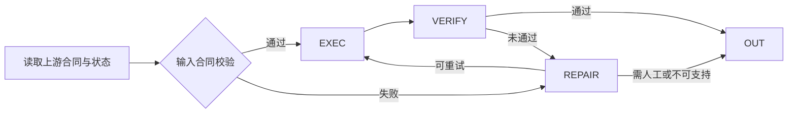

# M15：单位、时间、坐标与值规范化——详细需求与 Codex 实施说明

> 文档版本：V4.0  
> 状态：Implementation Ready  
> 上游：M14 FieldMappingSet  
> 下游：M16 实体消歧与重复检测

## 1. 模块使命

使用确定性科学库将单位、时间系统、坐标参考系、标识符、类别编码和缺失值规范化，并记录完整TransformationRecord。

本模块必须同时满足三类要求：

1. **业务正确性**：输出能够直接推动“从科学问题到可用数据”的下游流程；
2. **科学可信性**：不隐藏不确定性，不让LLM替代确定性数据处理；
3. **工程可运行性**：可测试、可观测、可恢复、可扩展且成本受控。

## 2. 范围与非范围

### 2.1 本模块负责

- Astropy/Pint单位换算
- 时间历法/时区/纪元转换
- CRS变换
- 标识符规范化
- 缺失值与有效位数处理
- 仅识别可能的单位/时间语义候选和解释，不执行数值转换

### 2.2 本模块不负责

- 不替代上游数据合同定义；
- 不静默修改其他模块持有的状态；
- 不绕过质量门直接输出最终Gold数据；
- 不将未注册工具、临时脚本或真实密钥写入运行逻辑；
- 不在无法证明正确时假装完成。

## 3. 输入与输出合同

### 3.1 输入

- 映射后的字段候选
- 合同目标单位/格式
- DomainPack规范化插件

### 3.2 输出

- NormalizedRecordSet
- TransformationRecordSet
- NormalizationIssueSet
- record.normalized事件

### 3.3 合同不变量

- 输入和输出都使用Pydantic v2模型，禁止裸`dict`跨模块传递核心状态；
- 每个产物包含`task_id`、`run_id`、`contract_version`、`created_at`和`producer_version`；
- 失败使用结构化错误码，不使用只有字符串的异常作为业务结果；
- 重试不得产生重复副作用，事件使用`event_id`和幂等键；
- 任何科学数值变换均保留原值与变换记录。

### 3.4 推荐模型骨架

```python
from datetime import datetime
from typing import Literal
from pydantic import BaseModel, ConfigDict, Field

class ModuleResult(BaseModel):
    model_config = ConfigDict(extra="forbid")
    task_id: str
    run_id: str
    module_id: Literal["M15"] = "M15"
    contract_version: str
    status: Literal["succeeded", "partial", "needs_review", "unsupported", "failed"]
    created_at: datetime
    warnings: list[str] = Field(default_factory=list)
    metrics: dict[str, float] = Field(default_factory=dict)
```

## 4. 处理流程



### 4.1 前置条件

- 上游产物Schema验证通过；
- 当前任务未取消，预算未耗尽；
- 所需工具在Capability Registry中注册且健康；
- 当前模块版本与合同版本兼容；
- 需要外部网络或模型时，安全策略允许。

### 4.2 核心执行步骤

1. 任何转换先验证维度和上下文；未知单位不自动猜。
2. 保留raw_value、raw_unit、normalized_value、formula/library和版本。
3. 时间转换必须保留原时间系统、时区、历法和精度。
4. 浮点输出遵循原始有效位数/不确定度，不制造虚假精度。


### 4.3 后置条件

- 结果写入模块产物存储并计算哈希；
- 事件总线写入成功/部分成功/需审核状态；
- 模块指标写入`run_metrics.json`和Trace；
- 下游所需的最小字段完整；
- 任何降级、假设或未完成项均显式记录。

## 5. LLM 与确定性程序分工

### 5.1 LLM允许负责

- 仅识别可能的单位/时间语义候选和解释，不执行数值转换

### 5.2 确定性程序必须负责

- Astropy/Pint单位换算
- 时间历法/时区/纪元转换
- CRS变换
- 标识符规范化
- 缺失值与有效位数处理

### 5.3 统一护栏

- LLM温度默认低值，输出使用JSON Schema；
- LLM只产生候选、计划或解释，关键决策通过规则和验证器确认；
- 模型响应保存模型真实ID、prompt版本、token、延迟和响应哈希；
- 外部文档中的指令视为数据，不得提升为系统指令；
- 失败时优先返回`needs_review`，而不是生成看似完整的结果。

## 6. 类、接口与代码文件

| 类/接口 | 职责约束 |
|---|---|
| `NormalizationPipeline` | 单一职责实现；接口使用Protocol/ABC；公开方法有类型标注与docstring |
| `UnitNormalizer` | 单一职责实现；接口使用Protocol/ABC；公开方法有类型标注与docstring |
| `TimeNormalizer` | 单一职责实现；接口使用Protocol/ABC；公开方法有类型标注与docstring |
| `CoordinateNormalizer` | 单一职责实现；接口使用Protocol/ABC；公开方法有类型标注与docstring |
| `IdentifierNormalizer` | 单一职责实现；接口使用Protocol/ABC；公开方法有类型标注与docstring |
| `MissingValueNormalizer` | 单一职责实现；接口使用Protocol/ABC；公开方法有类型标注与docstring |


### 6.1 目标文件

- `src/normalization/pipeline.py`
- `src/normalization/units.py`
- `src/normalization/time.py`
- `src/normalization/coordinates.py`
- `domain_packs/*/normalizers/`
- `tests/benchmarks/normalization/`

### 6.2 接口设计原则

```python
from typing import Protocol

class ModuleService(Protocol):
    async def execute(self, request: object, *, context: object) -> ModuleResult:
        """幂等执行模块，所有外部副作用必须经过context中的受控适配器。"""
        ...
```

- 领域实现通过Plugin/Protocol扩展，不在通用核心中写`if domain == ...`长链；
- 网络、模型、存储和时钟均通过依赖注入，便于Mock；
- 纯计算逻辑与I/O分层，关键算法优先写成纯函数；
- 模块公开API保持稳定，内部解析器或模型可以替换。

## 7. 事件、状态和幂等性

建议事件字段：

```yaml
event_id: uuid
event_type: m15.completed
task_id: string
run_id: string
module_id: M15
input_hash: sha256
output_hash: sha256
status: succeeded|partial|needs_review|unsupported|failed
attempt: integer
producer_version: semver
timestamp: RFC3339
```

幂等键建议为：`task_id + module_id + contract_version + input_hash + producer_version`。同一幂等键重复执行应返回已存在结果，除非显式设置`force_recompute=true`。

## 8. 失败模式与恢复策略

- 单位缺失→从表头/脚注推断但需证据和置信度
- 单位维度冲突→禁止转换并报issue
- 时间标准模糊→保留原值等待确认
- 坐标系缺失→不做空间对齐

统一恢复顺序：

1. 本地确定性重试；
2. 切换同能力低风险Fallback；
3. 局部重新执行受影响数据；
4. 进入人工审核；
5. 明确标记unsupported/partial并继续交付可用部分。

## 9. 可观测性

每次执行至少记录：

- 输入/输出数量、字节数和哈希；
- 处理成功、部分成功、失败和审核数量；
- 模型/工具/解析器真实版本；
- 每一步延迟、重试、缓存命中、token与费用；
- 质量门得分和被阻断原因；
- 关联EvidenceAtom、TransformationRecord或QualityIssue数量。

禁止记录：真实密钥、完整个人敏感数据、未经脱敏的授权头。

## 10. 量化目标

| 指标 | 目标值 | 验收方式 |
|---|---|---|
| 单位识别准确率 | ≥0.97 | 自动化测试或基准集 |
| 单位转换正确率 | ≥0.995 | 自动化测试或基准集 |
| 时间转换正确率 | ≥0.995 | 自动化测试或基准集 |
| 坐标转换正确率 | ≥0.995 | 自动化测试或基准集 |
| Transformation覆盖率 | 100% | 自动化测试或基准集 |


目标值是项目工程验收建议，不代表赛事官方权重；比赛展示应同时提供基线、样本量和置信区间。

## 11. 测试规格

### 11.1 单元测试

- JD/MJD/ISO时间
- 线性/仿射单位
- 温度绝对与差值
- CRS转换
- 有效位数与误差传播

### 11.2 合同测试

- Pydantic `extra="forbid"`；
- 旧版本输入兼容或明确迁移失败；
- 非法枚举、缺字段、NaN/Inf和超长字符串；
- 事件字段和幂等键稳定；
- 错误码与HTTP状态映射。

### 11.3 集成测试

- 使用Fake LLM、Fake Connector、临时对象存储；
- 验证上游→本模块→下游最小闭环；
- 验证重试不会重复写数据；
- 验证断点恢复与取消；
- 验证Metrics和Trace完整。

### 11.4 故障注入

- 外部服务超时、429、500与非法响应；
- 模型返回非法JSON或不存在的证据；
- 存储写入一半失败；
- 预算在执行中耗尽；
- 规则版本或领域包不兼容。

## 12. Definition of Done

- [ ] 规范化过程可逆或可追踪
- [ ] 无LLM直接改数值
- [ ] 所有非恒等转换均有TransformationRecord
- [ ] 公共API有类型、docstring和结构化错误；
- [ ] 外部服务均可Mock；
- [ ] Ruff、类型检查和pytest通过；
- [ ] 指标能从代码自动计算，不靠手填；
- [ ] 新增架构取舍写入ADR；
- [ ] 无真实密钥、无空壳`pass`、无静默科学值覆盖。

## 13. Codex 分步施工顺序

1. 阅读合同和上游/下游接口，输出差距分析；
2. 新增或修订Pydantic模型、错误码和事件；
3. 先写黄金路径、边界和故障测试；
4. 实现纯函数核心逻辑；
5. 接入模型/网络/存储适配器；
6. 接入工作流节点、检查点与指标；
7. 运行静态检查和测试；
8. 写模块README/ADR并汇报限制。

## 14. 可直接复制给 Codex 的提示词

```text
你是本项目负责 **M15：单位、时间、坐标与值规范化** 的资深 Python/LLM/科学数据工程师。

只实现本模块及其必要的最小依赖，不擅自扩展到后续模块。开始前必须读取：
- `docs/00_项目文档导航与执行顺序.md`
- `docs/03_核心数据契约_事件模型与状态机.md`
- `docs/modules/M15_单位、时间、坐标与值规范化.md`
- `AGENTS.md`
- 当前仓库代码与测试。

执行要求：
1. 先输出仓库现状、缺口、拟修改文件和分步计划；
2. 优先定义/更新数据合同与失败类型，再实现逻辑；
3. 所有LLM输出视为不可信，必须通过Pydantic v2验证；
4. 外部调用必须具备超时、重试、限流、缓存和Mock测试；
5. 原始Artifact不可变，科学数值不得由LLM编造或直接修改；
6. 工作流节点必须幂等、可检查点恢复，并产出结构化事件；
7. 实现本文档列出的正常路径、边界路径和失败路径测试；
8. 运行ruff、类型检查和pytest，修复全部由本次修改导致的错误；
9. 完成后汇报：修改文件、设计取舍、测试命令与结果、指标采集方式、已知限制；
10. 不提交真实密钥，不创建只有`pass`的空壳。

本模块精确目标：使用确定性科学库将单位、时间系统、坐标参考系、标识符、类别编码和缺失值规范化，并记录完整TransformationRecord。

最低验收：
- 规范化过程可逆或可追踪
- 无LLM直接改数值
- 所有非恒等转换均有TransformationRecord

```
